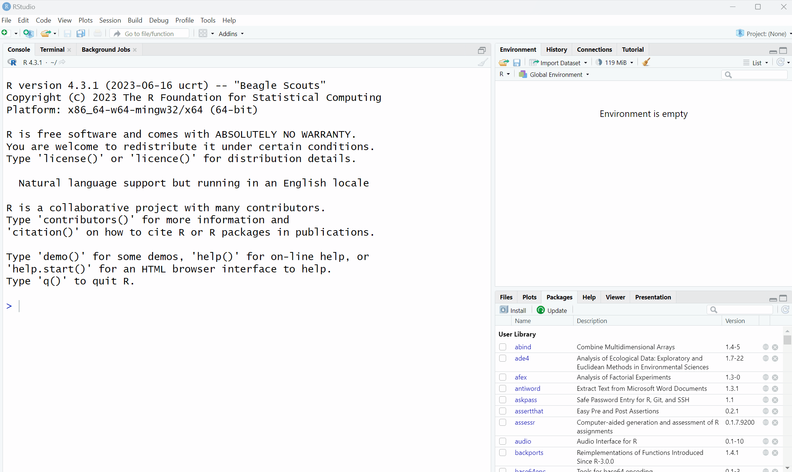

--- 
title: "Data Skills" # edit
#subtitle: "optional" 
author: "Emily Nordmann" # edit
date: "2025-10-07"
site: bookdown::bookdown_site
documentclass: book
classoption: oneside # for PDFs
geometry: margin=1in # for PDFs
bibliography: [book.bib, packages.bib]
description: "This is the Level 1 data skills book for Psychology at UofG"
csl: include/apa.csl
link-citations: yes
url: https://psyteachr.github.io/data-skills-v3 # edit
github-repo: psyteachr/data-skills-v2 # edit
cover-image: images/logos/logo.png # replace with your logo
apple-touch-icon: images/logos/apple-touch-icon.png # replace with your logo
apple-touch-icon-size: 180
favicon: images/logos/favicon.ico # replace with your logo
always_allow_html: true
---


# Overview {-}

<div class="small_right"></div>

By the end of this book, you will be able to analyse data from classic psychological experiments and questionnaires by:

* Importing and simulating data
* Manipulating and wrangling data into an appropriate format for analysis
* Calculating summaries of descriptive statistics
* Producing informative data visualisations
* Performing basic probability calculations using simulation

This book accompanies our first-year undergraduate psychology curriculum. The course materials for our [second](https://psyteachr.github.io/analysis-v2/) and [third](https://psyteachr.github.io/stat-models-v1/) year courses are also available open-access, in addition to [PGT and ad-hoc courses.](https://psyteachr.github.io/)

## How to use this book and the walkthrough videos

For most chapters of this book there is an associated walkthrough video. These videos are there to support you as you get comfortable using R, however, it's important that you use them wisely. You should always try to work through each chapter of this book (or if you prefer each activity) on your own and only then watch the video if you get stuck, or for extra information. 

For many of the initial chapters, we will provide the code you need to use. You can copy and paste from the book, however, we strongly encourage you to type out the code by yourself. This will seem much slower and you will make errors, but you will learn much more quickly this way.

Additionally, we also provide the solutions to many of the activities. No-one is going to check whether you tried to figure it out yourself rather than going straight to the solution but remember this: if you copy and paste without thinking, you will learn nothing. 

Finally, on occasion we will make updates to the book such as fixing typos and including additional detail or activities and as such this book should be considered a living document. When substantial changes are made, new walkthrough videos will be recorded, however, it would be impossible to record a new video every time we made a minor change, therefore, sometimes there may be slight differences between the walkthrough videos and the content of this book. Where there are differences between the book and the video, the book should always be considered the definitive version. 

## Changes from version 2

The main change from version 2 aside from typos and edits for clarity is that we have reverted back to instructing students to locally install R and RStudio on their machines rather than using a browser-based version due to issues with the stability of the service around assessment deadlines. 

## Statement on use of AI

A premium subscription to ChatGPT using GPT4.0 was used to assist in the writing of these materials in the following ways:

* To suggest multiple-choice questions and other types of quizzes and/or to provide the text for "Explain this answer" for such quizzes
* To proof-read and check for typos and inconsistencies in variable names
* To suggest improvements to the text

Any information provided by ChatGPT was verified, for example, where code was used, the syntax and output was checked to ensure it was correct and where theoretical or conceptual information was provided, only that which the author could verify from their pre-existing expertise was included. 


<!--chapter:end:index.Rmd-->

# Intro to R and RStudio {#sec-intro}

## Intended Learning Outcomes {#sec-ilo-intro}

By the end of this chapter you should be able to:

* Access R and RStudio
* Create a new R Markdown document with code chunks
* Create objects by writing and running code in the console and in R Markdown

::: {.try data-latex=""}
If you're completely new to programming, you're unlikely to understand everything in the first few chapters the first time you work through it - and that's ok! Some of the beginning information we provide has a bit of a chicken-and-egg problem in that we need to give you it before you begin but until you've had some experience with R, it won't fully make sense. Take what you can from the chapters on the first attempt but also come back to them in a few weeks time and have another read through - you'll be surprised at how much you've learned in a short space of time. 
:::


## Walkthrough video {#sec-walkthrough-intro}

There is a walkthrough video of this chapter available via [Zoom](https://uofglasgow.zoom.us/rec/share/E51qflbRrIm1ADdWfU78cOR4wr8YyC7hHnYeIX8TzqiQ_31Hgr7D1IRB3ZMQJjty.uYONMVysezCnhRZY) We recommend first trying to work through each section of the book on your own and then watching the video if you get stuck, or if you would like more information. This will feel slower than just starting with the video, but you will learn more in the long-run. Please note that there may have been minor edits to the book since the video was recorded. Where there are differences, the book should always take precedence.

## R and RStudio {#sec-intro-r}

R is a programming language that you will write code in. RStudio is an Integrated Development Environment (<a href='https://psyteachr.github.io/glossary/i#ide' target='_blank' class='glossary' title='Integrated Development Environment: a program that serves as a text editor, file manager, and provides functions to help you read and write code. RStudio is an IDE for R.'>IDE</a>). Think of it as knowing English and using a plain text editor like NotePad to write a book versus using a word processor like Microsoft Word. You could do it, but it would be much harder without things like spell-checking and formatting and you wouldn't be able to use some of the advanced features that Word has developed. In a similar way, you can use R without R Studio but we wouldn't recommend it. RStudio serves as a text editor, file manager, spreadsheet viewer, and more.

* There's an [RStudio IDE Cheatsheet](https://raw.githubusercontent.com/rstudio/cheatsheets/main/rstudio-ide.pdf){download=""} you will find helpful to download and keep as a reference.

## Activity 1: Install R and RStudio

Your first task is to install R and RStudio and we have prepared [a guide for how to do this](https://psyteachr.github.io/RSetGo/) on Windows and Macs. Please note that you cannot install R on a Chromebook or a tablet, only a full laptop or desktop computer. If you do not have a laptop or desktop, you can use any of the [University computers](https://www.gla.ac.uk/myglasgow/it/studentclusters/) and there is also a [laptop loan scheme](https://www.gla.ac.uk/myglasgow/registry/finance/funds/laptoploan/). We also have a guide on how to use R on a university computer.

If you need help with the installation, or if you'd just feel more confident doing it with someone else in the room, there will be GTA support sessions in week 1 and 2 specifically to help with installation. You can also attend office hours with any member of the Level 1 team.


::: {.warning data-latex=""}
If you did the UofG Access Course, you may have been given access to R through a browser based version. Please don't use this, use a local installation as the Access course does not have the same features and layout that will align with our instructions.
:::

## Activity 2: Open RStudio

As noted, you have installed two bits of software, R and RStudio. **You only ever need to open RStudio**. If during the installation process you created a shortcut to R, delete the shortcut, it will only cause you trouble.

* Open RStudio. The icon looks like this:

<div class="figure" style="text-align: center">

<p class="caption">(\#fig:img-rstudio-icon)RStudio icon</p>
</div>

* You may also find it useful to add a shortcut to your desktop or task bar so that it is easy to find.

## RStudio panes

RStudio is arranged with four window <a href='https://psyteachr.github.io/glossary/p#panes' target='_blank' class='glossary' title='RStudio is arranged with four window “panes”.'>panes</a>. By default, the upper left pane is the **source pane**, where you view, write, and edit code from files and view data tables in a spreadsheet format. **When you first open RStudio this pane won't display until you open a document or load in some data** -- don't worry, we'll get to that soon.

<div class="figure" style="text-align: center">

<p class="caption">(\#fig:fig-rstudio)The RStudio IDE</p>
</div>

The lower left pane is the **console pane**, where you can type in commands and view output messages. **When you first open RStudio, the console pane will take up the entire left hand side**. You can write code in the console to test it out. The code will run and can create objects in the environment, but the code itself won't be saved. You need to write your code into a script in the source pane to save it, which we'll cover later in this chapter. 

::: {.try data-latex=""}
Try using the console as a calculator - type `1 + 1` and press enter.
:::

The right panes have several different tabs that show you information about your code. The most used tab in the upper right pane is the **Environment** tab. The Environment tab lists some information about the <a href='https://psyteachr.github.io/glossary/o#object' target='_blank' class='glossary' title='A word that identifies and stores the value of some data for later use.'>objects</a> that you have defined in your code. 

In the lower right pane, the most used tabs are the **Files** tab for directory structure, the **Plots** tab for plots, the **Packages** tab for managing add-on packages (we'll explain what these are in the next chapter), and the **Viewer** tab to display reports created by your scripts. You can change the location of panes and what tabs are shown under `Tools > Global Options... > Pane Layout`. 


## Activity 3: Settings {#sec-rstudio-settings}

Before we start writing code, we're going to change a few settings to make things easier for us in the long-run. 

### Themes and accessiblilty

You can customise how RStudio looks to make it work for you. 

* Click `Tools > Global Options > Appearance`. You can change the default font, font size, and general appearance of R Studio by applying a theme, including using dark mode. 

Play around with the settings and see what you prefer - you're going to spend a lot of time with R, it might as well look how you like it!

### Settings for Reproducibility {#sec-rstudio-repro}

One of the reasons you're going to learn R is so that any quantitative data analysis and research you do is **reproducible**. If your work is reproducible, it means that you (or someone else) can take your data and get the same result you got. This is easier to do with code because you have a written record of everything you did, compared to using point-and-click software where there is no record and you just have to remember what you did.

To help ensure your work is reproducible, there are a few settings you should change in RStudio. If you keep stuff around in your workspace, things can get messy and you can accidentally end up using the wrong dataset or object. You should always start with a clear workspace. This also means that you never want to save your workspace when you exit - the only thing you want to save are your scripts. 

* Go to `Tools > Global Options`
* In the General tab, uncheck the box that says `Restore .RData into workspace at startup`.  
* Additionally, set the "Save workspace to .RData on exit" to `Never`.


<div class="figure" style="text-align: center">

<p class="caption">(\#fig:fig-settings)RStudio settings</p>
</div>

## Sessions and projects

A "session" refers to a single period of use with R. During this session, you can load data, write code, and create visualizations. All of the objects that you create and data that you import into R exist within the environment of this session.

For example, if you create a variable in R, that variable is stored in memory for the duration of the session. If you end the session and then start a new one, that variable will no longer exist in your R environment unless you've saved your workspace or the object to a file.

A "project" is a specific working directory (or folder) designated to contain all the files relevant to a particular set of analyses or a specific research study. Projects are a way of organizing your work in RStudio that makes it easier to keep track of all the different files associated with a particular line of work.

We're going to use projects to help organise your data skills work for Psych 1A

## Activity 4: Create a new project {#new-project}

First, if you don't have one already, make a folder on your computer named "PSYCH1A" and then within this folder, make another folder named "Data Skills".

* If you're unsure how to create a folder, here is [a guide for Windows and Mac](https://www.digitaltrends.com/computing/how-to-create-folder-on-desktop/).
* You should have OneDrive installed on your computer using your University account. Create this folder in OneDrive so that it is always backed up to the cloud.

Then do the following, in this order, in RStudio:

* Click "File" then click "New project"
* Then, click on the first option in the list "New Directory"
* Then, click ""New Project"
* Then you are given the opportunity to name your project and select which folder it should be stored in. First in the "Directory name" box, type "Intro to R".
* Then, click "Browse" and find the "Data Skills" folder in the "PSYCH1A" folder you created and click "Open".
* Finally, click "Create project".

<div class="figure" style="text-align: center">

<p class="caption">(\#fig:img-rserver-2)Creating a new project</p>
</div>


## Activity 5: Writing code

Ok, let's write some code! We're going to open a script soon but first let's show you how to write code and create objects in the console.

### Objects {#sec-objects}

A large part of your coding will involve creating and manipulating objects. Objects contain stuff. That stuff can be numbers, words, or the result of operations and analyses. You assign content to an object using `<-`

Run the following code in the console, but change the values of `name`, `age` and `birthday` to your own details (`birthday` should be the date of your next birthday, year-month-day). Press enter after you type each line.


``` r
name <- "Patsy"
age <- 39
today <- Sys.Date()
birthday <- as.Date("2025-07-11")
```

You'll see that four objects now appear in the environment pane:

* `name` is <a href='https://psyteachr.github.io/glossary/c#character' target='_blank' class='glossary' title='A data type representing strings of text.'>character</a> (text) data. In order for R to recognise it as text, it **must** be enclosed in double quotation marks `" "`.
* `age` is <a href='https://psyteachr.github.io/glossary/n#numeric' target='_blank' class='glossary' title='A data type representing a real decimal number or integer.'>numeric</a> data. In order for R to recognise this as a number, it **must not** be enclosed in quotation marks. Every year I have to update my age in this book and I am confronted with my own mortality drawing ever closer. 
* `today` stores the result of the function `Sys.Date()`. This function returns your computer system's date. Unlike `name` and `age`, which are hard-coded (i.e., they will always return the values you enter), the contents of the object `today` will change dynamically with the date. That is, if you run that function tomorrow, it will update the date to tomorrow's date.
* `birthday` is also a date but it's hard-coded as a specific date. It's wrapped within the `as.Date()` function that tells R to interpret the character string you provide as a date rather than text.

::: {.callout-note .try}
To print the contents of an object, type the object's name in the console and press enter. Try printing all four objects now.
:::

### Removing objects

To clear objects from the environment you can remove them individually:


``` r
rm(name)
```

Or you can remove them all at once by clicking on the brush icon at the topof the environment pane.

<div class="figure" style="text-align: center">

<p class="caption">(\#fig:rm-brush)Removing objects</p>
</div>

## Activity 6: R Markdown

The problem with writing code in the console is that it doesn't save it anywhere, and the whole point of writing code is so that you can save it and use it again. We're going to write our code in a document format called **R Markdown** (abbreviated as Rmd).

R Markdown documents are a great way to create dynamic documents with embedded chunks of code and we'll use R Markdown to do all your data skills work including the homework. 

For more information about R Markdown feel free to have a look at their main webpage http://rmarkdown.rstudio.com. The key advantage of R Markdown is that it allows you to write code into a document, along with regular text, and then **knit** it using the package `knitr` to create your document as either a webpage (HTML), a PDF, or Word document (.docx). 

### Create a new R Markdown

To open a new R Markdown document click the 'New File' icon (it's a white document with a green plus sign just under the "File" menu) and then click 'R Markdown'. You will be prompted to give it a title, call it "Intro to R". Also, change the author name to your GUID as this will be good practice for the homework. Keep the output format as HTML.

Once you've opened a new document be sure to save it by clicking `File` -> `Save`. You should also name this file "Intro to R". If you've set the working directory correctly, you should now see this file appear in your file viewer pane.

<div class="figure" style="text-align: center">

<p class="caption">(\#fig:img-new-markdown)Opening a new R Markdown document</p>
</div>

::: {.info data-latex=""}
One of the great things about using projects in RStudio is that your files will automatically save into your project working directory by default. This makes it easy to keep everything organised so make sure you have followed the steps to set up your project carefully!
:::


### Creating code chunks

When you first open a new R Markdown document you will see a bunch of welcome text and code. This will appear every time you open a new R Markdown document.

Do the following steps in this order:  

* Delete **everything** from line 8 onwards  
* On line 8, type "About me" and press enter to move the cursor down to line 9
* Click the  code chunk button at the top of your Markdown document (it's a green square with a C and a plus sign) then click `R` to insert a new R code chunk.  

<div class="figure" style="text-align: center">

<p class="caption">(\#fig:img-new-chunk)Creating a new R chunk</p>
</div>

What you have created is a **code chunk**. In R Markdown, anything written in the white space is regarded as normal text, and anything written in a grey code chunk is assumed to be code. This makes it easy to combine both text and code in one document.

::: {.warning data-latex=""}
When you create a new code chunk you should notice that the grey box starts and ends with three back ticks ```. One common mistake is to accidentally delete these back ticks. Remember, code chunks are grey and text entry is white - if the colour of certain parts of your Markdown doesn't look right, check that you haven't deleted the back ticks.
:::

### Adding code

Now we're going to add in the code we used earlier to our R Markdown document so that we can save it. 

* In your code chunk write the below code (but again, replace the values of name/age/next birthday with your own details).   
* Remember that text values and dates need to be contained in quotation marks but numerical values do not. Missing and/or unnecessary quotation marks are a common cause of code not working - remember this!


``` r
name <- "Patsy" 
age <- 39
today <- Sys.Date()
birthday <- as.Date("2026-07-11")
```

### Running code {#sec-run-code}

When you're working in an R Markdown document, there are several ways to run your lines of code.

The best way to run a single line of code is to use a keyboard shortcut. Make sure that the cursor is in the line of code you want to run (it can be anywhere) and press `Ctrl + enter` or `Cmd + enter` if you're on a Mac. This will run the line of code and move your cursor to the next line.

* Run each line of code to create the objects using the above method.
* Then, clear all the objects from the environment either using `rm()` on each object or click the brush icon to get rid of them all at once.

Now, let's try running all the code in the chunk at once rather than one line at a time. You have two options:

* Put your cursor somewhere in the code chunk and press `Ctrl + shift + enter`
* Or, press the green "play" button at the top-right of the code chunk and this will run **all** lines of code in that chunk.

::: {.info data-latex=""}
Whilst you're working through this book, use the white space to add notes. For example, if you figure something out or you manage to fix an error, make a note of it in your Markdown document.
:::

## Activity 7: Inline code

An incredibly useful feature of R Markdown is that R can insert values into your writing using **inline code**. If you've ever had to copy and paste a value or text from one file to another, you'll know how easy it can be to make mistakes. Inline code avoids this. It's easier to show you what inline code does rather than to explain it so let's have a go.

* First, copy and paste this text exactly (do not change anything) to the **white space** underneath your code chunk.


``` r
My name is `r name` and I am `r age` years old. It is `r birthday - today` days until my birthday.
```

* Now, we're going to "knit" our file. This simply means that we're going to compile our code into a document that is more presentable. To do this click `Knit` -> `Knit to HMTL`. R Markdown will create a new HTML document and it will automatically save this file in your project working directory. 

As if by magic, that slightly odd bit of text you copied and pasted now appears as a normal sentence with the values pulled in from the objects you created. 

**My name is Patsy and I am 39 years old. It is 277 days until my birthday.**

We're not going to use this function too often in the rest of the course but hopefully you can see just how useful this would be when writing up a report with lots of numbers. R Markdown is an incredibly powerful and flexible format - this book was written using it! 

There are a few final things to note about knitting that will be useful for the homework:  

* R Markdown will only knit if your code works, otherwise it will throw an error. Knitting your file is therefore a good way of checking for the homework assignments whether you've written legal code!  
* The order of what's in your Markdown document matters. When the file knits, it starts at the beginning. This means that if you want to use any values in inline code, the code that creates these values must come before the inline code that calls upon it.
* You can choose to knit to a Word or PDF document rather than HTML. This can be useful for e.g., sharing the document with others, however, it may lose some functionality and it probably won't look as good so we'd recommend always knitting to HTML.
* R will automatically open the knitted file in the viewer, however, you can also navigate to the Files tab and open the HTML file in your web browser (e.g., Chrome or Firefox).  


## Activity 8: Saving and quitting the session

We're done with all the coding activities for this chapter and whilst it might be tempting to just ~~run away from R~~ close your laptop, ensuring you save and quit the session properly can save you a lot of time and problems in the long-run.

* First, make sure your R Markdown is saved. If there are any unsaved changes then the save icon will be in blue, if it's greyed out it means there are no unsaved changes. But just to be safe, always hit `Ctrl + s` or click `File - Save` which will save your file.
* Then, exit RStudio completely by clicking "File - Quit session" or using the shortcut "Ctrl + Q" (Windows) or "Cmd + Q" (Mac).

## Finished!

And you're done! On your very first time using R you've not only written functioning code but you've written a reproducible output! You could send someone else your R Markdown document and they would be able to produce exactly the same HTML document as you, just by pressing knit.

The key thing we want you to take away from this chapter is that R isn't scary. It might be very new to a lot of you, but we're going to take you through it step-by-step. You'll be amazed at how quickly you can start producing professional-looking data visualisations and analysis.


## Glossary {#sec-glossary-intro}

The glossary at the end of each chapter defines common jargon you might encounter while learning R. This specialised vocabulary can help you to communicate more efficiently and to search for solutions to problems. The terms below link to our [PsyTeachR glossary](https://psyteachr.github.io/glossary/), which contains further information and examples.

|term      |definition                                                                                                                                                                 | |:---------|:--------------------------------------------------------------------------------------------------------------------------------------------------------------------------| |character |A data type representing strings of text.                                                                                                                                  | |IDE       |Integrated Development Environment: a program that serves as a text editor, file manager, and provides functions to help you read and write code. RStudio is an IDE for R. | |numeric   |A data type representing a real decimal number or integer.                                                                                                                 | |object    |A word that identifies and stores the value of some data for later use.                                                                                                    | |panes     |RStudio is arranged with four window "panes".                                                                                                                              |


<!--chapter:end:01-intro.Rmd-->


# Stroop 1 {#stroop}


## Intended Learning Outcomes {#sec-ilo-stroop}

By the end of this chapter you should be able to:

* Explain what the Stroop effect is and how is it measured
* Load and use packages and functions in R
* Load data using `read_csv()`
* Check data using `summary()`, `str()`, and visual methods

## Walkthrough video {#sec-walkthrough-stroop}

There is a walkthrough video of this chapter available via [Zoom](https://uofglasgow.zoom.us/rec/share/vRwnO_rjeJC7ewcMA3avOuC8UhR-sra_6cGNTmZ-xz24IRpd4-LW1WF_957qPNY.e4V3Kp6TU9rODsFo). We recommend first trying to work through each section of the book on your own and then watching the video if you get stuck, or if you would like more information. This will feel slower than just starting with the video, but you will learn more in the long-run. Please note that there may have been minor edits to the book since the video was recorded. Where there are differences, the book should always take precedence.

## Activity 1: The Stroop Effect

In this chapter and the next chapter, we're going to develop your data skills by using data from one of the most famous experiments in psychology: The Stroop Effect.

* First, take part in [this online version](https://www.psytoolkit.org/experiment-library/experiment_stroop.html) of the Stroop test. It only takes a few minutes to complete. You need to be on a device with a keyboard. 
* Second, read the [Wikipedia summary](https://en.wikipedia.org/wiki/Stroop_effect) of the Stroop Effect and how it is used in psychological research.
* Finally, answer the following questions. Please note that your responses will not save in the browser - if you want to save them, make a note of them somewhere.

1. What does the Stroop Effect primarily measure?

<select class='webex-select'><option value='blank'></option><option value=''>Color perception</option><option value=''>Language comprehension</option><option value='answer'>Cognitive interference</option><option value=''>Reading speed</option></select>


<div class='webex-solution'><button>Explain this answer</button>

The Stroop Effect primarily measures cognitive interference, which occurs when the processing of a specific stimulus feature impedes the simultaneous processing of a second stimulus attribute.

</div>
 

2. What is one possible explanation for the Stroop Effect?

<select class='webex-select'><option value='blank'></option><option value=''>People are naturally slower at reading than identifying colors</option><option value='answer'>Reading is an automatic process that can interfere with color identification</option><option value=''>Color identification is an automatic process that can interfere with reading</option><option value=''>None of the above</option></select>


<div class='webex-solution'><button>Explain this answer</button>

The Stroop Effect is often explained by the theory of automaticity, which suggests that reading—the task of recognizing words—has become an automatic process for most individuals, and this automatic reading process interferes with the task of naming the color.

</div>
 

3. In a typical Stroop test, <input class='webex-solveme nospaces ignorecase' size='9' data-answer='["congruent"]'/> trials (where the color of the ink matches the word) are completed faster than <input class='webex-solveme nospaces ignorecase' size='11' data-answer='["incongruent"]'/> trials (where the color of the ink does not match the word).


<div class='webex-solution'><button>Explain this answer</button>

Answer: congruent, incongruent

In a typical Stroop test, there are two types of tasks - congruent and incongruent.

Congruent tasks are those where the color of the ink matches the word. For example, the word "BLUE" is printed in blue ink. In this case, the visual color and the semantic information (the meaning of the word) align or are "congruent."

Incongruent tasks, on the other hand, are those where the color of the ink does not match the word. For example, the word "BLUE" might be printed in red ink. Here, the visual color and the semantic information are in conflict or are "incongruent."

Participants in a Stroop test are typically asked to name the color of the ink, not the word. This is where the interference comes in. Reading words is such an automatic process for most literate adults that the participant's brain automatically reads the word before recognizing the color of the ink. This causes a delay in the response time for incongruent tasks, as the brain has to overcome the initial automatic response to read the word.

Therefore, congruent tasks are typically completed faster than incongruent tasks in a Stroop test. The difference in response times is the measure of the Stroop effect, which demonstrates the nature of cognitive interference and the automatic process of reading.

</div>


## Activity 2: New project

* Open up RStudio on your computer.

To help keep things organised, we'll make a new project for the Stroop experiment chapters (this week and next week). To make a new project, the steps are almost the same as what you did in the first chapter with the exception that you don't need to make the PSYCH1A and Data Skills folders this time, you just need to find them:

* Click File then "New project";
* Then, click on the first option in the list "New Directory";
* Then, click "New Project";
* Then you are given the opportunity to name your project and select which folder it should be stored in. First in the "Directory name" box, type "Stroop Effect";
* Click browse and find your PSYCH1A and then Data Skills folder and click "Open".
* Finally, click "Create project".

<div class="figure" style="text-align: center">

<p class="caption">(\#fig:img-stroop-project)Creating a project for the Stroop Effect</p>
</div>

## Activity 3: Setting check

Now you need to download the data files we're going to use. Before you do, we need to check some settings on your browser because the biggest issue new students face with R is not learning to code, it's knowing where your files are.

* First, if you're not 100% sure, check your browser settings to make sure you know where files you download are going to go. If you're on Windows, there's a good chance the default will be the Downloads folder. However, this folder can sometimes end up a dumpster fire of files so it can be better to change your settings so that your browser asks you where to save each download to so that you have to consciously choose each time. [This website](https://www.computerhope.com/issues/ch002103.htm) explains how to check and change these settings for all different browsers.

We're going to ask you to download **zip files**. A zip file is a folder that contains files that have been compressed to make the file size smaller (like vacuum packed food) and enables you to download multiple files at once.

* If you're on a Mac and using Safari as your browser, it has a very annoying default habit of unzipping files when you download them. It's trying to be useful but it means you don't learn about different file types and this is important. We'd strongly recommend just not using Safari at all because it seems to cause a few issues with R and using Chrome or Firefox instead  but if you are particularly attached to it, [change the settings](https://apple.stackexchange.com/questions/961/how-to-stop-safari-from-unzipping-files-after-download) to stop it unzipping files.

## Activity 4: Data files {#sec-unzip}

Once you've done all this, it's time to download the files we need and unzip them. 

* First, download the <a href="data/stroop/stroop_data.zip" download>Stroop data zip file</a> to your computer and **save it in your Stroop Effect project folder**.
* In RStudio, in the Files tab, click on "stroop_data.zip". This will open up the zip folder.
* If you're using a [Mac](https://support.apple.com/en-qa/guide/mac-help/mchlp2528/mac) double-click on the zip folder and it will automatically unzip them into a regular folder. If you're on [Windows](https://support.microsoft.com/en-gb/windows/zip-and-unzip-files-8d28fa72-f2f9-712f-67df-f80cf89fd4e5), you need to click "Extract all" then ok.

We then need to make sure that the unzipped files are in the main project folder, not in a sub-folder. If you're comfortable with computers, move the files over and delete any other copies including the zip file with whichever method your prefer.

If you're not sure how to do this, follow these instructions.There are other, potentially faster ways of achieving this, but this method will work for both Mac and Windows.

* In the RStudio Files tab, navigate back to the Stroop Effect folder.
* Then open the new unzipped stroop_data folder.
* Select the four files by ticking the check boxes next to them.
* Click "More" then "Move" then navigate to the Stroop Effect folder and click "Open".
* Finally, to keep everything tidy, navgiate back to the Stroop Effect folder and delete both the stroop_data folders (the zip folder and the regular folder) as you don't need them. This means you only have one copy of each file so you can't use the wrong one.
* Importantly, all your files should all be in the main project folder. If you're unsure about this, attend a GTA session or office hours. If you can get this first step right, it avoids a lot of issues down the line. 

<div class="figure" style="text-align: center">

<p class="caption">(\#fig:img-unzip)Unzipping and moving the files</p>
</div>

The zip file contains four files:

* `stroop_stub1.Rmd` and `stroop_stub2.Rmd`: to help you out in the first semester, we'll provide pre-formatted Markdown files ("stub" files) that contain code chunks for each activity and spaces for you to take notes. Open `stroop_sub1.Rmd` by clicking on it in the Files tab and then edit the heading to add in your GUID and today's date.
* `participant_data.csv` is a data file that contains each participant's anonymous ID, age, and gender. This data is in <a href='https://psyteachr.github.io/glossary/w#wide' target='_blank' class='glossary' title='A data format where all of the observations about one subject are in the same row'>wide-form</a> which means that all of the observations about one subject are in the same row. There are 270 participants, so there are 270 rows of data.

<div class="kable-table">

| participant_id|gender | age|
|--------------:|:------|---:|
|              1|Man    |  20|
|              2|Man    |  20|
|              3|Man    |  27|
|              4|Man    |  19|
|              5|Man    |  23|
|              6|Man    |  28|

</div>

* `experiment_data.csv` is a data file that contains each participant's anonymous ID, and mean reaction time for all the congruent and incongruent trials they completed. This data is in <a href='https://psyteachr.github.io/glossary/l#long' target='_blank' class='glossary' title='A data format where each observation is on a separate row'>long-form</a> where each observation is on a separate row so for the Stroop experiment, each participant has two rows because there are two observations (one for congruent trials and one for incongruent trials). So there are 270 participants, but 540 rows of data (270 * 2).

You may be less familiar with this way of organising data, but for many functions in R your data must be stored this way. This semester, we'll provide you with the data in the format it needs to be in and next semester we'll show you how to transform it yourself.

<div class="kable-table">

| participant_id|condition   | reaction_time|
|--------------:|:-----------|-------------:|
|              1|congruent   |      847.0311|
|              1|incongruent |      910.3084|
|              2|congruent   |      748.1366|
|              2|incongruent |      967.4626|
|              3|congruent   |      786.2370|
|              3|incongruent |      975.7407|

</div>

Before we load in and work with the data files we need to explain a few more things about how R works.

## Packages and functions {#sec-packages}

When you install R you will have access to a range of <a href='https://psyteachr.github.io/glossary/f#function' target='_blank' class='glossary' title='A named section of code that can be reused.'>functions</a> including options for <a href='https://psyteachr.github.io/glossary/d#data-wrangling' target='_blank' class='glossary' title='The process of preparing data for visualisation and statistical analysis.'>data wrangling</a> and statistical analysis. The functions that are included in the default installation are typically referred to as <a href='https://psyteachr.github.io/glossary/b#base-r' target='_blank' class='glossary' title='The set of R functions that come with a basic installation of R, before you add external packages.'>base R</a> and you can think of them like the default apps that come pre-loaded on your phone. 

One of the great things about R, however, is that it is **user extensible**: anyone can create a new add-on that extends its functionality. There are currently thousands of <a href='https://psyteachr.github.io/glossary/p#package' target='_blank' class='glossary' title='A group of R functions.'>packages</a> that R users have created to solve many different kinds of problems, or just simply to have fun. For example, there are packages for data visualisation, machine learning, interactive dashboards, web scraping, and playing games such as Sudoku.

Add-on packages are not included with base R, but have to be downloaded and installed from an archive, in the same way that you would, for instance, download and install PokemonGo on your smartphone. The main repository where packages reside is called <a href='https://psyteachr.github.io/glossary/c#cran' target='_blank' class='glossary' title='The Comprehensive R Archive Network: a network of ftp and web servers around the world that store identical, up-to-date, versions of code and documentation for R.'>CRAN</a>, the Comprehensive R Archive Network.

There is an important distinction between **installing** a package and **loading** a package.

## Activity 5: Install packages {#sec-install-package}

This is like installing an app on your phone: you only have to do it once and the app will remain installed until you remove it. For instance, if you want to use PokemonGo on your phone, you install it once from the App Store or Play Store; you don't have to re-install it each time you want to use it. Once you launch the app, it will run in the background until you close it or restart your phone. Likewise, when you install a package, the package will be available (but not *loaded*) every time you open up R.

For Level 1, the main package you need to use is named the"tidyverse" and it has functions to deal with data wrangling, summaries, and visualisation. 

To install the `tidyverse`:

* In the Files pane in the bottom right, click "Packages", then click "Install".
* In the "Packages" box type "tidyverse". It provide auto-complete suggestions to save you time. Click on "tidyverse" and then click install.
* It will start installing the package and produce a lot of text that might look like an error but isn't. If you get a message that says something like `package ‘tidyverse’ successfully unpacked and MD5 sums checked`, the installation was successful. If you get an error and the package wasn't installed, come to office hours or a GTA session.

Now do the same but install the package "cowsay" and then `rmarkdown`.

<div class="figure" style="text-align: center">

<p class="caption">(\#fig:img-install)Installing packages</p>
</div>

### Loading a package

This is done using the `library()` function. This is like **launching** an app on your phone: the functionality is only there when the app is launched and remains there until you close the app or restart. For example, when you run `library(tidyverse)` within a session, the functions in the package `cowsay` will be made available for your R session. The next time you start R, you will need to run `library(tidyverse)` again if you want to access that package.

## Activity 6: Packages and function

As an example, let's load the <code class='package'>cowsay</code> package that you installed above. The <code class='package'>cowsay</code> package is just for fun - it will print a message with an animal - but it's useful to show you how packages work. To load a package, you use the function `library()` and include the name of the package you want to load in parentheses.

* In code chunk 1, type and run the below code to load the `cowsay` package. If you can't remember how to run code, take a look back at Chapter\ \@ref(sec-run-code).


``` r
library(cowsay)
```

You'll see `library(cowsay)` appear in the console. There's no warning messages or errors so it looks like it has loaded successfully.

### Using a function

Now you can use the function `say()`. A <a href='https://psyteachr.github.io/glossary/f#function' target='_blank' class='glossary' title='A named section of code that can be reused.'>function</a> is a name that refers to code that performs some sort of action.

* In code chunk 2, write and run the below code to use the function `say()`.
* If you get the error `could not find function` it means you have not loaded the package properly, try running `library(cowsay)` again and make sure everything is spelled exactly right.


``` r
say()
```

```
## 
##  ______________ 
## < Hello world! >
##  -------------- 
##       \
##        \
## 
##         ^__^ 
##         (oo)\ ________ 
##         (__)\         )\ /\ 
##              ||------w|
##              ||      ||
```

After the function name, there is a pair of parentheses, which contain zero or more <a href='https://psyteachr.github.io/glossary/a#argument' target='_blank' class='glossary' title='A variable that provides input to a function.'>arguments</a>. These are options that you can set. If you don't give it any information, it will try and use the default arguments if it has them. `say()` has two main arguments with a <a href='https://psyteachr.github.io/glossary/d#default-value' target='_blank' class='glossary' title='A value that a function uses for an argument if it is skipped.'>default value</a>: `what` the text says (default `Hello world`), and the animal the message is said `by` (default is a cat).

To look up all the various options that you could use with `say()`, run the following code in the console:


``` r
?say
```

The help documentation can be a little hard to read - scrolling to the bottom and looking at the examples can help.

* In code chunk 2, add the below code to produce a different message and animal - below is an example but try your own.


``` r
say(what = "Do or do not, there is no try",
    by = "yoda")
```

### Function Help {#sec-function-help}

If you want more information about what a function does or how to use it, you can look at the help document. If a <a href='https://psyteachr.github.io/glossary/f#function' target='_blank' class='glossary' title='A named section of code that can be reused.'>function</a> is in <a href='https://psyteachr.github.io/glossary/b#base-r' target='_blank' class='glossary' title='The set of R functions that come with a basic installation of R, before you add external packages.'>base R</a> or a package you have loaded, you can type `?function_name` in the console to access the help file. At the top of the help it will give you the function and package name. 

If the package isn't loaded, use `?package_name::function_name`. When you aren't sure what package the function is in, use the shortcut `??function_name` which will give you a list of all possible options.

* In the **console**, type and run the code for the different help options below. The reason you run the help code in the console not a code chunk is that you generally don't want to save this code in your script.


``` r
# get help with a package
?cowsay

# get help with a function if the package it's from is already loaded
?say

# get help with a function whether or not the package is loaded
?cowsay::say

# shows a list of potentially matching functions
??say
```

Function help is always organised in the same way. For example, look at the help for `?cowsay::say`. At the top, it tells you the name of the function and its package in curly brackets, then a short description of the function, followed by a longer description. The **Usage** section shows the function with all of its <a href='https://psyteachr.github.io/glossary/a#argument' target='_blank' class='glossary' title='A variable that provides input to a function.'>arguments</a>. If any of those arguments have default values, they will be shown like `function(arg = default)`. The **Arguments** section lists each argument with an explanation. There may be a **Details** section after this with even more detail about the functions. The **Examples** section is last, and shows examples that you can run in your console window to see how the function works.


::: {.callout-note .try style="clear: both;"}
Use the help documentation to find the answers to this question:

* What is the first argument to the `mean` function? <select class='webex-select'><option value='blank'></option><option value=''>trim</option><option value=''>na.rm</option><option value=''>mean</option><option value='answer'>x</option></select>`
:::

## Activity 7: Loading data

OK, let's get back to looking at our data. In order to load and work with our Stroop data, we need to load another that very important package, the <code class='package'>tidyverse</code>.

### Load the Tidyverse {#sec-tidyverse}

<code class='package'>tidyverse</code> is a meta-package that loads several packages we'll be using in almost every chapter in this book:

- <code class='package'>ggplot2</code>, for data visualisation
- <code class='package'>readr</code>, for data import
- <code class='package'>tibble</code>, for tables 
- <code class='package'>tidyr</code>, for data tidying
- <code class='package'>dplyr</code>, for data manipulation
- <code class='package'>stringr</code>, for <a href='https://psyteachr.github.io/glossary/s#string' target='_blank' class='glossary' title='A piece of text inside of quotes.'>strings</a>
- <code class='package'>forcats</code>, for <a href='https://psyteachr.github.io/glossary/f#factor' target='_blank' class='glossary' title='A data type where a specific set of values are stored with labels; An explanatory variable manipulated by the experimenter'>factors</a>
- <code class='package'>purrr</code>, for repeating things

To use <code class='package'>readr</code> to import the data, we need to load the <code class='package'>tidyverse</code>.

* In code chunk 3, write and run the code to load the <code class='package'>tidyverse</code>. When you run this code, you're going to get something that at first glance might look like an error but it's not, it's just telling you which packages it has loaded.


``` r
library(tidyverse)
```

<div class="figure" style="text-align: center">

<p class="caption">(\#fig:img-tidyverse)Tidyverse message when successfully loaded</p>
</div>

### Read in the data {#sec-read-csv}

Now we can read in the data. To do this we will use the function `read_csv()` that allows us to read in .csv files, which are a type of data file. There are also functions that allow you to read in .xlsx  (Excel) files and other formats, however in this course we will only use .csv files.

First, we will create an object called `dat` that contains the data in the `experiment_data.csv` file. Then, we will create an object called `ppt_info` that contains the data in the `participant_data.csv`.

* In code chunk 4, write and run the below code to load the data files.


``` r
dat <- read_csv(file = "experiment_data.csv")
ppt_info <- read_csv(file = "participant_data.csv")
```

::: {.info data-latex="Help with errors"}
In order to load the file successfully, the name of the file needs to be in double quotation marks and it must have the file extension `.csv`. If you miss this out, you'll get the error message `...does not exist in current working directory`. To fix it, make sure you've spelled the name of the file right and included the file extension.

Additionally, if you get the message `could not find function "read_csv()"` it means that you have not loaded the <code class='package'>tidyverse</code> - a common error is to write the code but not run it! To fix it, run the code that loads the tidyverse. Another reason you might see this message is if you've made a typo in the name of the function, so check that you've spelled `read_csv` exactly right.
:::

## Activity 8: Check your data

You should now see that the objects `dat` and `ppt_info` have appeared in the environment pane. Whenever you read data into R you should always do an initial check to see that your data looks like how you expected. There are several ways you can do this, try them all out to see how the results differ.

* In the environment pane, click on `dat` and `ppt_info`. This will open the data to give you a spreadsheet-like view (although you can't edit it like in Excel).
* In the environment pane, click the small blue play button to the left of `dat` and `ppt_info`. This will show you the structure of the object information including the names of all the variables in that object and what type they are. 
* In code chunk 5, write and run `summary(ppt_info)` (and do the same for `dat`)
* In code chunk 5, write and run `str(ppt_info)` (and do the same for `dat`)

What is the **mean** age pf participants to 1 decimal place? <input class='webex-solveme nospaces' size='4' data-answer='["24.4"]'/>

What is the **mean** overall reaction time to 1 decimal place? <input class='webex-solveme nospaces' size='5' data-answer='["817.7"]'/>

## Activity 9: Visualise the data

As you're going to learn about more over this course, data visualisation is extremely important. Visualisations can be used to give you more information about your dataset, but they can also be used to mislead. 

We're going to look at how to write the code to produce simple visualisations in a few weeks, for now, we want to focus on how to read and interpret different kinds of graphs. Please feel free to play around with the code and change `TRUE` to `FALSE` and adjust the values and labels and see what happens but **do not worry about understanding this code for now**. Just copy and paste it. 

* Copy, paste and run the below code in code chunk 6 to produce a bar graph that shows the number of men, women, and non-binary participants in the dataset. 


``` r
ggplot(ppt_info, # data we're using
       aes(x = gender, # variable we want to show as bars
                     fill = gender)) + # make bars different colours
  geom_bar(show.legend = FALSE) + # add bar plot & turn off redundant legend
  scale_x_discrete(name = "Gender") + # edit x-axis label
  scale_fill_viridis_d(option = "D") + # colour-blind friendly
  scale_y_continuous(name = "Number of participants")+ # edit y-axis label
  theme_minimal() # add a theme
```

<div class="figure" style="text-align: center">

<p class="caption">(\#fig:unnamed-chunk-7)Number of participants by gender</p>
</div>

Are there more men, women, or non-binary participants in the sample? <select class='webex-select'><option value='blank'></option><option value=''>More men</option><option value='answer'>More women</option><option value=''>More non-binary participants</option></select>

* Copy, paste, and run the below code  in code chunk 7 to create violin-boxplots of reaction times for each condition.


``` r
# make plot
ggplot(dat, # data we're using
       aes(x = condition, # grouping variable (IV)
                     y = reaction_time, # measurement (DV)
                     fill = condition)) + # make bars different colours
  geom_violin(show.legend = FALSE, # turn off redundant legend for colour
              alpha = .4) + # make violin a bit transparent
  geom_boxplot(width = .2, # adjust size of boxplot
               show.legend = FALSE, # turn off redundant legend for colour
               alpha = .7)+ # make boxplots a little transparent
  scale_x_discrete(name = "Condition", # edit x-axis labels
                   labels = c("Congruent", "Incongruent")) +
  scale_y_continuous(name = "Reaction time (ms)") + # edit y-axis labels
  theme_minimal() + # add a theme
  scale_fill_viridis_d(option = "E") # colour-blind friendly colours
```

<div class="figure" style="text-align: center">

<p class="caption">(\#fig:unnamed-chunk-8)Violin-boxplot of reaction times in each condition</p>
</div>

* The violin (the wavy line) shows density. Basically, the fatter the wavy shape, the more data points there are at that point. It's called a violin plot because it very often looks (kinda) like a violin. 
* The boxplot is the box in the middle. The black line shows the median score in each group. The median is calculated by arranging the scores in order from the smallest to the largest and then selecting the middle score.
* The other lines on the boxplot show the interquartile range. There is a really good explanation of [how to read a boxplot here](https://medium.com/dayem-siddiqui/understanding-and-interpreting-box-plots-d07aab9d1b6c). 

Which condition has the longest median reaction time? <select class='webex-select'><option value='blank'></option><option value=''>Congruent</option><option value='answer'>Incongruent</option></select>

## Finished

Finally, try knitting the file to HTML. And that's it, well done! It's absolutely ok if you don't understand 100% of what you're doing at this point, we're going to repeat everything you've done with different datasets so you will get lots of practice and we're going to build it up very slowly. Also remember that you can attend GTA sessions and office hours for help with data skills - you don't have to have specific questions, some students just like to use the GTA sessions as the time to work through the data skills book so that if they need help, they're already there.

Remember to  make a note of any mistakes you made and how you fixed them, any other useful information you learned, save your Markdown, and quit R completely. 

<!--chapter:end:02-stroop.Rmd-->


# Stroop 2


## Intended Learning Outcomes {#sec-ilo-stroop-analysis}

By the end of this chapter you should be able to:

* Calculate counts and descriptive statistics (mean, median, sd) by groups using `count()`, `group_by()` and `summarise()`
* Troubleshoot a couple of common errors

We'll work through this chapter as a group in the lab in week 3 so feel free to have a read through it in advance but you can do the actual work in the lab!

## Walkthrough video {#sec-walkthrough-stroop2}

There is a walkthrough video of this chapter available via [Zoom](https://uofglasgow.zoom.us/rec/share/ooeZZQwAIndLpUOoi8zaPIM6h2qjxWwUjXBjsa1ShEY_eF9pRRwuCTyzxRvW8P4J.psdW-80kfb-CZxNj). We recommend first trying to work through each section of the book on your own and then watching the video if you get stuck, or if you would like more information. This will feel slower than just starting with the video, but you will learn more in the long-run. Please note that there may have been minor edits to the book since the video was recorded. Where there are differences, the book should always take precedence.

## Activity 1: Set-up {#sec-open-project}

First you need to open up your Stroop Effect project. There are two ways to do this:

1. Navigate to the folder on your computer and open the file "Stroop Effect.Rproj"
2. Open up RStudio and then in the drop down list at the top right hand corner, select Stroop Effect from the list of recent projects.

<div class="figure" style="text-align: center">

<p class="caption">(\#fig:img-tidyverse)Opening a previously saved project</p>
</div>

* Then from the Files pane, open the `stroop_stub2.Rmd` Markdown file that we'll use for this chapter;
* Your environment should be clear but if there are objects in it, remove them by pressing the brush icon. Remember that to avoid issues, you always want to start R in a new session with a clean environment so make sure to quit at the end of each chapter and also check that you've got the settings right as described in Chapter\ \@ref(sec-rstudio-settings).

Refresh your memory, thinking back to what you know about the Stroop Effect, complete the hypothesis using the word "higher" or "lower".

* H1: Reaction times in the congruent condition will be significantly <input class='webex-solveme nospaces ignorecase' size='5' data-answer='["lower"]'/> than reaction times in the incongruent condition. 
* H0: There will be no significant difference between reaction times in the congruent and incongruent condition.

H1 is a <select class='webex-select'><option value='blank'></option><option value='answer'>Directional</option><option value=''>Non-directional</option></select> hypothesis.


<div class='webex-solution'><button>Explain these answers</button>


In the context of the Stroop effect, it is generally expected that reaction times will be faster (i.e., lower) in the congruent condition than in the incongruent condition. This is because, in the congruent condition, the color and the word match (e.g., the word "RED" displayed in red color), which doesn't require additional cognitive processing to resolve any conflict. In contrast, in the incongruent condition, the color and the word are different (e.g., the word "RED" displayed in blue color), which creates cognitive conflict that takes additional time to resolve.

A hypothesis is considered directional (or one-tailed) when it predicts the direction of the difference or relationship. In this case, H1 predicts that reaction times will be lower in the congruent condition than in the incongruent condition, so it is a directional hypothesis. A non-directional (or two-tailed) hypothesis, on the other hand, would only state that there is a difference in reaction times between the two conditions, without specifying which one is expected to be faster.


</div>


## Activity 2: Loading data and packages

Because we're working in a new session, we need to load the <code class='package'>tidyverse</code> package and then load in the data again.

Which function do you use to load in any package? <select class='webex-select'><option value='blank'></option><option value=''>summary()</option><option value='answer'>library()</option><option value=''>tidyverse</option><option value=''>read_csv()</option></select>


<div class='webex-solution'><button>Explain this answer</button>


* `summary()`: This is a generic function used to produce result summaries of the results of various model fitting functions.
* `library()`: This is the function used to load or attach add-on packages in R. For example, to load the tidyverse package, you would use the command library(tidyverse).
* `tidyverse`: This is an example of a package in R, not a function. The tidyverse package is a collection of R packages designed for data science.
* `read_csv()`: This is a function from the readr package (which is part of tidyverse) used to import data from .csv files into R.


</div>


Which function do you use to load in a .csv dataset? <select class='webex-select'><option value='blank'></option><option value='answer'>read_csv()</option><option value=''>str()</option><option value=''>readr</option><option value=''>tidyverse</option></select>


<div class='webex-solution'><button>Explain this answer</button>


* `read_csv()`: This function is part of the readr package (which is also part of the tidyverse suite of packages). You use it to read comma-separated values (csv) files into R. So, if you have a .csv file called "data.csv", you would load it into R with the command read_csv("data.csv").
* `str()`: The str() function is used to compactly display the internal structure of an R object, not to load in data.
* `readr`: This is the name of a package, not a function. The readr package provides functions for reading in different types of text data, including .csv files. The function from this package to read .csv files is read_csv().
* `tidyverse`: This is also a package (actually a collection of packages), not a function. The tidyverse collection includes the readr package, which contains the read_csv() function.


</div>


* In code chunk 1, write three lines of code that load the tidyverse, load the file `participant_data.csv` into an object named `ppt_info`, and then load the file `experiment_data.csv` into an object named `dat`. Try and see if you can do this from memory and use the hints before you look at the solution - you'll learn much quicker if you do it this way (even if you don't get it right) than just going straight to the solution.
* Once you've loaded the data files, click on them to view them and check everything looks as it should.
* If you get an error, trouble-shoot with your group and also check the notes in Chapter\ \@ref(sec-read-csv) on how to resolve it.


<div class='webex-solution'><button>Hint</button>


``` r
library(package_name)
object_name <- read_csv(file = "file_name.csv")
```


</div>


<div class='webex-solution'><button>Solution</button>


``` r
library(tidyverse)
dat <- read_csv(file = "experiment_data.csv")
ppt_info <- read_csv(file = "participant_data.csv")
```


</div>


## Activity 3: Participant information

Let's start doing some simple analysis on our dataset and as a first step, we'll get some descriptive information about our sample. We already know that there are 270 participants in our dataset, but we can check this using code and the function `count()` which comes from the <code class='package'>dplyr</code> package that is loaded as part of the <code class='package'>tidyverse</code>.

### Counting observations

`count()` simply counts the number of observations (rows) of the object you give it. First, we'll count the number of observations of the total dataset. It's important we use the `ppt_info` dataset to do this because this is in wide-form so 1 row = 1 participant. If we used `dat`, we might think we have double the number of participants we really do.

* The weird `%>%` symbol is known as the *pipe* and it's loaded in as part of the <code class='package'>tidyverse</code>. The formal definition is that the pipe takes an object and sends it to the next function but it's maybe easier to read it as **and then**. So the below code reads "Take the object `ppt_infO` **and then** count it.


``` r
ppt_info %>%
  count()
```

<div class="kable-table">

|   n|
|---:|
| 270|

</div>

But we can also use `count()` to count the number of observations in each group. When writing up psychological research, it's common to report the gender split of your sample. To do this, we add `gender` to our `count()` function which will count the number of observations separately for each group in the variable `gender`:


``` r
ppt_info %>%
  count(gender)
```

<div class="kable-table">

|gender     |   n|
|:----------|---:|
|Man        | 100|
|Non-Binary |  50|
|Woman      | 120|

</div>


::: {.info data-latex=""}
You can choose whether the output of your code appears within your Markdown document, or in the console. If you want to change this setting go to `Tools` - `Global options` - `RMarkdown` and then uncheck the box for `Show output inline for all R Markdown documents` if you want it to appear in the console. It makes no difference to your code which one you use, it's entirely preference. 
:::

### Calculating summary statistics

It's also common to report the mean and standard deviation of the age of your sample. Rather than using `count()`, we'll use the function `summarise()` which can be used to create summary statistics (e.g., mean, median, SD etc).

* `summarise()` will create a table with the summary statistics you have requested. 
* The bit to the left of the `=` sign is the name of the column it will create in the output table, you can call this whatever you want but make it informative and easy to read. Variable names cannot have spaces so it's common to separate words with an `_` underscore. In this case, we'll name the column `mean_age`.
* The bit to the right of the `=` sign is the calculation R will perform. In this case, we'll use the function `mean()` on the variable `age`.


``` r
ppt_info %>%
  summarise(mean_age = mean(age))
```

<div class="kable-table">

| mean_age|
|--------:|
|  24.4037|

</div>

You can add multiple operations to a single call to `summarise()`, for example, we can add on the calculation of standard deviation:


``` r
ppt_info %>%
  summarise(mean_age = mean(age),
            sd_age = sd(age))
```

<div class="kable-table">

| mean_age|   sd_age|
|--------:|--------:|
|  24.4037| 3.496677|

</div>

In R, there are many functions to calculate summary statistics. Here is a list of some of the most commonly used functions:

1. `mean(x)`: Calculates the arithmetic mean of a numeric vector `x`.
2. `median(x)`: Finds the median of `x`.
3. `max(x)`: Finds the maximum value in `x`.
4. `min(x)`: Finds the minimum value in `x`.
5. `range(x)`: Returns a column containing the minimum and maximum of all the given arguments.
6. `sum(x)`: Calculates the sum of all the values in `x`.
7. `sd(x)`: Calculates the standard deviation of `x`.
8. `var(x)`: Computes the variance of `x`.
9. `n()` Computes the number of observations, similar to `count()`

<br>

* Add in the code to the above that will also calculate the median age of participants and store it in a column named `median_age`.


<div class='webex-solution'><button>Solution</button>


``` r
ppt_info %>%
  summarise(mean_age = mean(age),
            sd_age = sd(age),
            median_age = median(age))
```


</div>


### Summarising by groups

Finally, you can also compute summary statistics by groups, just like we did with `count()`. To do this we need to take a slightly different approach and use an additional function `group_by()`. `group_by()` will group a dataset and then whatever you do to that dataset next will be done separately for each group, so for example, if you group it by gender and then ask it to calculate mean age, it will calculate mean age separately for each gender.

A useful addition when you are calculating summary statistics by groups is to add in a call to `n()`. This function counts the number of observations in each group. This gives you the same info you got when you used `count()` but adding it to the table is a useful reminder of how many data points were used for each calculation. For example, if you calculated the mean score of two groups and one group had 1000 participants and the other had 5 participants, it would be good to be reminded that they're very different sizes.

* In code chunk 2, add the below code to calculate summary stats for age by group.


``` r
ppt_info %>%
  group_by(gender) %>%
  summarise(mean_age = mean(age),
            sd_age = sd(age),
            median_age = median(age),
            group_size = n())
```

<div class="kable-table">

|gender     | mean_age|   sd_age| median_age| group_size|
|:----------|--------:|--------:|----------:|----------:|
|Man        | 24.25000| 3.382591|       24.0|        100|
|Non-Binary | 24.22000| 3.726847|       25.5|         50|
|Woman      | 24.60833| 3.510598|       25.0|        120|

</div>

Which gender has the highest mean age? <select class='webex-select'><option value='blank'></option><option value=''>Men</option><option value=''>Non-binary</option><option value='answer'>Women</option></select>

Which gender has the highest median age? <select class='webex-select'><option value='blank'></option><option value=''>Men</option><option value='answer'>Non-binary</option><option value=''>Women</option></select>

### Saving to objects

Before we move on, one last thing. So far the code you have written produces the output in the viewer, however, you will often want to save the output to an object so that you can use it again. To do this we use the same code as in previous chapters to assign output to an object.

* In code chunk 2, amend your final bit of code to save it to an object named `age_stats`. Look at how you created the objects `dat` and `ppt_info`.


<div class='webex-solution'><button>Hint</button>


``` r
object_name <- code_to_save_to_object
```


</div>


<div class='webex-solution'><button>Solution</button>


``` r
age_stats <- ppt_info %>%
  group_by(gender) %>%
  summarise(mean_age = mean(age),
            sd_age = sd(age),
            median_age = median(age),
            group_size = n())
```


</div>


## Activity 4: Experimental data

Let's now turn to the experimental data and reinforce the use of `count()` and `summarise()` with this different dataset. It's a good idea to perform checks on your data before analysis just to make sure everything is right. You can do this by doing things we've already done like eyeballing your data (literally, looking at it), or using `summary()` and `str()` but there's a few other things we can check.

In the long-form data set, we should have two rows for each participant, one for their congruent reaction time and one for their incongruent reaction time so this also means we should have the same number of congruent and incongruent observations.

* In code chunk 3, use `count()` to count the number of observations in each `condition`. Look at the code for counting the gender of participants and try and adapt it to the new data and variables. Discuss with your group and use the hint before you look at the solution.


<div class='webex-solution'><button>Hint</button>


``` r
new_data %>%
  count(variable_to_count)
```


</div>


<div class='webex-solution'><button>Solution</button>


``` r
dat %>%
  count(condition)
```


</div>


Are there the same number of observations for each condition? <select class='webex-select'><option value='blank'></option><option value='answer'>Yes</option><option value=''>No</option></select>

Next, we need to calculate the mean reaction times in each condition so that we can determine if our hypothesis is supported.

* In code chunk 3, add the code that calculates the mean reaction time and standard deviation for each condition and save it to an object named `condition_stats`. Again, look at the code for the participant information and the hint and discuss with your group before you look at the solution. You will find it helpful to check `dat` to see exactly how all the variable names are spelled. Your final table should have 3 columns (`condition`, `mean_rt`, and `sd_rt`) and 2 rows of data (one for each condition).


<div class='webex-solution'><button>Hint</button>


``` r
object_name <- data_set %>%
  group_by(grouping_variable) %>%
  summarise(column_name = statistic(measurement),
            column_name2 = statistic(measurment))
```


</div>


<div class='webex-solution'><button>Solution</button>


``` r
condition_stats <- dat %>%
  group_by(condition) %>%
  summarise(mean_rt = mean(reaction_time),
            sd_rt = sd(reaction_time))
```


</div>


View `condition_stats` by clicking on the object. Based on the mean reaction times, the hypothesis is <select class='webex-select'><option value='blank'></option><option value='answer'>supported</option><option value=''>rejected</option></select>


<div class='webex-solution'><button>Explain this answer</button>


Given that the mean reaction time for the congruent condition is lower than the mean for the incongruent condition, it seems that the initial hypothesis (H1: Reaction times in the congruent condition will be significantly lower than reaction times in the incongruent condition) is supported.


</div>


## Activity 5: Data visualisation

To finish up, let's make a few plots to visualise the data. Again, don't worry too much about understanding this code right now, we'll explain it in the next set of chapters. For now, read through the code and see if you can match up the code to what displays on the plot, and try changing the values of `width` to see what happens and answer the questions.

* In code chunk 4, add the below code to create a boxplot of the reaction times in each condition.


``` r
ggplot(dat, aes(x = condition, y = reaction_time)) +
  geom_boxplot(width = .4)
```


Are there more outliers in the congruent or incongruent condition? <select class='webex-select'><option value='blank'></option><option value=''>congruent</option><option value='answer'>incongruent</option></select>


<div class='webex-solution'><button>Explain this answer</button>


On a boxplot, outliers are represented by the black dots beyond the end of the whiskers. There is one outlier in the congruent condition, and four in the incongruent condition.  

In a ggplot2 boxplot, an outlier is typically defined as an observation that falls below Q1 - 1.5IQR or above Q3 + 1.5IQR.

Q1: This is the first quartile, or the 25th percentile.
Q3: This is the third quartile, or the 75th percentile.
IQR: This stands for Interquartile Range, and it is calculated as Q3 - Q1. The IQR is a measure of statistical dispersion, and it represents the middle 50% of the data.

So, in a boxplot, the "box" represents the IQR and the line inside the box is the median (Q2). The "whiskers" typically extend to the smallest and largest observations within Q1 - 1.5IQR and Q3 + 1.5IQR, respectively. Any observations that fall outside of this range are considered outliers and are usually represented as points beyond the whiskers.


</div>


* In code chunk 5, add the below code to create a grouped histogram that shows the distribution of the reaction times with a different colour for each condition. You can change the colours if you like - use [this list](https://www.datanovia.com/en/blog/awesome-list-of-657-r-color-names/) of all the colour names you can use with `ggplot()`.


``` r
ggplot(dat, aes(x = reaction_time, fill = condition)) +
  geom_histogram(colour = "black") +
  scale_fill_manual(values = c("deepskyblue", "gold"))
```

```
## `stat_bin()` using `bins = 30`. Pick better value with `binwidth`.
```


The most frequent value for reaction times in the congruent condition is about <select class='webex-select'><option value='blank'></option><option value='answer'>800 ms</option><option value=''>1000 ms</option></select>


<div class='webex-solution'><button>Explain this answer</button>


A histogram shows the distribution of responses. The x-axis is the value of the measurement, in this case reaction time in milliseconds, and the y-axis is a count, i.e., how many times that value occurs. The most frequent value is therefore the highest bar which for the congruent condition is around 800ms.


</div>


* In code chunk 6, add the below code to create a grouped density plot which is another way of visualising the distribution of a variable?


``` r
ggplot(dat, aes(x = reaction_time, fill = condition)) +
  geom_density(alpha = .4) +
  scale_fill_manual(values = c("deepskyblue", "gold"))
```


Which plot is a better representation of the distribution? <select class='webex-select'><option value='blank'></option><option value=''>Histogram</option><option value=''>Density plot</option><option value='answer'>They both have their own strengths</option></select>


<div class='webex-solution'><button>Explain this answer</button>


Histograms and density plots are both graphical representations that show the distribution of a dataset, but they display the data in slightly different ways and each has its own strengths.

Histograms show the distribution of a variable by dividing the data into bins (each represented by a bar), and then plotting the number of observations that fall into each bin (the frequency). The height of each bar corresponds to the count of data points within the bin. Histograms are useful when you want to get a sense of the count (or frequency) distribution of your data, and especially where the data points fall in terms of discrete bins.

Density plots (also known as Kernel Density Plots) show the distribution of a variable by estimating a smooth "curve" (the density function) that fits the distribution. Density plots can be thought of as smoothed versions of histograms: they use a kernel function to create a smooth curve, and the area under the curve represents the total proportion of observations. They're useful when you want to visualize the shape of the data distribution, and they can be especially helpful for identifying multiple modes (peaks) in the data.

The choice between histograms and density plots often comes down to the specifics of your dataset and what you want to emphasize:

If you're interested in the exact distribution of frequencies across bins, a histogram might be the best choice.
If you're more interested in the overall shape of the data distribution, a density plot might be more appropriate.


</div>


## Activity 6: Debugging

A large part of coding is trying to figure why your code doesn't work and this is true whether you are a novice or an expert. As you progress through this course  you should keep a record of mistakes you make and how you fixed them. In each chapter we will provide a number of common mistakes to look out for but you will undoubtedly make (and fix!) new mistakes yourself.

* Have you loaded the correct packages for the functions you are trying to use? One very common mistake is to write the code to load the package, e.g., `library(tidyverse)` but then forget to run it.
* Have you made a typo? Remember `data` is not the same as `DATA` and `ggplot` is not the same as `ggPlot`.
* Is it definitely an error? Not all red text in R means an error - sometimes it is just giving you a message with information. 
* Have you used the **exact** same object names as we did in each activity? Remember, `name` is different to `Name`. In order to make sure you can follow along with this book, take extra care to ensure you use the same object names as we do.  
* Have you used quotation marks where needed?  
* Have you accidentally deleted any back ticks (```) from the beginning or end of code chunks?

### Debugging exercises

These exercises will produce errors. Try to solve the errors yourself, and then make a note of what the error message was and how you solved it - you might find it helpful to create a new file just for error solving notes. You will find that you make the same errors in R over and over again so whilst this might slow you down initially, it will greatly speed you up in the long-run. 

1. To create the errors, you'll need to ensure you're working from a clean environment and new session. First, click `Session` then `Restart R`.


2. Then run the following code which will clear all objects you have created:


``` r
rm(list = ls())
```


3. Then run the below code:


``` r
dat_exercise <- read_csv("participant_data.csv")
```

This will produce the error `could not find function "read_csv"`. Once you figure out how to fix this error, make a note of it.


<div class='webex-solution'><button>Solution</button>


When you restarted the session, you unloaded all the packages you previously had loaded. The function `read_csv()` is part of the `tidyverse` package which means that in order for the code to run, you need to run `library(tidyverse)` to reload the package **before** the code that loads the data so that you can use the function.


</div>
 

2. Next run the following code:


``` r
library(tidyverse)
dat_exercise <- read_csv("participant_data")
```

This will produce the error `Error: 'participant_data' does not exist in current working directory`. Once you figure out how to fix this error, make a note of it.


<div class='webex-solution'><button>Solution</button>


When loading data, you need to provide the full file name, including the file extension. In this case, the error was caused by writing `participant_data` instead of `participant_data.csv`. As far as R is concerned, these are two completely different files and only one of them exists in the working directory.


</div>


## Finished

Remember to  make a note of any mistakes you made and how you fixed them, any other useful information you learned, save your Markdown, and quit RStudio. 

<!--chapter:end:03-stroop-analysis.Rmd-->


# Homework 1


## Intended Learning Outcomes {#sec-ilo-homework}

By the end of this chapter you should be able to:

* Understand how to complete the homework files for Psych 1A

In this chapter you'll find the instructions for how to complete the data skills homework. The first homework is a mark for participation so that you have a safety net to learn how to complete them before they start being markedd fully.

## New project and data files

First, we need to get the project and data files set-up.

* Open RStudio and create a new project named `Homework 1`;
* Navigate to the Psych 1A Moodle page > Data skills > Homework 1 and download the zip folder that contains the homework files
* Unzip the folder and make sure that all the files are in your main Homework 1 folder. If you need a refresher on how to do this, refer back to section\ \@ref(sec-unzip).

::: {.dangerous data-latex=""}
The number one reason that students lose marks on the data skills homeworks is submitting the wrong file to Moodle. The reason this happens tends to be because a student has multiple copies of the same file, all with the same name, except some of them are blank and some of them are complete. The best way to avoid is by having good file management. Once you have downloaded and unzipped the file, delete any copies because you don't them and they will only cause you problems. 
:::

The zip folder contains three files:

* `ds1_GUID_blank.Rmd` which is the Markdown document you will write your answers in. It already has all the code chunks and instructions you need.
* `ahi-cesd2023.csv` is data from a study that looked at happiness and depression scores. There are three variables `id`, the participant's ID, `ahiTotal`, their total happiness score from a questionnaire, and `cesdTotal` their total depression score from a questionnaire.
* `pinfo_2023.csv` has the information about each participant, their `id`, their `age`, and their `income`, which is one of three groups, `Below average`, `Average`, `Above average`.

## Completing the homework file

In order to get the marks **you must complete the homework using the .Rmd file we have provided**. Do not make your own. Use `ds1_GUID_blank.Rmd`. To understand why this is so important, let's explain how the homework will be marked.

The data skills homework is marked using **computer-assisted marking**. There is a code script that compares your answers to the solutions. If you provide the correct answer, you will get the marks for the question, if you don't provide an answer that matches, the code will initially award a mark of zero. A human (Matt and Emily), then manually reviews all the incorrect answers to ensure they are actually incorrect, which is why we call it computer-assisted rather than computer-automated.

The script uses two pieces of information to check whether your answers are correct.

* First, it looks for the **code chunk name**. You've already seen these before in the stub files you've used when they were named e.g., `chunk1`. In `ds1_GUID_blank.Rmd`you'll see they are named `question1`, `question2` etc. If you don't have a code chunk named e.g., `question1`, you won't get the mark for question 1, even if you've written the right answer in a code chunk with a different name.
* Second, almost every question will ask you to create an **object with a specific name**. The marking code will compare the object your code creates to the object the solution code creates to see if they match. It can only do this if the object names match *exactly*.

This might all sound quite complicated but it's not if you follow these simple rules:

* Use the file we give you, don't make your own
* Don't change the code chunk names
* Don't change the object names

## Types of questions

There are usually four types of questions in the homework files.

### Create an object

These questions will ask you to write code that performs a specific task and save it in a specific object name. For example:

Replace the NULL with code that calculates mean age and standard deviation for each income group as well as how many participants are in that group using the dataset `ppt_info`. Save this in an object named `age_stats`. The final table should have four columns and three rows. The columns should be named `income`, `mean_age`, `sd_age` and `n_group`.

You will be given a code chunk that looks like this:


``` r
age_stats <- NULL
```

You should replace the NULL with the code that completes the task, for example:


``` r
age_stats <- dat %>%
  group_by(income) %>%
  summarise(mean_age = mean(age),
            sd_age = sd_age,
            n_group = n())
```

To get the marks, everything about the object must match the solution, so check the number of columns and rows, and the names of the variables are how they are specified in the question.

### Provide a single number

Sometimes we will ask you to look at the output you have created and provide a single number. For example:

Look at `age_stats`. How many participants are in the largest income group? Replace the NULL with a single whole number. This number should not be in quotation marks.


``` r
largest_group <- NULL
```

To answer this you would look at `age_stats` and see that the largest income group is Average with 136 participants so you would replace the NULL with 136 It's important that you don't put the number in quotation marks otherwise R will treat your answer as a character variable rather than a number and it won't match the solution.


``` r
largest_group <- 136
```

### Multiple-choice

Finally, we will sometimes ask you a multiple choice question, usually based on interpreting the data or a plot. For example:

First, run the below code to create a boxplot of happiness scores for each condition.


``` r
library(tidyverse)
read_csv("ahi-cesd2023.csv") %>%
  ggplot(aes(x = income, y = ahiTotal)) +
  geom_boxplot()
```

Based on this plot, which group has the lowest happiness scores?

1. Below Average
2. Average
3. Above average

Replace the NULL with your answer. Please just provide a single whole number and do not put this number in quotation marks.


``` r
lowest_hap <- NULL
```

You would then replace look at the plot and replace the NULL with your answer, for example:


``` r
lowest_hap <- 1
```

## Knitting your file

After every question you complete, you should knit your file. The file will only knit if you have written legal code and if you haven't done anything to mess up the formatting of the code chunks. Whilst it might seem laborious, if you knit your file after each question it will make it really easy to spot where something has gone wrong. If you wait until all questions are complete before you check the file, it'll be harder to pinpoint where the error is.

## Off you go

Ok, at this point you have enough information to complete the homework. Once you're done, come back to this chapter and we'll explain how to save and rename your file and upload it to Moodle. Remember that you can attend GTA sessions and office hours for help with the homework. 

## Saving and renaming your file

The instructions in this section might seem like overkill but the number 1 reason students lose marks really is submitting the wrong file, so if you follow the below it will make sure you avoid doing this.

* Once you have completed all questions, first, make sure your file is saved. You can do this by clicking the save icon or clicking `File - Save` or by hitting `Ctrl + s`.
* Next, rename the name of the Markdown file. The file name you were given was `ds1_GUID_blank.Rmd`. Have your Markdown open and then click `File - Rename` and change `GUID` to your GUID and change `blank` to `complete`. **Do not delete the file extension .Rmd**, it should look like the below.

<div class="figure" style="text-align: center">

<p class="caption">(\#fig:fig-settings)Renaming your file</p>
</div>

* If you have multiple copies of the homework file on your computer for whatever reason, now is the time to go and clean them up. Delete all other copies except for your finished file that you've marked "complete". If you don't have any blank files, you can't submit a blank file!

## Submitting to Moodle

Finally, navigate to Moodle and submit your completed .Rmd file. Moodle will only allow you to submit an .Rmd file so if you've done anything wrong with saving the file or saving the wrong file, it won't let you upload it. If this happens, go to a GTA session or office hours for help. You can overwrite your submission up until the deadline if you need to change your file for whatever reason, just be aware that if you edit the file after the deadline, you'll recieve late penalties.

The length of this chapter has made the homework sound much more complicated than it is but it's important to have all the info. If you ever have an issue with completing or submitting the homework in the future, remember to come back and review this page.

Congrats on submitting the first assignment for Psych 1A!

<!--chapter:end:04-homework.Rmd-->


# Corsi Blocks 1

## Intended Learning Outcomes {#sec-ilo-corsi}

By the end of this chapter you should be able to:

* Explain what the Corsi Block Task is and what it measures
* Join two datasets together using `inner_join()`
* Create boxplots using `ggplot()`, `geom_boxplot()`, and `facet_wrap()`

## Walkthrough video {#sec-walkthrough-corsi}

There is a walkthrough video of this chapter available via [Zoom](https://uofglasgow.zoom.us/rec/share/zvSVTve_9p2EvqPKDgHyAkFrKOwGeN4zMxhZcd3IZeqhRR8basFm-qZ0FB2Zgr-p.H97RxoeNZuHIAii5?startTime=1728573645000). We recommend first trying to work through each section of the book on your own and then watching the video if you get stuck, or if you would like more information. This will feel slower than just starting with the video, but you will learn more in the long-run. Please note that there may have been minor edits to the book since the video was recorded. Where there are differences, the book should always take precedence.

## Activity 1: The Corsi Block Task

For the next set of chapters we're going to use another classic experiment: Corsi Blocks. 

* First, take part in [this online version](https://www.psytoolkit.org/experiment-library/experiment_backward_corsi.html) of the Backwards Corsi Block task. It only takes a few minutes to complete. You need to be on a device with a mouse/touchscreen and speakers/headphones. 
* Second, read the [Wikipedia summary](https://en.wikipedia.org/wiki/Corsi_block-tapping_test) of the Corsi Block task and how and why it is used in psychological research.
* Finally, answer the following questions. Please note that your responses will not save in the browser - if you want to save them, make a note of them somewhere.

1. What does the Corsi block task measure?

<select class='webex-select'><option value='blank'></option><option value=''>Long-term memory</option><option value=''> Sensory memory</option><option value='answer'>Spatial working memory</option><option value=''>Implicit memory</option></select>


<div class='webex-solution'><button>Explain this answer</button>

The Corsi block task is designed to measure spatial working memory. The task requires the participant to reproduce a sequence of block-tapping in the same order (or in reverse order in some versions), which relies heavily on the spatial working memory.

</div>
 

2. In a typical Corsi block task, what does a higher score indicate?

<select class='webex-select'><option value='blank'></option><option value=''>Poorer spatial memory</option><option value='answer'>Better spatial memory</option><option value=''>Poorer attention span</option><option value=''>Shorter reaction time</option></select>


<div class='webex-solution'><button>Explain this answer</button>

 In the Corsi block task, a higher score represents a greater capacity for spatial working memory, as it indicates that the participant was able to accurately replicate a longer sequence of block taps.
 
</div>
 

3. In a sleep-deprivation study using the Corsi block task, which group would you expect to have lower scores?

<select class='webex-select'><option value='blank'></option><option value=''>The group allowed to sleep for 8 hours</option><option value=''>The group allowed to sleep for 4 hours</option><option value='answer'>The sleep-deprived group</option></select>


<div class='webex-solution'><button>Explain this answer</button>

The sleep-deprived group is expected to perform worse on the Corsi block task as lack of sleep has been found to affect cognitive performance including spatial working memory.

</div>
 

4. What would you expect a typical score to be on the Corsi Block task?

<select class='webex-select'><option value='blank'></option><option value=''>1-2</option><option value=''>3-4</option><option value='answer'>5-6</option><option value=''>8-9</option></select>


<div class='webex-solution'><button>Explain this answer</button>

The typical score on a Corsi Block Task is usually around 5 or 6. Scores between "8-9" would typically indicate an above-average performance on the task. Lower scores such as "1-2" or "3-4" would suggest difficulties with spatial working memory.

</div>
 

## Activity 2: New project

* Open RStudio and make a new project for the Corsi Block chapters (this week and next week):
* Click "File" and then "New project";
* Then, click on the first option in the list "New Directory";
* Then, click "New Project";
* Then you are given the opportunity to name your project and select which folder it should be stored in. First in the "Directory name" box, type "Corsi Blocks";
* Click browse and find your PSYCH1A and Data Skills folder and click "Open"
* Finally, click "Create project".

## Activity 3: Data files

Once you've done all this, it's time to download the files we need and then unzip them and put them in the right place.

* First, download the <a href="data/corsi/corsi_data.zip" download>Corsi data zip file</a> to your computer and make sure you know which folder you saved it in.
* Then, extract the files and copy them into the main folder of your Corsi Block project. If you need a refresher on how to do this, refer back to section\ \@ref(sec-unzip).

The zip file contains four files:

* `corsi_stub1.Rmd` and `corsi_stub2.Rmd`, the stub files you'll complete for this chapter and the next one. Open  `corsi_stub1.Rmd` by clicking on it in the Files tab and then edit the heading to add in your GUID and today's date.
* `demographic_data.csv` is a data file that contains each participant's anonymous ID, age, gender and which experimental condition they were in (8 hours sleep, 4 hours sleep, or sleep deprived). This data is in <a href='https://psyteachr.github.io/glossary/w#wide' target='_blank' class='glossary' title='A data format where all of the observations about one subject are in the same row'>wide-form</a>. There are 600 participants, so there are 600 rows of data.

<div class="kable-table">

| Participant|Gender | Age|Condition     |
|-----------:|:------|---:|:-------------|
|           1|Woman  |  48|8 hours sleep |
|           2|Woman  |  32|8 hours sleep |
|           3|Man    |  31|8 hours sleep |
|           4|Man    |  20|8 hours sleep |
|           5|Man    |  59|8 hours sleep |
|           6|Man    |  60|8 hours sleep |

</div>

* `score_data.csv` is a data file that contains each participants ID and their score on the Corsi block task from 1-9. 

Now, we need to load the tidyverse and the data files so that we can use them. 

* Add the following to code chunk 1 and run the code.


``` r
library(tidyverse)
demographic_data <- read_csv("demographic_data.csv")
score_data <- read_csv("score_data.csv")
```


## Activity 4: Check and summarise the data

As we did with the Stroop data, let's check the data and perform some summary statistics to make sure everything looks ok. First, we'll get the descriptive statistics we need about our sample to write up the study - total number of participants, number of each gender, and mean age and SD. 

* In code chunk 2 add the below code to calculate the demographic information


``` r
# count the total number of participants
total_participants <- demographic_data %>%
  count()

# count the number of participants by each group of Gender
gender_count <- demographic_data %>%
  count(Gender)

# calculate mean age and standard deviation
age_stats <- demographic_data %>%
  summarise(mean_age = mean(Age),
            sd_age = sd(Age))
```

How many men are there in the sample? <input class='webex-solveme nospaces' size='3' data-answer='["240"]'/>

What is the mean age of the sample to 2 decimal places? <input class='webex-solveme nospaces' size='5' data-answer='["38.16"]'/>

We also want to check how many participants were in each experimental condition.

* In code chunk 3, write the code that counts the number of participants in each condition and save this in an object named `condition_count`. 
* Remember to try and figure it out yourself first, then use the hint, and only then look at the solution. This will take longer in the short-term but you'll learn more and faster in the long-term.


<div class='webex-solution'><button>Hint</button>


``` r
object_name <- data %>%
  count(grouping_variable)
```

</div>


<div class='webex-solution'><button>Solution</button>


``` r
condition_count <- demographic_data %>%
  count(Condition)
```

</div>


How many participants are in each condition? <input class='webex-solveme nospaces' size='3' data-answer='["200"]'/>

## Activity 5: Summarise and visualise the scores

We're actually interested in how the scores for each sleep condition compare but before we do that, it's a good idea to check the scores as a whole.

* In code chunk 4, add the code to calculate the mean score and standard deviation and save this in an object named `overall_score`. The columns should be named `mean_score` and `sd_score` and you should use the data stored in `score_data` to start. You can look at the code that calculated the age mean and SD to help figure out how to do this.


<div class='webex-solution'><button>Hint</button>


``` r
object_name <- score_data %>%
  summarise(column_name1 = mean(measure),
            column_name2 = sd(measure))
```

</div>


<div class='webex-solution'><button>Solution</button>


``` r
overall_score <- score_data %>%
  summarise(mean_score = mean(Corsi_Score),
            sd_score = sd(Corsi_Score))
```

</div>


We can also produce a histogram to visualise the distribution of the scores so let's explain a little more how about the plot code works.

ggplot() builds plots by combining layers. If you're used to making plots in Excel this might seem a bit odd at first, however, it means that you can customise each layer and R is capable of making very complex and beautiful figures ([this website](https://www.data-to-viz.com/) gives you a good sense of what's possible).

<div class="figure" style="text-align: center">

<p class="caption">(\#fig:img-layers)ggplot Layers from Field et al. (2012)</p>
</div>

* The main function we use is `ggplot()` which is from the <code class='package'>ggplot2</code> package and is loaded as part of the <code class='package'>tidyverse</code>. `ggplot()` works on a system of layers.
* The first layer sets up what data the plot will use and the "aesthetic mapping" (`aes()`) which means which variables should be represented on each axis. We want to produce a histogram of the Corsi block scores so we tell `ggplot()` to put the variable `Corsi_Score` on the x-axis.
* The next layer tells `ggplot()` what type of plot (or "geom") to use and here we specify `geom_histogram()`. There are two arguments added to `geom_histogram()`: `binwidth` changes the size of the bars (try changing this value to 2 or 3 and see happens) whilst `colour` changes the colour of the line around the bars (try changing "black" to the name of another colour).
* `scale_x_continuous()` controls the x-axis. `name` is the x-axis label and `breaks` updates the number labels on the x-axis. In this case we ask us to give us the sequence (`seq`) of numbers from 1 to 9, which is quicker than writing them all out. 
* All the layer are connected with `+` and it's important that this comes at the end of the first line and not the start of the second line or it won't work.

* In code chunk 5, add the below code and run it to create the histogram


``` r
ggplot(data = score_data, aes(x = Corsi_Score)) +
  geom_histogram(binwidth = 1, colour = "black") +
  scale_x_continuous(name = "Corsi block score",
                     breaks = seq(1:9))
```


::: {.info data-latex=""}
If you get an error that says `object X not found`, double check you have spelled the object and variable names exactly right and remember that R is case sensitive which means that you have to have the capital and lower case letters exactly right.
:::

## Activity 6: Joining the datasets

We want to compare the scores for each sleep condition, however, the column that says what condition a participant took part in is contained in a different dataset (`demographic_data`) to the column that has their scores (`score_data`). To fix this, we can perform a <a href='https://psyteachr.github.io/glossary/j#joins' target='_blank' class='glossary' title='Ways to combine data from two tables'>joins</a>.There are lots of different types of joins you can do, but the one we want is an  <a href='https://psyteachr.github.io/glossary/i#inner-join' target='_blank' class='glossary' title='A mutating join that returns all the rows that have a match in the other table.'>inner-join</a> which returns all the rows in one table that have a match in the other table.

Before you run the code, think about what the final output is going to look like. `demographic_data` has 4 columns, `score_data` has 2 columns, but the column `Participant` is the same column. 

How many unique columns should there be if we join these two together? <input class='webex-solveme nospaces' size='1' data-answer='["5"]'/>


<div class='webex-solution'><button>Explain this answer</button>

The joined dataset will have 5 columns, Participant, Gender, Age, Condition, and Corsi_Score.

</div>


* In code chunk 6, copy and paste the code code to join the two tables.
* `x` is the name of the first table you want to join. `y` is the name of the second table. You can only ever join two tables together at once.
* `by` is the name of the column the two tables have in common (i.e., the information that will be used to join them together). In this case, the column that is present in both datasets is `Participant`.


``` r
full_dat <- inner_join(x = demographic_data,
                       y = score_data,
                       by = "Participant")
```

### Argument names

This gives us a good opportunity to explain argument names.

In the above examples, we have written out the argument names in our code (e.g., `x`, `y`, `by`), however, this is not strictly necessary. The following two lines of code would both produce the same result:


``` r
full_dat <- inner_join(x = demographic_data,
                       y = score_data,
                       by = "Participant")

full_dat <- inner_join(demographic_data,
                       score_data,
                       "Participant")
```

Importantly, if you do not write out the argument names, R will use the default order of arguments, that is for `inner_join` it will assume that the first name you enter is `x`. the second is `y` and the number is `by`. 

If you write out the argument names then you can write the arguments in whatever order you like:


``` r
full_dat <- inner_join(by = "Participant",
                       y = demographic_data,
                       x = score_data)
```

When you are first learning R, you may find it useful to write out the argument names as it can help you remember and understand what each part of the function is doing. However, as your skills progress you may find it quicker to omit the argument names and you will also see examples of code online that do not use argument names so it is important to be able to understand which argument each bit of code is referring to (or look up the help documentation to check).

In this course, we will always write out the argument names the first time we use each function, however, in subsequent uses they may be omitted.

### Tab auto-complete

One very useful feature of R Studio is the tab auto-complete for functions (see Figure \@ref(fig:img-autocomplete)). If you write the name of the function and then press the tab key, R Studio will show you the arguments that function takes along with a brief description. If you press enter on the argument name it will fill in the name for you, just like auto-complete on your phone. This is incredibly useful when you are first learning R and you should remember to use this feature frequently. 

<div class="figure" style="text-align: center">

<p class="caption">(\#fig:img-autocomplete)Tab auto-complete</p>
</div>


## Activity 7: Analysis by groups

Now that we have both the condition data (`Condition`) and the participant's score (`Corsi_score`) in the same dataset, we can see how the scores compare by groups.

* In code chunk 7, use `group_by()` and `summarise()` to calculate the mean score and SD for each group and save this in an object named `group_scores`. The columns should be named `mean_score` and `sd_score`. Your starting dataset should be `full_dat`.
* You may want to look back at the code you used for the Stroop analysis to help you with this.
* Be careful with capital letters.


<div class='webex-solution'><button>Hide</button>


``` r
object_name <- data %>%
  group_by(grouping_variable) %>%
  summarise(column_name1 = mean(measure),
            column_name2 = sd(measure))
```

</div>


<div class='webex-solution'><button>Solution</button>


``` r
group_scores <- full_dat %>%
  group_by(Condition) %>%
  summarise(mean_score = mean(Corsi_Score),
            sd_score = sd(Corsi_Score))
```

</div>


Which group has the lowest score? <select class='webex-select'><option value='blank'></option><option value=''>8 hours sleep</option><option value=''>4 hours sleep</option><option value='answer'>Sleep deprived</option></select>

### Visualise the groups

Finally, we can also visualise the difference in score between groups.

* Add this code to code chunk 8 to create a boxplot of the scores in each group.


``` r
ggplot(full_dat, aes(x = Condition, y = Corsi_Score)) +
  geom_boxplot() +
  scale_y_continuous(name = "Corsi block score",
                     breaks = seq(1:9))
```


We can also create histograms for each condition.

* `facet_wrap()` creates a separate plot for each group of the variable you give it. You can read the `~` (tilde) symbol as **by**, i.e., facet the plot by Condition.
* `nrow` specifies we want the faceted plots to be spread over three rows. This makes it easier to compare the distributions than if they were side-by-side (try changing this to 1 to see the difference).


``` r
ggplot(full_dat, aes(x = Corsi_Score)) +
  geom_histogram(binwidth = 1) +
  facet_wrap(~Condition, nrow = 3) +
  scale_x_continuous(breaks = seq(1:9))
```


Based on the descriptive statistics and plot, is the hypothesis that sleep deprivation will negatively affect spatial working memory supported or rejected? <select class='webex-select'><option value='blank'></option><option value='answer'>Supported</option><option value=''>Rejected</option></select>


<div class='webex-solution'><button>Explain this answer</button>

If the descriptive statistics and the plot of the data show a  difference in Corsi Block Task scores between sleep conditions with the sleep-deprived group performing worse, the hypothesis would be supported. Remember, in the context of experimental research, we can't definitively prove a hypothesis - we can only provide evidence that supports or fails to support it.

</div>


## Finished

Finally, try knitting the file to HTML and remember to  make a note of any mistakes you made and how you fixed them or any other useful information you learned. Then save your Markdown, and quit RStudio completely. 


<!--chapter:end:05-corsi.Rmd-->


# Corsi Blocks 2


## Intended Learning Outcomes {#sec-ilo-corsi-analysis}

By the end of this chapter you should be able to:

* Select variables using `select()`
* Filter observations by multiple criteria using `filter()`
* Change the colour of plots look by customising `ggplot()`
* Reorder categorical variables using `factor()`

## Walkthrough video {#sec-walkthrough-corsi-analysis}

There is a walkthrough video of this chapter available via [Zoom.](https://uofglasgow.zoom.us/rec/share/EXwc5hS7AqN_NyqgDt4rajXQRaXDmmszzNIxPlvIpgpLOLlTbicT3tONqZaUCZrR.eVYonFFkxc5kMbFy) We recommend first trying to work through each section of the book on your own and then watching the video if you get stuck, or if you would like more information. This will feel slower than just starting with the video, but you will learn more in the long-run. Please note that there may have been minor edits to the book since the video was recorded. Where there are differences, the book should always take precedence.

## Activity 1: Set-up

* Open your Corsi Block project. If you can't remember how to open a project, refer back to section\ \@ref(sec-open-project);
* Open the `corsi_stub2.Rmd` Markdown file that we'll use for this chapter;
* Your environment should be clear but if there are objects in it, remove them by pressing the brush icon. 

## Activity 2: Loading the data

In code chunk 1, write and run the code that:

* Loads the <code class='package'>tidyverse</code>
* Loads `demographic_data.csv` into an object named `demographic_data` using the function `read_csv()`
* Loads `score_data.csv` into an object named `score_data` using the function `read_csv()`
* Joins the two datasets together using `inner_join()` by their common column (`Participant`) and saves it in an object named `full_dat`

The final step might be a bit tricky to do from memory as you've only done it once but try and do the others without looking at the hint first.


<div class='webex-solution'><button>Hint</button>


``` r
library(package_name)
object_name1 <- read_csv("file_name1.csv")
object_name2 <- read_csv("file_name1.csv")
object_name3 <- inner_join(x = table1, y = table2, by = "common_columns")
```


</div>


<div class='webex-solution'><button>Solution</button>


``` r
library(tidyverse)
demographic_data <- read_csv("demographic_data.csv")
score_data <- read_csv("score_data.csv")
full_dat <- inner_join(x = demographic_data, 
                       y = score_data, 
                       by = "Participant")
```


</div>


## Activity 3: Selecting variables

Often you will have more variables (columns) than you need. For the analysis we're interested in, we really only need three columns, `Participant`, `Condition`, and `Corsi_Score`.

You can create a new dataset with just the columns you want using the `select()` function. You can either specify the columns you want to keep:


``` r
full_dat %>%
  select(Participant, Condition, Corsi_Score)
```

Or you could specify which columns you want to drop using `-variable`:


``` r
full_dat %>%
  select(-Gender, -Age)
```

Which method you use will depend on how many variables you have, sometimes it's quicker to specify that ones you want, sometimes it's quicker to specify the ones you don't want. Additionally, the columns in the object you create will be arranged in the order you state them so you can also use `select()` to rearrange the order of your columns.

* In code chunk 2, use `select()` to create a new object named `analysis_data` that just contains the columns `Participant`, `Condition`, `Age`, and `Corsi_Score` in that order. Your starting dataset should be `full_dat`.


<div class='webex-solution'><button>Hint</button>


``` r
object_name <- dataset %>%
  select(column1, column2, column3)
```

</div>


<div class='webex-solution'><button>Solution</button>


``` r
analysis_data <- full_dat %>%
  select(Participant, Condition, Age, Corsi_Score)
```

</div>


## Activity 4: Filtering observations

Whilst `select()` is used to pick and choose columns, `filter()` is used to pick which rows of data you want to keep based on one or more criteria. 

`filter()` is very powerful and can be used in a number of ways. For example, you can use it to select rows where one of the variables equals an exact value. If this value is text, it should be in quotation marks (e.g., `"man"`) but if it's a number it doesn't need to be. You do have to use the double equal sign in both though:


``` r
# only keep data from men
full_dat %>%
  filter(Gender == "Man")

# only keep data from ppts who are exactly 18
full_dat %>%
  filter(Age == 18)
```

You can also use it to keep a range of values. For numerical values, you can do this by specifying criteria like more than or less than. 


``` r
# only keep data from ppts whose Age is more than 18
full_dat %>%
  filter(Age > 18)

# only keep data from ppts whose Age is more than or equal to 18
full_dat %>%
  filter(Age >= 18)
```

You can also specify a range of values using some slightly weird notation `%in%` which will keep any row where the value equals one of the ones you specify. Whenever you have to enter multiple values to a single argument, you need to wrap them in `c()` which stands for **combine**. A common error is to forget to use `c()` when you've got multiple values - make a note of this!


``` r
# keep ppts whose Age equals 18, 25, or 30
full_dat %>%
  filter(Age %in% c(18,25,30))

# keep pppts whose Gender equals man or woman
full_dat %>%
  filter(Gender %in% c("Man", "Woman"))
```

Finally, you can also combine multiple criteria using `&` (AND) or `|` (OR):


``` r
# keep data from men over 30
full_dat %>%
  filter(Age > 30 & Gender == "Man")

# keep data from men over 30 or non-binary under 25
full_dat %>%
  filter(Age > 30 & Gender == "Man" |
           Age < 25 & Gender == "Non-Binary")
```

::: {.info data-latex=""}
The `|` symbol can be a little hard to find on the keyboard. Normally you can type it by pressing `Shift + \` . The key will likely show a symbol of a bar split in two which is slightly confusing. 
:::

Previous research (e.g., [Hester at el., 2004](https://www.hesterlab.org/wp-content/uploads/publications/JINS-2004-Hester.pdf)) has found that age can affect performance on the Corsi block task.

* In code chunk 3, use `filter()` to create a new object named `age_control` that just has data from participants whose age is 20 or older but 30 or younger. Your starting dataset should be `analysis_data`


<div class='webex-solution'><button>Hint</button>


``` r
object_name <- dataset %>%
  filter(variable >= 20 & variable <= 30)
```

</div>


<div class='webex-solution'><button>Solution</button>


``` r
age_control <- analysis_data %>%
  filter(Age >= 20 & Age <= 30)
```

</div>


How many participants are left in the sample after filtering for age? <input class='webex-solveme nospaces' size='3' data-answer='["168"]'/>

## Activity 5: Summarise

Now we have reduced the dataset down to just the variables and observations we're interested in, let's compute the descriptive statistics and visualise this reduced sample.

* In code chunk 4, calculate the mean score (`Corsi_Score`) and standard deviation for each group (`Condition`) using the data set `age_control`. Save it in an object named `group_stats` and call the column names `mean_score` and `sd_score`. You will need to use `group_by()` and `summarise()` to do this.
* You've done this a couple of times before now, try doing it from memory and talk it through with your group before you look at the hint or solution.


<div class='webex-solution'><button>Hint</button>


``` r
object_name <- dataset %>%
  group_by(grouping_variable) %>%
  summarise(column_name = mean(measurement),
            column_name = sd(measurement))
```

</div>


<div class='webex-solution'><button>Solution</button>


``` r
group_stats <- age_control %>%
  group_by(Condition) %>%
  summarise(mean_score = mean(Corsi_Score),
            sd_score = sd(Corsi_Score))
```

</div>


## Activity 6: Visualise

We also want to create a boxplot of the scores in each group.

* In code chunk 5, write and run the code that creates a boxplot of the `Corsi_Scores` for each `Condition`. 
* Use `age_control` as your dataset.
* The grouping variable should be mapped to the `x` axis and the measurement should be mapped to the `y` axis.
* You've done this before, use the search function in the book to find an example.


<div class='webex-solution'><button>Hint</button>


``` r
ggplot(data, aes(x = grouping_variable, y = measurement)) +
  geom_boxplot()
```

</div>


<div class='webex-solution'><button>Solution</button>


``` r
ggplot(age_control, aes(x = Condition, y = Corsi_Score)) +
  geom_boxplot()
```


</div>


Is the hypothesis that sleep deprivation will negatively affect spatial working memory supported in the 20-30 age group? <select class='webex-select'><option value='blank'></option><option value='answer'>Supported</option><option value=''>Rejected</option></select>

## Activity 7: Make it look nice

### Adding colour

`ggplot()` gives you a huge amount of control over how your plots look. First, we can add colour by adding `fill` to the mapping. `fill` also takes the value `Condition` because we want a different colour for each level of condition.


``` r
ggplot(age_control, aes(x = Condition, 
                        y = Corsi_Score, 
                        fill = Condition)) +
  geom_boxplot() 
```


By default, any time you add in colour as a variable, `ggplot()` will produce a legend guide to tell you what the colours means. Sometimes this is necessary because you can't read the plot without knowing what the colours mean, but in this case, we already know what the colours mean because it's on the x-axis so all this legend is doing is taking up space. We can remove it by adding a layer and a call to `guides()`.


``` r
ggplot(age_control, aes(x = Condition, 
                        y = Corsi_Score, 
                        fill = Condition)) +
  geom_boxplot() +
  guides(fill = "none")
```


For reasons that are unclear, the default colours in `ggplot()` are extremely unhelpful to most colour-blind people so it's best to change them from the default. Thankfully there are built-in colour scales we can use, here, let's try the `viridis` scale by adding on a layer of `scale_fill_viridis_d()`. 

* The viridis palette has 8 options, in code chunk 6, add the below code and try changing `option` from any letter from A to H and see which one your favourite is.
* Sometimes when you add in colour, it can make the black lines harder to read. One approach to this problem is to reduce the transparency of the colour fill by using the argument `alpha` which will take a value of 0 (completely transparent) to 1 (fully opaque). Try changing this value to see which value works best (sometimes it is trial-and-error):


``` r
ggplot(age_control, aes(x = Condition, 
                        y = Corsi_Score, 
                        fill = Condition)) +
  geom_boxplot(alpha = 0.7) +
  guides(fill = "none") +
  scale_fill_viridis_d(option = "E")
```


### Reordering factors

There are many different types of data but two important concepts are discrete and continuous variables.

**Discrete variables** are variables that can only take on specific values or categories. These values are often counted and are typically whole numbers or categories. In our dataset, condition is an example of a discrete variable.

In contrast, **continuous variables** are those that can take on any value within a specific range or interval. These variables can be measured at different levels of precision and can include fractions or decimals. In our dataset, age is an example of a continuous variable.

What type of variable is `corsi_score`? <select class='webex-select'><option value='blank'></option><option value=''>continuous</option><option value='answer'>discrete</option></select>


<div class='webex-solution'><button>Explain this answer</button>


A lot of the time, whether a variable is discrete or continuous is easy enough to spot by whether the data is text (probably discrete) or numeric (probably continuous), however, this isn't always the case. Whilst the corsi score is a number, it can only take on a specific and relatively set of values (the whole numbers 1-9). In other cases you might have a category coded as numbers (e.g., gender coded as 1, 2, 3)

</div>


In R, **factors** are a type of variable that represents categorical data with distinct levels or categories. It is similar to a discrete variable because both involve distinct values or categories. By default, R will order any factors alpha-numerically. Sometimes this is what you want but sometimes you'd prefer a different order, for example if we make a bar chart of the counts of how many participants of each gender there are it will look like this:


``` r
ggplot(demographic_data, aes(x = Gender)) +
  geom_bar() 
```


But you may prefer to reorder the factor levels using `mutate()` and `factor()`. The function `mutate()` is used to create new variables or over-write existing ones and we're going to use it a lot.

Because we're overwriting the variables in an existing object rather than creating new ones, this code can seem a bit confusing but you can read it as "start with the dataset demographic data and then, overwrite the column Gender with Gender as a reordered factor and arrange the levels in the order woman, man, non-binary and save it all in the original object". Because we're passing multiple values to `levels` we to use `c()` to combine them all.


``` r
demographic_data <- demographic_data %>%
  mutate(Gender = factor(Gender, 
                         levels = c("Woman", "Man", "Non-Binary")))
```

If you run the plot code again, you'll see it has updated the order:


``` r
ggplot(demographic_data, aes(x = Gender)) +
  geom_bar() 
```


* In code chunk 7, use `mutate()` and `factor` to reorder the variable `Condition` in the dataset `age_control` so that the bars are in the order "Sleep deprived",  "4 hours sleep", "8 hours sleep" and then run the box plot code again.


<div class='webex-solution'><button>Hint</button>


``` r
dataset <- dataset %>%
  mutate(variable_to_reorder = factor(variable_to_reorder, 
                                      levels = c("condition1",  "condition2", "condition3")))
```


</div>


<div class='webex-solution'><button>Solution</button>


``` r
# relevel the factor
age_control <- age_control %>%
  mutate(Condition = factor(Condition, 
                            levels = c("Sleep deprived",  "4 hours sleep", "8 hours sleep")))

# 
ggplot(age_control, aes(x = Condition, 
                        y = Corsi_Score, 
                        fill = Condition)) +
  geom_boxplot(alpha = 0.9) +
  guides(fill = "none") +
  scale_fill_viridis_d(option = "E") +
  theme_minimal()
```


</div>


## Finished

Finally, try knitting the file to HTML and remember to  make a note of any mistakes you made and how you fixed them or any other useful information you learned. Then save your Markdown, and quit your session RStudio completely. 

<!--chapter:end:06-corsi-analysis.Rmd-->


# Belonging 1


## Intended Learning Outcomes {#sec-ilo-belonging}

By the end of this chapter you should be able to:

* Explain what Belonging is and how it is measured
* Convert variables to factors using `mutate()`and `factor()` 
* Create scatterplots and grouped scatterplots using `ggplot()`, `geom_smooth()` and `geom_point()`

## Walkthrough video {#sec-walkthrough-belong}

There is a walkthrough video of this chapter available via [Zoom](https://uofglasgow.zoom.us/rec/share/hogyLoMn7xBis7JIGrO1Giw_OwdQYI20U56t2nc8n4q5EvD5af0fn3KucE6DuDUm.sbf8g2roegnXvYAG) We recommend first trying to work through each section of the book on your own and then watching the video if you get stuck, or if you would like more information. This will feel slower than just starting with the video, but you will learn more in the long-run. Please note that there may have been minor edits to the book since the video was recorded. Where there are differences, the book should always take precedence.

## Activity 1: Belonging, engagement, and self-confidence

For the next set of chapters we're going to use data from a questionnaire that measures an important psychological construct, and one that is key to your success at university: belonging. 

* First, take part in [this online version](https://www.psytoolkit.org/cgi-bin/3.4.4/survey?s=Vj3mg) of the questionnaire. It only takes a few minutes to complete.  
* Second, read the [overview](https://www.psytoolkit.org/survey-library/bes.html) of the scale you just completed, including what the scores mean.
* Third, read the introduction and discussion of the paper ["A sense of belonging at university: student retention, motivation and enjoyment"](https://go.exlibris.link/cV2NR1GR). You can read the method and the results if you're interested although we haven't yet learned about the statistics they use. Note that this paper uses a slightly different scale than the one you did above. 
* Finally, answer the following questions. Please note that your responses will not save in the browser - if you want to save them, make a note of them somewhere.

<br>

1. Which of the following best describes the concept of belongingness in the context of university students? 

<div class='webex-radiogroup' id='radio_SOEFIODXIH'><label><input type="radio" autocomplete="off" name="radio_SOEFIODXIH" value="answer"></input> <span>The degree to which students feel accepted, valued, and included in their university community</span></label><label><input type="radio" autocomplete="off" name="radio_SOEFIODXIH" value=""></input> <span>The students&apos; ability to adhere to university policies and rules</span></label><label><input type="radio" autocomplete="off" name="radio_SOEFIODXIH" value=""></input> <span>The physical presence of students on campus</span></label><label><input type="radio" autocomplete="off" name="radio_SOEFIODXIH" value=""></input> <span>The level of students&apos; academic achievement</span></label></div>


<div class='webex-solution'><button>Explain this answer</button>

The concept of belongingness in the context of university students is best described as "The degree to which students feel accepted, valued, and included in their university community". This is because belongingness refers to the sense of being part of a community and feeling valued and accepted within that community. In a university setting, this includes feeling a part of the student body, feeling valued by faculty and peers, and feeling included in university activities and discussions.

</div>


<br>

2. According to research, why is fostering a sense of belonging crucial for first-year university students? 

<div class='webex-radiogroup' id='radio_GRJLKFKISS'><label><input type="radio" autocomplete="off" name="radio_GRJLKFKISS" value="answer"></input> <span>It can enhance their academic engagement and reduce dropout rates</span></label><label><input type="radio" autocomplete="off" name="radio_GRJLKFKISS" value=""></input> <span>It is a requirement for university accreditation</span></label><label><input type="radio" autocomplete="off" name="radio_GRJLKFKISS" value=""></input> <span>It improves the reputation of the university</span></label><label><input type="radio" autocomplete="off" name="radio_GRJLKFKISS" value=""></input> <span>It has no particular importance</span></label></div>


<div class='webex-solution'><button>Explain this answer</button>

Fostering a sense of belonging is crucial for first-year university students because "It can enhance their academic engagement and reduce dropout rates". Research has shown that when students feel a sense of belonging at their university, they are more likely to be engaged with their studies and less likely to drop out. This is likely due to feeling more motivated and supported, and being more likely to seek help when needed.

</div>


3. According to the paper by Pedler et al., which group of students had lower belonging scores? 

<select class='webex-select'><option value='blank'></option><option value=''>Final year students</option><option value=''>Students who join clubs & societies</option><option value='answer'>First generation students</option><option value=''>Students who enjoy the course</option></select>


<div class='webex-solution'><button>Explain this answer</button>

According to the paper by Pedler et al., first generation students (and those with just one parent who had attended university) had lower belonging scores. First generation students often face unique challenges that can affect their sense of belonging, such as lack of family understanding or support, financial difficulties, and feeling out of place among their peers.

</div>


4. If you wanted to try and increase your sense of belonging at university, what might help?

<select class='webex-select'><option value='blank'></option><option value=''>Joining a club or society</option><option value=''>Taking part in a study group</option><option value=''>Attending a social or extra-curricular event</option><option value='answer'>Any or all of the above</option></select>


<div class='webex-solution'><button>Explain this answer</button>

Sense of belonging at a university often comes from a combination of academic and social integration. Joining a club or society, participating in a study group, or attending a social or extra-curricular event can all contribute to the sense of belongingness by connecting individuals with others who have similar interests, challenges, or goals. These activities provide opportunities for interaction, mutual understanding, shared experiences, and the formation of supportive relationships. These connections can enhance a student's identification with and commitment to the university, thereby strengthening their sense of belonging. Additionally, being part of a group or a community can also provide emotional support and reduce feelings of isolation, both of which can further enhance a sense of belonging.

I KNOW THIS CHAPTER ISN'T SUBTLE. 

</div>


## Activity 2: New project {#sec-new-project-belong}

* Open RStudio and make a new project for the Belonging chapters (this week and next week):

## Activity 3: Data files {#sec-data-belong}

Once you've done all this, it's time to download the files we need and then upload them to the server.

* First, download the <a href="data/belong/belonging_data.zip" download>Belonging data zip file</a> to your computer and make sure you know which folder you saved it in.
* Then, extract the files and copy them into the main folder of your Belonging project. If you need a refresher on how to do this, refer back to section\ \@ref(sec-unzip).

The zip file contains four files:

* `belong_stub1.Rmd` and `belong_stub2.Rmd`, the stub files you'll complete for this chapter and the next one. Open  `belong_stub1.Rmd` by clicking on it in the Files tab and then edit the heading to add in your GUID and today's date.
* `demographic_data.csv` is a data file that contains each participant's anonymous ID, age, gender and level of study. Gender has been coded numerically where woman = 1, man = 2, and non-binary = 3.
* `questionnaire_data` is a data file that contains each participant's ID, level of study, and their score on three components of the belonging scale (belonging, engagement, self-confidence). 

Now, we need to load the tidyverse and the data files so that we can use them. 

* In code chunk 1, add the code that loads the tidyverse and then imports `demographic_data.csv` into an object named `demographic_data` and `questionnaire_data.csv` into a object named `questionnaire_data` using `read_csv()`.


<div class='webex-solution'><button>Solution</button>


``` r
library(tidyverse)
demographic_data <- read_csv("demographic_data.csv")
questionnaire_data <- read_csv("questionnaire_data.csv")
```


</div>


## Activity 3: Check the data

As usual, once you've imported the data the first thing you should do is check it.

* Click on each object and view them in the viewing pane
* Then run `summary()` on each object in the console and answer the following questions:

How are men coded in the variable gender? <input class='webex-solveme nospaces' size='1' data-answer='["2"]'/>  
Which sub-scale has the highest mean score? <select class='webex-select'><option value='blank'></option><option value='answer'>belongingess</option><option value=''>engagement</option><option value=''>self_confidence</option></select>  
How old is the oldest participant in years? <input class='webex-solveme nospaces' size='2' data-answer='["25"]'/>  
Which variables are included in both datasets? <select class='webex-select'><option value='blank'></option><option value='answer'>participant</option><option value=''>gender</option><option value=''>participant & age</option><option value='answer'>participant & level</option><option value=''>belongingess</option><option value=''>enagagement</option><option value=''>self-confidence</option></select>  

## Activity 4: Join the datasets

As we've done before, we want to join the two datasets together. However, because there are multiple columns that each dataset has in common, the code needs adapted.

We need to list both `participant` and `level` in the `by` argument so that R knows that these columns are the same data in both objects. Because there's multiple values being passed to a single argument, we use the combine function `c()` - if you don't use `c()`, it will only take the first variable into account and will create problems (try it and see what happens).

* In code chunk 2, add and run the below code to join the datasets.Try removing the `c()` to see what happens to the table.


``` r
full_data <- inner_join(x = demographic_data, # table 1
                        y = questionnaire_data, # table 2
                        by = c("participant", "level")) # all common columns
```

## Activity 5: Data types

Look carefully at the `summary()` output for `demographic_data`. Can you see a problem with `gender`?


```
##   participant         gender         age           level          
##  Min.   :   1.0   Min.   :1.0   Min.   :17.00   Length:1000       
##  1st Qu.: 250.8   1st Qu.:1.0   1st Qu.:19.00   Class :character  
##  Median : 500.5   Median :2.0   Median :21.00   Mode  :character  
##  Mean   : 500.5   Mean   :1.7   Mean   :21.16                     
##  3rd Qu.: 750.2   3rd Qu.:2.0   3rd Qu.:23.00                     
##  Max.   :1000.0   Max.   :3.0   Max.   :25.00
```

Because `gender` is coded numerically, R has assumed that the data in this column is numeric so it has calculated statistics as if it were a number but it's entirely meaningless (what does a mean gender of 1.7 mean?). 

::: {.info data-latex=""}

There are several different <a href='https://psyteachr.github.io/glossary/d#data-type' target='_blank' class='glossary' title='The kind of data represented by an object.'>data types</a> in R and when you load data in, R will do it's best to guess which one each variable is:

* integer (whole numbers like 1L, -10L, 3000L)
* double (numbers like -0.223, 10.324, 1e4)
* character (letters or words like "I love R")
* factor (a specific set of values are stored with labels using categorical variables like gender or experimental condition)
* logical (TRUE or FALSE)
* complex (numbers with real and imaginary parts like 2i)

Integers and doubles are both numeric.

::: 

### Recoding factors

If you try and use the data that's in `gender` as it is, it can cause some problems. For example, if you tried to plot a boxplot of the scores by gender, you'd get this mess because as far as R is concerned, you haven't given it a grouping variable, you've given it two continuous variables


``` r
ggplot(full_data, aes(x = gender, y = belongingness)) +
  geom_boxplot()
```

```
## Warning: Continuous x aesthetic
## ℹ did you forget `aes(group = ...)`?
```


Instead, we need to convert that data to a factor, using the `mutate()` and `factor()` functions. We could overwrite the existing `gender` variable or we could add a new variable - let's add a new one.

* `levels` specifies the original values in the variable, in the order you want to present them (think about how they'd look on a graph from left to right). We can use this to reorganise our variable so that "Man" will be presented first by stating the order as `2,1,3`.
* `labels` then specifies the labels you want to use instead of the original values and these **must be in the same order as the levels**. R will do exactly what you tell it to so if you accidentally tell it to give a label of "Man" to number 1, you'll end up getting your gender scores the wrong way round. This is one of the reasons why it can be safer to create a second variable when recoding so that you can more easily check that the values line up with what they're supposed to be. 
* Add and run the below code to code chunk 3. 


``` r
full_data <- full_data %>%
  mutate(gender_coded = factor(gender, 
                        levels = c(2,1, 3),
                        labels = c("Man", "Woman", "Non-binary")))
```

* Next, redo the boxplot we tried above but use the new variable `gender_coded` rather than the original variable `gender`.


<div class='webex-solution'><button>Solution</button>


``` r
ggplot(full_data, aes(x = gender_coded, y = belongingness)) +
  geom_boxplot()
```


</div>


## Activity 6: Demographic info

As usual, let's get some demographic info about our participants. In code chunk 4:

* Calculate the number of participants of each gender
* Calculate the number of participants in each level of study
* Calculate the gender split in each level of study


<div class='webex-solution'><button>Hint</button>


``` r
data %>%
  count(group)
```


</div>


<div class='webex-solution'><button>Solution</button>


``` r
full_data %>%
  count(gender_coded)

full_data %>%
  count(level)

full_data %>%
  count(level, gender_coded)
```

<div class="kable-table">

|gender_coded |   n|
|:------------|---:|
|Man          | 500|
|Woman        | 400|
|Non-binary   | 100|

</div><div class="kable-table">

|level       |   n|
|:-----------|---:|
|First year  | 920|
|Second year |  80|

</div><div class="kable-table">

|level       |gender_coded |   n|
|:-----------|:------------|---:|
|First year  |Man          | 457|
|First year  |Woman        | 373|
|First year  |Non-binary   |  90|
|Second year |Man          |  43|
|Second year |Woman        |  27|
|Second year |Non-binary   |  10|

</div>


</div>


## Activity 7: Filter and select

Our analysis will focus on gender differences in belonging for first year students and as we can see from the demographic counts, we have some second year students in our sample that we need to get rid of.

* In code chunk 5, create an object named `first_year_data` that only contains the data from first year students. Your starting dataset should be `full_data`.


<div class='webex-solution'><button>Hint</button>


``` r
object_name <- dataset %>%
  filter(variable = "value")
```


</div>


<div class='webex-solution'><button>Solution</button>


``` r
first_year_data <- full_data %>%
  filter(level == "First year")
```


</div>


We can also drop the numeric gender column and level as we don't need them anymore. This also gives us a good opportunity to show a useful feature of `select()` which is that you can rename variables as well as reordering them.

* Add this code to code chunk 5. It will reorder the dataset, drop the original `gender` column and `level`, and rename `gender_coded` as `gender` to make it simpler to type. 
* The `:` notation means that it will select all columns from `belonginess` to `self-confidence` so we don't have to type them all out.


``` r
first_year_data <- first_year_data %>%
  select(participant, 
         "gender" = gender_coded,
         age,
         belongingness:self_confidence) 
```

Finally, see if you can string both the `filter()` and `select()` code together using pipes (`%>%`) in one code chunk. You should start with `full_data` and save it all in an object named `first_year_data`.


<div class='webex-solution'><button>Hint</button>


``` r
first_year_data <- starting_dataset %>%
  first_function %>%
  second_function
```


</div>


<div class='webex-solution'><button>Solution</button>


``` r
first_year_data <- full_data %>%
  filter(level == "First year")%>%
  select(participant, 
         "gender" = gender_coded,
         age,
         belongingness:self_confidence) 
```


</div>


## Activity 8: Plots

For the final activity, let's make some plots and show you some additional options for how to make them look nice.

### Scatterplots

To visualise two continuous variables we can use a scatterplot by calling `geom_point()`. To use `geom_point()` you need to specify an `x` and a `y` variable.


``` r
ggplot(first_year_data, aes(x = belongingness, y = engagement)) +
  geom_point()
```


To add a line of best fit, add a layer that calls `geom_smooth()` (instinctively you might expect to need `geom_line()`, this does something very different and will make your plot look mad, try it). You can specify different methods of drawing the line, for now, we'll choose `method = "lm"` which stands for "linear model" which basically means draw a straight line.


``` r
ggplot(first_year_data, aes(x = belongingness, y = engagement)) +
  geom_point() +
  geom_smooth(method = "lm")
```

```
## `geom_smooth()` using formula = 'y ~ x'
```


As belonging scores increase, engagement scores <select class='webex-select'><option value='blank'></option><option value='answer'>increase</option><option value=''>decrease</option></select>. This is an example of a <select class='webex-select'><option value='blank'></option><option value='answer'>positive</option><option value=''>negative</option></select> correlation.


<div class='webex-solution'><button>Expain this answer</button>


In a scatterplot, a positive correlation is visually represented by an upward trend of the data points. This means that as one variable (belongingness, in this case) increases, the other variable (engagement, in this case) also tends to increase. A stronger positive correlation would show the data points clustering closely around a line that slopes upwards from left to right. In contrast, a negative correlation would be represented by a downward trend, meaning that as one variable increases, the other tends to decrease. The data points would cluster around a line sloping downwards from left to right.


</div>


### Grouped scatterplots

We can also add in a grouping variable to our scatterplot code which will draw different coloured geoms (in this case points and lines) for each level of the grouping variable. 

* `color` changes the outline (or the border) colour of the geom. It works with geoms like points, lines, and polygons (like the outlines of bars in a bar plot or histogram).
* `fill` changes the interior colour of the geom. It works with 'filled' geoms like bars, boxplots, or the interior of polygons.
* To use colour-blind friendly colours, you add on `scale_colour_viridis_d()` - `colour` because it's mapped to `colour` and `d` because it's a discrete variable (gender is categorical).


``` r
ggplot(first_year_data, aes(x = belongingness, 
                            y = engagement,
                            colour = gender)) +
  geom_point() +
  geom_smooth(method = "lm") +
  scale_colour_viridis_d(option = "D")
```

```
## `geom_smooth()` using formula = 'y ~ x'
```


### Adding a theme

In addition to adding colour, you can also apply a theme to the entire plot which will apply a preset aesthetic style.

* The below code adds on `theme_minimal()` but try removing this line and then typing `theme_` to see all the options that are available with the auto-complete. Try a few and see which one your favourite is.


``` r
ggplot(first_year_data, aes(x = belongingness, 
                            y = engagement,
                            colour = gender)) +
  geom_point() +
  geom_smooth(method = "lm") +
  scale_colour_viridis_d(option = "D") +
  theme_minimal()
```

### Editing axis labels and breaks

There's a couple of ways that you can edit axis labels and breaks. If you just want to edit the overall axis labels, the easiest way is to use the `labs()` function:


``` r
ggplot(first_year_data, aes(x = belongingness, 
                            y = engagement,
                            colour = gender)) +
  geom_point() +
  geom_smooth(method = "lm") +
  scale_colour_viridis_d(option = "D") +
  theme_minimal() +
  labs(x = "Mean belonginess score",
       y = "Mean engagement score",
       colour = "Gender",
       title = "Relationship between belonging and engagement",
       subtitle = "First year students")
```

```
## `geom_smooth()` using formula = 'y ~ x'
```


However, if you want to make more fine-grained changes you may need to use the `scale_` functions.

* We don't need to add on another scale function for colour, we can just use the one that's alreedy there and add in the arguments `name` and `labels`.
* `breaks` changes the breaks of the axis, i.e., the numbers that are presented. We ask it for a sequence (`seq`) of all the numbers from ` to 7.


``` r
ggplot(first_year_data, aes(x = belongingness, 
                            y = engagement,
                            colour = gender)) +
  geom_point() +
  geom_smooth(method = "lm") +
  scale_colour_viridis_d(name = "Gender",
                         labels = c("Men", "Women", "Non-binary"),
                         option = "D") +
  theme_minimal() +
  scale_x_continuous(name = "Mean belonginess score",
                     breaks = seq(1:7)) +
  scale_y_continuous(name = "Mean engagement score",
                     breaks = seq(1:7)) +
  labs(title = "Relationship between belonging and engagement",
       subtitle = "First year students")
```

```
## `geom_smooth()` using formula = 'y ~ x'
```


### Make your own

In the above example we made a scatterplot to visualise the relationship between belonging and engagement but there are two other relationships we can look at.

* In code chunk 6, create scatterplots to visualise the relationship between belonginess and self-confidence, and between engagment and self-confidence. Be careful to change all the axis labels as necessary.


<div class='webex-solution'><button>Solution</button>


``` r
# belonging and self-confidence
ggplot(first_year_data, aes(x = belongingness, 
                            y = self_confidence,
                            colour = gender)) +
  geom_point() +
  geom_smooth(method = "lm") +
  scale_colour_viridis_d(name = "Gender",
                         labels = c("Men", "Women", "Non-binary"),
                         option = "D") +
  theme_minimal() +
  scale_x_continuous(name = "Mean belonginess score",
                     breaks = seq(1:7)) +
  scale_y_continuous(name = "Mean self-confidence score",
                     breaks = seq(1:7)) +
  labs(title = "Relationship between belonging and self-confidence",
       subtitle = "First year students")
```

```
## `geom_smooth()` using formula = 'y ~ x'
```


``` r
# engagement and self-confidence
ggplot(first_year_data, aes(x = engagement, 
                            y = self_confidence,
                            colour = gender)) +
  geom_point() +
  geom_smooth(method = "lm") +
  scale_colour_viridis_d(name = "Gender",
                         labels = c("Men", "Women", "Non-binary"),
                         option = "D") +
  theme_minimal() +
  scale_x_continuous(name = "Mean engagement score",
                     breaks = seq(1:7)) +
  scale_y_continuous(name = "Mean self-confidence score",
                     breaks = seq(1:7)) +
  labs(title = "Relationship between engagement and self-confidence",
       subtitle = "First year students")
```

```
## `geom_smooth()` using formula = 'y ~ x'
```


</div>


Which relationship appears to be the strongest? <select class='webex-select'><option value='blank'></option><option value=''>Belonging and engagement</option><option value=''>Belonging and self-confidence</option><option value='answer'>Engagment and self-confidence</option></select>


<div class='webex-solution'><button>Explain this answer</button>

In the context of scatterplots, the strength of the relationship between two variables is typically represented by how closely the points follow a clear trend (either linear or nonlinear). A tighter clustering of points along a line suggests a stronger relationship.

In this case, the scatterplot for "Engagement and Self-confidence" would show the tightest clustering of points along a line or curve, indicating a strong correlation between these two variables. This could be because the more engaged students are in their learning activities, the more confident they feel about their ability to succeed in these tasks.

In contrast, the scatterplots for "Belonging and Engagement" and "Belonging and Self-confidence" show a less tight clustering of points, indicating a weaker relationship (although it's still pretty strong). The points in these scatterplots would be more spread out and not as closely aligned with a trend line or curve.

It's important to note that correlation doesn't imply causation, and these are just observed associations in the data. Further research would be necessary to understand the causal relationships between these variables.


<div class='webex-solution'><button>Solution</button>


## Finished

Finally, try knitting the file to HTML and remember to  make a note of any mistakes you made and how you fixed them or any other useful information you learned. Then save your Markdown, and quit your session RStudio completely. 

<!--chapter:end:07-belong.Rmd-->


# Belonging 2


## Intended Learning Outcomes {#sec-ilo-belong-analysis}

By the end of this chapter you should be able to:

* Debug your code by identifying and fixing a variety of errors

## Walkthrough video {#sec-walkthrough-belong-error}

There is a walkthrough video of this chapter available via [Zoom](https://uofglasgow.zoom.us/rec/share/tXIYUEbJJDhmHv8rF0LWbZx9Ftbo3M7vKvTgCOrD5Gx13p5_FoUCt3OFlcgGpvaS.Sis8Pgi2yn90lq5V). We recommend first trying to work through each section of the book on your own and then watching the video if you get stuck, or if you would like more information. This will feel slower than just starting with the video, but you will learn more in the long-run. Please note that there may have been minor edits to the book since the video was recorded. Where there are differences, the book should always take precedence.

## Error mode

For the final chapter of this semester, we're going to try something a bit different. Instead of asking you to write code, we're going to give you code that either won't run and will throw an error, or it will run, but it won't quite do what it's supposed to do. Your job is to debug your code by finding and fixing the errors.

We will give you hints but we won't be giving any solutions. To figure out the answer to each activity you should:

* Read the error messages
* Check the output of any code that runs very carefully, including looking at variable names
* Use the search function in this book to look up how to use functions
* Talk to your group and try and figure it out together
* Google the error messages
* Try changing stuff and see what happens

Don't use ChatGPT or other AI tools for this chapter because you won't learn anything, you need to be the one that figures out the error. Once you've figured it out, make notes on what the error was and how you fixed it because there's actually a relatively small set of errors you'll make again and again so it will help you debug future code.

## Activity 1: Setup
* Open your Belonging project 
* Then open `belong_stub2.Rmd`. 
* To create the errors, you'll need to ensure you're working from a clean environment and new session. If you followed the instructions in Chapter 1, this should happen automatically but just in case, follow the below steps which will clear all objects and unload any packages you have loaded:

1. Click `Session` then `Restart R`.


2. Then run the following code which will clear all objects you have created:


``` r
rm(list = ls())
```

Then, read this article on the [Top 10 Errors in R and How to Fix Them](https://statsandr.com/blog/top-10-errors-in-r/)

## Activity 2: Load packages and data

With this code, we want to use the function `read_csv()` from the `tidyverse` package to load the data into two objects `demographic_data` and `questionnaire_data`. This code will produce an error and won't run.


``` r
demographic_data <- read_csv("demographic_data.csv")
questionnaire_data <- read_csv("questionnaire_data.csv")
```


<div class='webex-solution'><button>Hint</button>


In order to use a function, you must load the package it is in first


</div>


## Activity 3: Join the datasets

With this code, we want to join the two objects `demographic_data` and `questionnaire_data` together and save them in an object named `full_dat`. `full_dat` should have 1000 rows and 7 variables. This code will run, but it won't produce what you want. 


``` r
full_dat <- inner_join(x = demographic_data,
                       y = questionnaire_data, 
                       by = "participant", "level")
```


<div class='webex-solution'><button>Hint</button>


If you want to pass multiple values to an argument, you need to `c`ombine them otherwise R will only parse the first value. In the case of `inner_join()`, if R doesn't know that columns are the same in both objects it will create two versions of the column (and distinguish them with`.x` and `.y`).


</div>


## Activity 4: Filter

Next, we want to filter the questionnaire data to only include first-year students:


``` r
first_year <- full_dat %>%
  filter(level = "First year")
```


<div class='webex-solution'><button>Hint</button>


This is one of those rare times when reading the error message will give you a clear explanation of what the problem is and how to fix it.


</div>


## Activity 5: Mutate and recode

Then, we want to recode gender as a factor and count the number of participants in each gender group. This code will run, but it will introduce an error into your data.


``` r
first_year <- first_year %>%
  mutate(gender_coded = factor(gender, levels = c(1,2,3),
                         labels = c("Man", "Woman", "Non-binary")))

first_year %>%
  count(gender_coded)
```


<div class='webex-solution'><button>Hint</button>


Look at the order of the levels and labels and think about what 1, 2, and 3 are supposed to represent. 


</div>


## Activity 6: Select

This code should use the function `select()` to select the columns `participant`, `gender_coded`, `age`, the three questionnaire score columns, and also rename `gender_coded` as `gender`. 


``` r
first_year <- first_year %>%
  selct(Participant, 
         "gender" = gender_coded,
         age,
         belongingness:self_confidence) 

first_year %>%
  count(gender_coded)
```


<div class='webex-solution'><button>Hint</button>


Typos (either mispelled word or incorrect use of capital letters) are the most common cause of code not working. There are two of them in this code.


</div>


## Activity 7: Summarise

This code should use `group_by()` and `summarise()` to calculate the mean scores on each belonging sub-scale by gender and save it in an object named `scores_gender`. The final table should have 4 columns (gender, belong, engagement, and confidence) and three rows (one for each gender). This code will run, but it won't produce what it is supposed to.


``` r
scores_gender <- first_year %>%
  group_by(participant, gender) %>%
  summarise(belong = mean(belongingness),
            engagement = mean(engagement),
            confidence = mean(self_confidence))
```


<div class='webex-solution'><button>Hint</button>


If you're trying to calculate summary statistics by group, you only need to add the variables you want to create stats for to `group_by()`. If you get more rows of data than you want, you've probably got too many variables in `group_by()`, if you've got too few rows of data, you've probably not got all the variables you need.


</div>


## Activity 8: Boxplots

Now we want to make a boxplot that shows belonging scores by gender using `ggplot()`. This code will either give you an error of `incomplete expression` or it may not throw an error, but it also won't fully run and you'll need to put your cursor in the console and press escape to get out of it. 


``` r
ggplot(first_year, aes(x = gender, y = belongingness) +
  geom_violin() +
  geom_boxplot(width = .2) 
```


<div class='webex-solution'><button>Hint</button>


Every `(` needs a `)`.


</div>


## Activity 9: Scatterplot

Finally, we want to make a grouped scatterplot that shows the relationship between belonging scores and engagement scores by gender. There should be different coloured data points for each gender and different coloured lines and the colours should use the colour-blind friendly viridis palette.

This code will run and produce a scatterplot, but it isn't what we want. 


``` r
ggplot(first_year, aes(x = belongingness, y = engagement, fill = gender)) +
  geom_point() +
  geom_smooth(method = "lm") +
  scale_colour_viridis_d(option = "D")
```

```
## `geom_smooth()` using formula = 'y ~ x'
```


<div class='webex-solution'><button>Hint</button>

 
`fill` sets the color inside the points. Using `fill` with dots and lines might not make much of a difference because they don't have an area to fill. What other argument can you use to change the `colour`?


</div>


## Finished

And you're done, not only with this chapter but for the data skills workbook for Psych 1A! You've come incredibly far in a short space of time. It doesn't matter if you don't understand absolutely all of the code we've covered so far and there's no expectation that you would be able to do any of it completely from memory at this point. What matters is that your skills are developing and you're making progress in the right direction.


<!--chapter:end:08-belong-error.Rmd-->


# Big five personality 1

## Intended Learning Outcomes {#sec-ilo-big5}

By the end of this chapter you should be able to:

* Explain what the Big Five model of personality is
* Create your own R Markdown documents with code chunks
* Explain the concept of forward and reverse coding

## Psych 1B

Welcome back to Psych 1B! Whilst much of the data skills work this semester will seem very familiar, now that you've got the basics of R, there will be a few minor changes to our approach to help scaffold you towards becoming an independent learner which will be really important at Level 2.

First, you'll notice that we have reduced the number of walkthrough videos. Rather than having walkthroughs for every chapter, they're limited to a couple of chapters that introduce a lot of new coding concepts. If you'd like additional help working through the chapters, remember that you can attend office hours or GTA sessions. You don't have to have a specific question, some students use the GTA times to complete their data skills work so if they come across a problem, they're already in a place where support is available.

Second, in Psych 1A we provided you with the Markdown stub files, this semester you'll create your own (and we'll recap how to do that in this chapter).

Third, there are now two data skills homeworks but one is 5% and will be an MCQ conducted in the lab under exam conditions, and the second will be worth 10% and will be an more complex analysis. Check the Assessment Information Sheet on Moodle for more information.

## Activity 1: Personality traits

For the next set of chapters we're going to use data from the most popular model of personality, the Big Five.

* First, take part in [this online version](https://projects.fivethirtyeight.com/personality-quiz/) of the Big-5. It only takes a few minutes to complete and it used the items from [Soto and John (2017)](https://www-sciencedirect-com.ezproxy.lib.gla.ac.uk/science/article/pii/S0092656616301325) which a short-form version of the Big Five Inventory 2 (BFI-2).  
* Second, read the [textbook chapter](https://openstax.org/books/psychology-2e/pages/11-7-trait-theorists) on personality trait theorists.
* Finally, answer the following questions. Please note that your responses will not save in the browser - if you want to save them, make a note of them somewhere.

<br>

1. The trait 'Agreeableness' in the Big Five personality model refers to:
<div class='webex-radiogroup' id='radio_PSSFEPETGY'><label><input type="radio" autocomplete="off" name="radio_PSSFEPETGY" value=""></input> <span>The tendency to be organized, careful, and disciplined</span></label><label><input type="radio" autocomplete="off" name="radio_PSSFEPETGY" value="answer"></input> <span>The tendency to be compassionate, cooperative, and warm towards others</span></label><label><input type="radio" autocomplete="off" name="radio_PSSFEPETGY" value=""></input> <span>The tendency to be outgoing, energetic, and sociable</span></label><label><input type="radio" autocomplete="off" name="radio_PSSFEPETGY" value=""></input> <span>The tendency to experience mood swings, anxiety, and irritability.</span></label></div>


<br>

2. In the context of the Big Five Personality model, which trait might be associated with a person who is diligent, efficient, and follows a schedule?

<div class='webex-radiogroup' id='radio_QWZHIGHAMI'><label><input type="radio" autocomplete="off" name="radio_QWZHIGHAMI" value=""></input> <span>Neuroticism</span></label><label><input type="radio" autocomplete="off" name="radio_QWZHIGHAMI" value="answer"></input> <span>Conscientiousness</span></label><label><input type="radio" autocomplete="off" name="radio_QWZHIGHAMI" value=""></input> <span>Extraversion</span></label><label><input type="radio" autocomplete="off" name="radio_QWZHIGHAMI" value=""></input> <span>Agreeableness</span></label></div>


<br>

3. Individuals who are often nervous, insecure, and easily upset, are considered to have high <input class='webex-solveme nospaces ignorecase' size='11' data-answer='["neuroticism"]'/> according to the Big Five Personality Model.

<br>

4. In the Big Five Personality Model, people who are outgoing, sociable, and assertive score high on the trait known as <input class='webex-solveme nospaces' size='12' data-answer='["extraversion","extroversion","TRUE"]'/>

<br>

5. Which of these traits in the Big Five Personality model is most closely associated with creativity and a preference for novelty?
<div class='webex-radiogroup' id='radio_OSHVTNHXQM'><label><input type="radio" autocomplete="off" name="radio_OSHVTNHXQM" value=""></input> <span>Extraversion</span></label><label><input type="radio" autocomplete="off" name="radio_OSHVTNHXQM" value=""></input> <span>Conscientiousness</span></label><label><input type="radio" autocomplete="off" name="radio_OSHVTNHXQM" value=""></input> <span>Neuroticism</span></label><label><input type="radio" autocomplete="off" name="radio_OSHVTNHXQM" value="answer"></input> <span>Openness to Experience</span></label></div>


<div class='webex-solution'><button>Explain these answers</button>

1. The correct answer is "The tendency to be compassionate, cooperative, and warm towards others". Agreeableness as a personality trait characterizes individuals who are friendly, compassionate, and like working with others. They tend to be more cooperative while interacting with others.

2. The correct answer is "Conscientiousness". This trait is associated with people who are organized, responsible, and prefer planned rather than spontaneous behavior. High conscientiousness means a person is disciplined, efficient, and diligent.

3. Neuroticism is a personality trait in the Big Five Model. High neuroticism often means a person is likely to experience feelings such as anxiety, anger, or depression. These individuals are more likely to interpret ordinary situations as threatening and minor frustrations as hopelessly difficult.

4. Extraversion characterizes individuals who are outgoing, sociable, and often possess high group visibility. They like to talk, assert themselves, and draw attention to themselves.

5. The correct answer is "Openness to Experience". Individuals with high openness are often very creative, curious about their surroundings, and more aware of their feelings. They tend to think and act in individualistic and non-conforming ways and are likely to have a broad range of interests.


</div>


## Activity 2: New project {#sec-new-project-big5}

* Open RStudio and make a new project for the Big-5 chapters (this week and next week).


## Activity 3: Data files {#sec-data-big5}

Once you've done all this, it's time to download the files we need and then unzip them and put them in the right place.

* First, download the <a href="data/big5/big5_data.zip" download>Big 5 data zip file</a> to your computer and make sure you know which folder you saved it in.
* Then, extract the files and copy them into the main folder of your Big-5 project. If you need a refresher on how to do this, refer back to section\ \@ref(sec-unzip).

The zip file contains three files:

* `big5_data.csv` is a data file that contains each participant's response to each question on the full version of the Big Five Inventory-2. There are 60 items in total, and there are 12 items for each of the five personality traits. Each item has a response from 1  (disagree strongly) to 5 (agree strongly).
* `code_book.csv` is a data file that lists the name of each question as it was stored in the questionnaire survey software (e.g., `Q4_1`), which trait the item refers to (e.g., `extraversion`), and whether it is a `forward` or `reversed`` scored item (we'll come back to what this means in a moment).
* `scoring.csv` is a data file that indicates what score each participant response should get depending on whether it is a forward or reversed item.

## Activity 4: New R Markdown

As noted, this semester we're not going to provide stub files, instead you need to create your own RMarkdown files. If you'd like a full refresher on exactly how to do this, you can review [Chapter 1](https://psyteachr.github.io/data-skills-v2/sec-intro.html#activity-4-r-markdown) but here's the brief version:

* Click `File - New File - R Markdown`.
* Give the document the title "Big five 1" and put in your GUID as the author.
* Save the file by clicking `File - Save as`. It should be saved in your project directory alongside all the data files from Activity 3.
* The gif below is from the Intro chapter and shows how to do this with a slightly different file name.

<div class="figure" style="text-align: center">

<p class="caption">(\#fig:img-new-markdown)Opening a new R Markdown document</p>
</div>

Next you need to add text and code chunks.

* Delete **everything** from line 8 onwards. On line 8, type "## Activity 5" and press enter to move the cursor down to line 9
* Click the  code chunk button at the top of your Markdown document (it's a green square with a C and a plus sign) then click `R` to insert a new R code chunk.  
* The gif below is from the Intro chapter and shows how to do this with slightly different text.

<div class="figure" style="text-align: center">

<p class="caption">(\#fig:img-new-chunk)Creating a new R chunk</p>
</div>

To make your life easier you can also use keyboard shortcuts. The default shortcut for adding a new code chunk is `Cmd + Option + I` on a Mac or `Ctrl + Alt + I` on Windows. You should create a new code chunk **for each activity** or each analysis step (like there was in the stub files from 1A) and make sure there is a description of what the code is doing. This will make it easier to read your Markdown and find where any errors in the code are. **Do not put all of your code in one big chunk.**

## Activity 5: Loading data

Now we've got everything set up, in the code chunk you just created write and run the code that:

* Loads the <code class='package'>tidyverse</code>.
* Uses `read_csv()` to load `big5_data.csv` into an object named `big5`.
* Loads `scoring.csv` into an object named `scoring`.
* Loads `code_book.csv` into a object named `codebook`.

Whilst coding isn't about memorisation and we certainly don't expect you to be able to write more complicated code off by heart, you should be able to do this task from memory. If you can't, it may be that you've been relying too much on the hints and solutions. Remember that it will make things much easier in the long-run not to take shortcuts at the beginning. 


<div class='webex-solution'><button>Hint</button>


``` r
library(package_name)
object_name <- read_csv("file_name.csv")
```

</div>


<div class='webex-solution'><button>Solution</button>


``` r
library(tidyverse)
big5 <- read_csv("big5_data.csv")
scoring <- read_csv("scoring.csv")
codebook <- read_csv("code_book.csv")
```
` r unhide()`


## Activity 6: Forward & reverse scoring

Before we go any further, let's explain what we mean by forward and reverse scoring. One of the issues with conducting research using surveys is that if we don't design them carefully, our data may be affected by response bias. One type of response bias is **acquiescence bias**, which is the finding that people have a tendancy to agree with all statements. To try and minimise the impact of this, many questionnaires will **reverse-code** some of the questions so that a positive response means agreeing with one question but disagreeing with another.

* Below are five of the Big 5 items that relate to "Agreeableness". Type the number of one of the items where you think **agreeing** with the item would mean the participant displayed a higher level of agreeableness<input class='webex-solveme nospaces' size='1' data-answer='["1","3","4"]'/> 
* Now type the number of one of the items where you think **disagreeing** with the item would mean the participant displayed a higher level of agreeableness <input class='webex-solveme nospaces' size='1' data-answer='["2","5"]'/> 


|Q_No |Question                                  |
|:----|:-----------------------------------------|
|Q 1  |Is compassionate, has a soft heart        |
|Q 2  |Feels little sympathy for others          |
|Q 3  |Is respectful, treats others with respect |
|Q 4  |Is polite, courteous to others            |
|Q 5  |Starts arguments with others              |

For those items where agreeing with the item means higher agreeableness, participants receive a score of 1 if they answer "disagree strongly" and a score of 5 if they answer "agree strongly". This is called **forward scoring**. For those items where disagreeing with the item means a higher agreeableness score, participants receive a score of 1 if they answer "agree strongly" and 5 if they answer "disagree strongly". This is know as **reverse coding**.

By combining all three datasets, We can use the information in `scoring` and `codebook` to score all responses to the Big 5 and we'll do that in the next chapter. Before we get there though, we need to ensure that we fully understand the data we have and revisit the concept of wide and long-form data.

## Activity 7; Check the data

First, answer these questions about the structure of the datasets and the variables they contain. Remember that R is case-sensitive so you need to type these out exactly.

There's a few ways you could answer these questions - run `summary()` or `str()` on each object, click on them in the environment pane, or view the list of variables by clicking on the blue arrow next to the object name.

1. `scoring` and `codebook` have a variable in common. What is the name of this variable? <input class='webex-solveme nospaces' size='9' data-answer='["direction"]'/>
2. What is the name of the variable in `big5` that contains the Participant's ID? Remember that is case sensitive. <input class='webex-solveme nospaces' size='10' data-answer='["ResponseId"]'/>.
3. `big5` is in wide-form, which means that all the information about each participant is contained in a single row, so the more data you have, the wider the dataset will be. How many participants are in this dataset? <input class='webex-solveme nospaces' size='4' data-answer='["5605"]'/>
4. How many questions are there in total on the Big 5 questionnaire? You've been given this information in this chapter. <input class='webex-solveme nospaces' size='2' data-answer='["60"]'/>
5. What is the name of the first variable in `big5` that contains the response to a BFI item? <input class='webex-solveme nospaces' size='4' data-answer='["Q4_1"]'/>
6. What is the name of the last variable in `big5` that contains the response to a BFI item? <input class='webex-solveme nospaces' size='5' data-answer='["Q4_60"]'/>


<div class='webex-solution'><button>Explain these answers</button>


1. They both have a column named "direction".
2. The column is named `ResponseId` which has very annoying capital letters but this is the default name that the Qualtrics survey software uses and you'll be using it for the group project so you might as well get used to it!
3. There are 5065 rows of data which means there are 5605 participants. You could have done this with code (`big5 %>% count()`), or by checking the output of `summary()` or `str()` but you could also just have looked in the environment pane and seen how many observations there were `5605 obs. of 61 variables`.
4. The BFI has 60 items and you were given this information in Activity 3.
5. The first items is named `Q4_1`.
6. The last item is named `Q4_60`. Again there's a few ways of doing this but running `str(big5)` or clicking the blue arrow next to the object name in the environment are probably the easiest.


</div>


## Activity 8: Long-form data

In order to be able to join all the data files together in a way that is helpful, we need to transform the `big5` dataset from wide-form to long-form. We've seen long-form data before in the [Stroop chapter](https://psyteachr.github.io/data-skills-v2/stroop.html#activity-3-data-files) but as a reminder, in wide-form data you have a single row for each participant whereas in long-form data, you have a row for each observation you have about that participant.

* There are 5605 participants and we have data from 60 questions for each of them. If the data were in long-form, how many rows should there be? (You will need a calculator for this, you can use the console in R) <input class='webex-solveme nospaces' size='6' data-answer='["336300"]'/>


<div class='webex-solution'><button>Explain this answer</button>


There are 5605 participants and 60 observations each. In long-form, each participant should have 60 rows of data so 5605*60 = 336300.


</div>


In long-form, the `big5` dataset would look something like this:

<div class="kable-table">

|ResponseId        |question_name | answer|
|:-----------------|:-------------|------:|
|R_3O9fzdsGn9tEeOm |Q4_1          |      5|
|R_3O9fzdsGn9tEeOm |Q4_2          |      4|
|R_3O9fzdsGn9tEeOm |Q4_3          |      1|
|R_3O9fzdsGn9tEeOm |Q4_4          |      1|
|R_3O9fzdsGn9tEeOm |Q4_5          |      5|
|R_3O9fzdsGn9tEeOm |Q4_6          |      3|
|R_3O9fzdsGn9tEeOm |Q4_7          |      5|
|R_3O9fzdsGn9tEeOm |Q4_8          |      1|
|R_3O9fzdsGn9tEeOm |Q4_9          |      2|
|R_3O9fzdsGn9tEeOm |Q4_10         |      4|

</div>

Given that we want to be able to eventually join together `big5` with `scoring` and `codebook`, we want variables that represent the same data to have the same name.

* What should we name `question_name` so that it matches the same column in `codebook`? <input class='webex-solveme nospaces' size='4' data-answer='["item"]'/>
* What should we name `answer` so that it matches the same column in `scoring`? `answer`? <input class='webex-solveme nospaces' size='8' data-answer='["response"]'/>


<div class='webex-solution'><button>Explain this answer</button>


`question_name` states which question/item the data refers to (these were previously the column names in the wide-form dataset). `codebook` also has a column with this information but but it is named `item` so it would be better decision to call it `item` so it matches.

Similarly, `answer` is the response the participant gave to that item. In `scoring`, this information is in a column named `response` so again we want them to match. 


</div>


This is the code that transform the data from wide-form to long-form using the function `pivot_longer()`. We're going to go through how to do this in the next chapter which you'll also work through in the lab. For now, see if you can figure out what each bit of the code is doing and try and write it out in words.


``` r
big5_long <- big5 %>%
  pivot_longer(cols = Q4_1:Q4_60, 
               names_to = "item", 
               values_to = "response") 
```


<div class='webex-solution'><button>Explain this code in words</button>


1. **big5_long <- big5 %>%**
This line is taking the data frame named `big5` and passing it to the next function using the pipe operator `%>%`. The `big5_long` object will store the result of the operations that follow.

2. **pivot_longer(cols = Q4_1:Q4_60,**
The `pivot_longer` function is used to transform the data from "wide" format to "long" format. In this case, the function is applied to the columns `Q4_1` through `Q4_60` of the `big5` data frame. The wide format has a column for each variable (in this case, 60 different items `Q4_1` through `Q4_60`), while the long format has a row for each variable-value pair.

3. **names_to = "item",**
The `names_to` argument specifies the name of a new column that will be created to store the column names from the original data frame (that is, the names of the items `Q4_1` through `Q4_60`). This new column will be named "item".

4. **values_to = "response")**
The `values_to` argument specifies the name of a new column that will store the values from the original data frame (that is, the responses to the items `Q4_1` through `Q4_60`). This new column will be named "response".

So, in summary, this script is taking the `big5` data frame and transforming it from a wide format to a long format, where the original column names are stored in a new column named "item", and their corresponding values are stored in a new column named "response". The transformed data frame is then stored in a new object called `big5_long`.

</div>


## Activity 9: Refresh your memory

Finally, so that your memory is refreshed ahead of Psych 1B, answer the following questions:

1. What does the select function in the tidyverse primarily do? <select class='webex-select'><option value='blank'></option><option value=''>Filter rows based on a condition</option><option value=''>Create new columns</option><option value='answer'>Select specific columns</option><option value=''>Sort the data</option></select>


<div class='webex-solution'><button>Explain this answer</button>

The `select` function is primarily used to choose and extract specific columns (variables) from a data frame or tibble. It allows you to subset your data by selecting only the columns you are interested in for further analysis, which can be very useful when dealing with large datasets.

</div>
 

2. What is the main purpose of the filter function in the tidyverse? <select class='webex-select'><option value='blank'></option><option value=''>Create new columns</option><option value=''>Sort the data</option><option value='answer'>Filter rows based on a condition</option><option value=''>Select specific columns</option></select>


<div class='webex-solution'><button>Explain this answer</button>

The `filter` function is used to subset or filter rows from a dataset based on specific conditions or criteria. It allows you to retain only those rows that meet certain criteria, making it easier to focus on the subset of data relevant to your analysis.

</div>
 

3. What does the mutate function in the tidyverse primarily do? <select class='webex-select'><option value='blank'></option><option value=''>Select specific columns</option><option value=''>Create new rows</option><option value='answer'>Create new columns</option><option value=''>Sort the data</option></select>


<div class='webex-solution'><button>Explain this answer</button>

The mutate function is used to add new columns (variables) to a data frame or tibble, often by applying some transformation or calculation to existing columns. It allows you to create new variables based on the values of other variables, which is useful for generating additional insights or features in your data.

</div>


4. How do you load an R package named "cowsay" into your R session? <select class='webex-select'><option value='blank'></option><option value='answer'>library(cowsay)</option><option value=''>install.packages('cowsay')</option><option value=''>load(cowsay)</option><option value=''>read_csv(cowsay)</option></select>


<div class='webex-solution'><button>Explain this answer</button>


When a package is already installed on your system, you can use the `library()` function to load it into your R session. This makes the package's functions and features available for use in your R code. So, if "cowsay" is already installed, you can simply load it into your session with `library(cowsay)` to start using its functionality.

</div>


## Finished

Finally, try knitting the file to HTML and remember to  make a note of any mistakes you made and how you fixed them or any other useful information you learned. Then save your Markdown, and quit your session RStudio completely. 

<!--chapter:end:09-big5.Rmd-->


# Big five personality 2


## Intended Learning Outcomes {#sec-ilo-big5-2}

By the end of this chapter you should be able to:

* Be able to reshape data from wide-form to long-form using `pivot_longer()`
* Be able to summarise data for different groupings using `group_by()` and `summarise()`


## Walkthrough video {#sec-walkthrough-big5}

There is a walkthrough video of this chapter available via [Zoom]https://uofglasgow.zoom.us/rec/share/eFUjETr2Ee9ldYHDwFRIFhVhj1FcX5mTOdG8J0lCorMSnE8hX3jEefRCGu1Cg5Dc.cW6cCCA_5jTQ_zbx). We recommend first trying to work through each section of the book on your own and then watching the video if you get stuck, or if you would like more information. This will feel slower than just starting with the video, but you will learn more in the long-run. Please note that there may have been minor edits to the book since the video was recorded. Where there are differences, the book should always take precedence.

## Activity 1: Set-up {#sec-setup-big5}

* Open your Big Five project. If you can't remember how to open a project, refer back to section\ \@ref(sec-open-project)
* Create a new Markdown document named "Big Five 2". Delete the default text and then create a new code chunk.
* Your environment should be clear but if there are objects in it, remove them by pressing the brush icon. 


## Activity 2: Loading the data

In code chunk 1, write and run the code that:

* Loads the <code class='package'>tidyverse</code>.
* Uses `read_csv()` to load `big5_data.csv` into an object named `big5`.
* Loads `scoring.csv` into an object named `scoring`.
* Loads `code_book.csv` into a object named `codebook`.


<div class='webex-solution'><button>Hint</button>


``` r
library(package_name)
object_name <- read_csv("file_name.csv")
```

</div>


<div class='webex-solution'><button>Solution</button>


``` r
library(tidyverse)
big5 <- read_csv("big5_data.csv")
scoring <- read_csv("scoring.csv")
codebook <- read_csv("code_book.csv")
```

</div>


## Activity 3: Wide-form and long-form data

As noted in the last chapter, our Big Five data is currently in wide-form, with one row for each participant that contains all the data for that one person. The below table shows a preview of the first 10 columns for the first five participants.

<div class="kable-table">

|ResponseId        | Q4_1| Q4_2| Q4_3| Q4_4| Q4_5| Q4_6| Q4_7| Q4_8| Q4_9|
|:-----------------|----:|----:|----:|----:|----:|----:|----:|----:|----:|
|R_3O9fzdsGn9tEeOm |    5|    4|    1|    1|    5|    3|    5|    1|    2|
|R_12z0hyaE0u5KaRG |    4|    4|    5|    1|    5|    3|    5|    5|    1|
|R_2VmvNkJQ6RpY3PV |    3|    5|    4|    2|    2|    4|    4|    4|    2|
|R_eboWF1vMzPIVPi1 |    4|    2|    5|    1|    2|    5|    2|    5|    2|
|R_1jBz09Q5pO9alkq |    4|    5|    1|    2|    1|    3|    4|    4|    1|
|R_pui4ZWuxPsJ7vUt |    2|    5|    5|    2|    1|    3|    5|    1|    2|

</div>

To join our dataset with the information we have in `codebook` and `scoring`, we need to transform this to long-form data, where there are multiple rows of data for each participant - one for each observation. 

There are 60 questions in the Big Five personality test, so we have 60 observations for each participant. How many rows of data will we have **for each participant** if we transform the dataset to long-form? <input class='webex-solveme nospaces' size='2' data-answer='["60"]'/>


<div class='webex-solution'><button>Explain this answer</button>

This might seem like a trick question, it's not, it's just trying to reinforce that you will have as many rows as you have bits of data for each participant. Therefore in this case, we have 60 observations, so we'll have 60 rows of data for each person.

</div>


The function we use for this is `pivot_longer()` and we briefly described it and showed how to use it in the last chapter but let's see if you can figure it out step-by-step. Create a new code chunk and then try and adapt the below code to pivot the data.

1. `object_name` should be the name of the new object you will create. In this case, we want to call our object `big5_long`.

2. `data` is the name of the starting dataset, the wide-form dataset you want to transform. This is the object that has all the Big Five data in it.

3. `cols` are all the columns (variables) that you want to pivot to long-form. There will be a separate row of data for each of these columns. To specify the columns we want to pivot you can use the notation `first_column:last_column`. We want to pivot all of the columns that contain the answers to the questionnaire items.

4. `names_to`  specifies the name of a new column that will be created to store the column names from the original data frame (that is, the names of the items `Q4_1` through `Q4_60`). Because we want to join our new long-form dataset with our other datasets, this name should be the same name as the variable name that is used in the other datasets. Go and have a look at `codebook` and find out what the column name is called that has the questionnaire items in.

5. `values_to`  specifies the name of a new column that will store the values from the original data frame (that is, the responses to the items `Q4_1` through `Q4_60`). As above, we want this name to match the names in the other objects. Go and look at `scoring` and find out what the column name is called that has the response data in.


``` r
object_name <- data %>%
  pivot_longer(cols = first_column:last_column, 
               names_to = "column_name", 
               values_to = "column_name") 
```


<div class='webex-solution'><button>Solution</button>


``` r
big5_long <- big5 %>%
  pivot_longer(cols = Q4_1:Q4_60, 
               names_to = "item", 
               values_to = "response") 
```


## Activity 4: `inner_join()`

Now that we have the data in long-form, we can join it with the other datasets. Remember that you can only join two tables together at once, so we need to do multiple joins.

First, let's join the new `big5_long` with `codebook` - create a new code chunk to do this in. The column that they both have in common is `item` so this is the variable we specify to join `by()`. This code shows a slightly different way of writing out join code. Instead of using `x` and `y`, you start with the dataset, then use the pipe `%>%` and then just give the second table as an argument to `inner_join()`

This can be read as "start with big5_long and then join it to codebook using the variable `item` to match the columns".


``` r
join1 <- big5_long %>%
  inner_join(codebook, 
             by = "item")
```

If you look at `join1` you can see that this object now has all the original columns of `big5_long`, but it also has all the information contained in `codebook`:

<div class="kable-table">

|ResponseId        |item | response|trait             |facet           |direction |
|:-----------------|:----|--------:|:-----------------|:---------------|:---------|
|R_3O9fzdsGn9tEeOm |Q4_1 |        5|extraversion      |sociability     |forward   |
|R_3O9fzdsGn9tEeOm |Q4_2 |        4|agreeableness     |compassion      |forward   |
|R_3O9fzdsGn9tEeOm |Q4_3 |        1|conscientiousness |organisation    |reversed  |
|R_3O9fzdsGn9tEeOm |Q4_4 |        1|neg_emotionality  |anxiety         |reversed  |
|R_3O9fzdsGn9tEeOm |Q4_5 |        5|open_minded       |aes_sensitivity |reversed  |
|R_3O9fzdsGn9tEeOm |Q4_6 |        3|extraversion      |assertiveness   |forward   |

</div>

We also want to add in the information that is in `scoring`.  First, look at the variables in `join1` and `scoring`. If you join these together, how many variables will be in the resulting dataset?<input class='webex-solveme nospaces' size='1' data-answer='["7"]'/>


<div class='webex-solution'><button>Explain this answer</button>


There are 6 variables in `join1`, `ResponseId`, `item`, `response`, `trait`, `facet`, and `direction`. 

`scoring` has 3 variables, `direction`, `response`, and `score`.

When you join the two, the new dataset will have all of the unique columns. `join1` already has `direction` and `response` so the only addition will be `score` taking the number of columns from 6 to 7.


</div>


* Create a new object named `join2` that starts with `join1` and then joins it to `scoring` by the two columns they have in common. Remember that if you need to specify multiple variables, you need to use `c()`.


<div class='webex-solution'><button>Hint</button>


``` r
join2 <- starting_data%>%
  inner_join(object_to_join, by = c("common_column1", "common_column2"))`
```

</div>


<div class='webex-solution'><button>Solution</button>


``` r
join2 <- join1%>%
  inner_join(scoring, by = c("response", "direction"))
```

</div>


## Actvity 5: Pipe it

The above two joins are a really good example of where pipes come in very useful. We don't need `join1`, it's just partial step on the way to `join2` and the problem is that the more objects we create and have in our environment, the more likely we are to accidentally use the wrong one.

* Create a new code chunk and then write the code to create an object named `full_dat` that starts with `big5_long`, and then joins it to `codebook`, and then joins it to `scoring` using the pipe `%>%`.


<div class='webex-solution'><button>Hint</button>


``` r
object_name <- starting_data %>%
  inner_join1() %>%
  inner_join2()
```

</div>


<div class='webex-solution'><button>Solution</button>


``` r
full_dat <- big5_long%>%
  inner_join(codebook, by = "item") %>%
  inner_join(scoring, by = c("response", "direction"))
```

</div>


## Activity 6: Describe and visualise

Now we have everything we need all in one place.

First, let's look at the mean scores for each trait (openness, conscientiousness, extraversion, agreeableness, neuroticism). The score for each trait for each participant is calculated by taking the average of their responses to 12 items.

`full_dat` contains the raw scores to each item, so a first step, we want to create a new object that calculates the mean score for each participant (`ResponseId`) for each `trait`. We can do this by using functions we have used before: `group_by()` and `summarise()`. Because we want scores by two variables (each participant and each trait), `group_by()` has two variables passed to it:


``` r
trait_scores <- full_dat%>%
  group_by(ResponseId, trait) %>%
  summarise(ppt_mean = mean(score),
            ppt_sd = sd(score),
            n = n()) 
```

We can see that `trait_scores` has the average score on each trait for each participant:

<div class="kable-table">

|ResponseId        |trait             | ppt_mean|    ppt_sd|  n|
|:-----------------|:-----------------|--------:|---------:|--:|
|R_00WKbbVigS4o2nD |agreeableness     | 3.916667| 1.0836247| 12|
|R_00WKbbVigS4o2nD |conscientiousness | 3.333333| 1.0730867| 12|
|R_00WKbbVigS4o2nD |extraversion      | 2.500000| 1.9306146| 12|
|R_00WKbbVigS4o2nD |neg_emotionality  | 3.666667| 1.3026779| 12|
|R_00WKbbVigS4o2nD |open_minded       | 4.833333| 0.5773503| 12|

</div>

In the above table, which trait does this participant have the lowest score on? <select class='webex-select'><option value='blank'></option><option value=''>agreeableness</option><option value=''>conscientiousness</option><option value='answer'>extraversion</option><option value=''>neg_emotionality</option><option value=''>open_minded</option></select>


<div class='webex-solution'><button>Explain this answer</button>


This participant's average extraversion score was 2.5 which is lower than the scores on the other traits.

</div>


Now, make a boxplot of the scores for each trait. See if you can do this from memory:

* Use the function `ggplot()`
* The first line sets up the `data` and the aesthetic mapping (`aes()`)
* `x` should be the `trait`
* `y` should be the `mean_score`
* The geom should be `geom_boxplot()`
* You can adjust the `width` and `fill` of the bars if you want, although it's not necessary.


<div class='webex-solution'><button>Basic solution</button>


``` r
ggplot(data = trait_scores, aes(x = trait, y = ppt_mean)) +
  geom_boxplot()
```


</div>


<div class='webex-solution'><button>Fancy solution</button>


This code introduces a lot of visual tweaks - try deleting each line of code or changing the values to figure out what each bit does.


``` r
ggplot(data = trait_scores, aes(x = trait, y = ppt_mean, fill = trait)) +
  geom_boxplot(alpha = .7) +
  guides(fill = "none") +
  theme_minimal() +
  coord_flip() +
  labs(title = "Mean Big Five scores by trait",
       x = NULL,
       y = "Mean score (1-5)") +
  scale_x_discrete(labels = c("Agreeableness", 
                              "Conscientiousness",
                              "Extraversion",
                              "Neuroticism",
                              "Openess")) +
  scale_fill_viridis_d(option = "D")
```


</div>


Which trait has the lowest median score? <select class='webex-select'><option value='blank'></option><option value=''>agreeablness</option><option value=''>conscientiousness</option><option value='answer'>extraversion</option><option value=''>neuroticism</option><option value=''>openness</option></select>

Which trait has the highest median score? <select class='webex-select'><option value='blank'></option><option value=''>agreeablness</option><option value=''>conscientiousness</option><option value=''>extraversion</option><option value=''>neuroticism</option><option value='answer'>openness</option></select>

You can also create a table of the mean scores for each trait, collapsing across participant by removing `ResponseId` from `group_by()`:


``` r
trait_means <- trait_scores %>%
  group_by(trait) %>%
  summarise(trait_mean = mean(ppt_mean),
            trait_sd = sd(ppt_mean),
            n = n()) 
```

<div class="kable-table">

|trait             | trait_mean|  trait_sd|    n|
|:-----------------|----------:|---------:|----:|
|agreeableness     |   3.666459| 0.6165711| 5605|
|conscientiousness |   3.253494| 0.7608749| 5605|
|extraversion      |   3.134121| 0.7838352| 5605|
|neg_emotionality  |   3.301784| 0.8500805| 5605|
|open_minded       |   3.775379| 0.6470955| 5605|

</div>


## Activity 7: Add a filter

Each personality trait is made up of a number of different facets. For example, of the 12 extraversion items, three measure sociability, three measure assertiveness, and three measure energy. The information about which item measures each facet was originally contained in `codebook` and is in the variable `facet`.

* Create a new code chunk and then create an object named `extra_data` that just contains the extraversion items. You will need to start with the object `full_dat` and use `filter()` to do this.


<div class='webex-solution'><button>Hint</button>


``` r
object_name <- starting_data %>%
  filter(trait == "value")
```

</div>


<div class='webex-solution'><button>Solution</button>


``` r
extra_data <- full_dat %>%
  filter(trait == "extraversion")
```

</div>


Then create an object named `facet_scores` and calculate the mean facet scores for each participant using `extra_data`. You can adapt the `group_by` and `summarise` code you used above, just change the data and variable names.


<div class='webex-solution'><button>Solution</button>


``` r
facet_scores <- extra_data %>%
  group_by(ResponseId, facet)%>%
  summarise(ppt_mean = mean(score),
            ppt_sd = sd(score),
            n = n()) 
```

```
## `summarise()` has grouped output by 'ResponseId'. You can override using the
## `.groups` argument.
```

</div>


Next, make a boxplot for each facet - again you can adapt the code you used in the previous example. The basic version should look like this:


Finally, create a table that has the mean facet scores for each facet of extraversion. This object should be named `facet_means` and have four columns `facet`, `facet_mean`, `facet_sd`, and `n`.


<div class='webex-solution'><button>Solution</button>


``` r
facet_means <- facet_scores %>%
  group_by(facet) %>%
  summarise(facet_mean = mean(ppt_mean),
            facet_sd = sd(ppt_mean),
            n = n()) 
```

</div>


The resulting table should look like this:


``` r
facet_means
```

<div class="kable-table">

|facet         | facet_mean|  facet_sd|    n|
|:-------------|----------:|---------:|----:|
|assertiveness |   3.014451| 0.9399298| 5605|
|energy        |   3.399777| 0.8608341| 5605|
|sociability   |   2.988136| 1.0608567| 5605|

</div>


## Finished

Finally, try knitting the file to HTML and remember to  make a note of any mistakes you made and how you fixed them or any other useful information you learned. Then save your Markdown, and quit your session RStudio completely. 

<!--chapter:end:10-big5-tidy.Rmd-->


# Resilience 1

## Intended Learning Outcomes {#sec-ilo-resil1}

By the end of this chapter you should be able to:

* Explain what resilience is
* Convert variables to different data types using `as.factor()` and `as.character()`
* Begin to problem solve how to reshape data to long-form


## Activity 1: Resilience

For the next set of chapters we're going to use data from a measurement of resilience.

* First, take part in [this online version](https://www.psytoolkit.org/cgi-bin/3.4.4/survey?s=LOYSJ) of the Brief Resilience Coping Scale by Sinclair and Wallston (2004).
* Second, read the [Wikipedia entry](https://en.wikipedia.org/wiki/Psychological_resilience#) on resilience. It's quite long so you don't have to read the entire thing (although feel free if you're interested), the main sections to focus on are Overview, Process, and Developing and Sustaining Resilience.
* Finally, answer the following questions. Please note that your responses will not save in the browser - if you want to save them, make a note of them somewhere.


1. Which of these is a strategy suggested to enhance resilience? <select class='webex-select'><option value='blank'></option><option value='answer'>Cognitive-behavioral techniques</option><option value=''>Avoidance of stress</option><option value=''>Emotional suppression</option><option value=''>Increased dependency</option></select>

2. Psychological resilience is mainly characterized as a: <select class='webex-select'><option value='blank'></option><option value=''>Permanent trait</option><option value=''>Singular event</option><option value='answer'>Process</option><option value=''>Fixed state</option></select>

3. Resilient individuals do not experience any increase in stress in response to stressors. <select class='webex-select'><option value='blank'></option><option value=''>True</option><option value='answer'>False</option></select>

4. Social support systems are considered external factors influencing a person's level of resilience. <select class='webex-select'><option value='blank'></option><option value='answer'>True</option><option value=''>False</option></select>

5. The presence of stress in life is necessary for the practice and development of resilience. <select class='webex-select'><option value='blank'></option><option value='answer'>True</option><option value=''>False</option></select>


<div class='webex-solution'><button>Explain these answers</button>


1. Cognitive-behavioral techniques are suggested for enhancing resilience because they involve actively changing thought patterns and behaviors to foster a more adaptive response to stress.

2. Psychological resilience is termed a "Process" because it is seen as a dynamic set of interactions between a person and their environment, which can be developed over time.

3. The statement is "False" because resilient individuals do experience stress; however, they generally manage to return to baseline stress levels more effectively than less resilient individuals.

4. "True", social support systems are external factors that contribute to a person's resilience by providing emotional and practical resources during times of stress.

5. "True", the presence of stress provides individuals with opportunities to practice resilience, although the optimal level of stress for this purpose varies among individuals.


</div>


## Activity 2: New project {#sec-new-project-resil}

* Open RStudio and make a new project for the Resilience chapters (this week and next week).
* Create a new Markdown document named "Resilience 1". Delete the default text and then create a new code chunk.
* Your environment should be clear but if there are objects in it, remove them by pressing the brush icon. 

## Activity 3: Data files {#sec-data-resil}

Once you've done all this, it's time to download the files we need and then unzip them and put them in the right place.

* First, download the <a href="data/resilience/resilience_data.zip" download>Resilience data zip file</a> to your computer and make sure you know which folder you saved it in.
* Then unzip the files and move them into the right folder.

The data we're working with is simulated data for an experiment where people have completed a resilience questionnaire and also take part in a treatment condition. They either are in the control group where they are asked to do a colouring book every night, or they're in an intervention group where they're asked to complete CBT exercises every night. There are 890 participants in total.

The zip file contains three files:

* `demographic_data` contains the participant ID, age, gender, and treatment condition (1 = control, 2 = intervention).
* `questionnaire_data` contains the participant ID and then their responses to each question on the Brief Resilience Scale.
* `scoring.csv` contains the scoring information for the questionnaire as some of the items are reverse-scored (also known as backward scoring).


## Activity 4: Loading the data

In code chunk 1, write and run the code that:

* Loads the <code class='package'>tidyverse</code>.
* Uses `read_csv()` to load `demographic_data.csv` into an object named `demo_data`.
* Loads `questionnaire_data.csv` into an object named `q_data`.
* Loads `scoring.csv` into an object named `scoring`


<div class='webex-solution'><button>Hint</button>


``` r
library(package_name)
object_name <- read_csv("file_name.csv")
```

</div>


<div class='webex-solution'><button>Solution</button>


``` r
library(tidyverse)
demo_data <- read_csv("demographic_data.csv")
q_data <- read_csv("questionnaire_data.csv")
scoring <- read_csv("scoring.csv")
```

</div>


Is `demographic_data` in wide-form or long-form? <select class='webex-select'><option value='blank'></option><option value='answer'>wide-form</option><option value=''>long-form</option></select>
Is `questionnaire_data` in wide-form or long-form? <select class='webex-select'><option value='blank'></option><option value='answer'>wide-form</option><option value=''>long-form</option></select>


<div class='webex-solution'><button>Explain these answers</button>


They're both in wide-form at the moment because each dataset has a single row for each participant, with multiple columns for each bit of information.


</div>


## Activity 5: Check the data

As always, your first step should be to check the data. Run `summary()` and `str()` on both `demo_data` and `q_data` and answer the following questions:

* What type of data is `gender` stored as? <select class='webex-select'><option value='blank'></option><option value='answer'>character</option><option value=''>numeric</option><option value=''>factor</option></select>
* What type of data is `treatment` stored as? <select class='webex-select'><option value='blank'></option><option value=''>character</option><option value='answer'>numeric</option><option value=''>factor</option></select>
* What type of data is `participant_ID` stored as? <select class='webex-select'><option value='blank'></option><option value=''>character</option><option value='answer'>numeric</option><option value=''>factor</option></select>
* How many missing data points does `bounce_back_quickly` have (these are coded as `NA`)? <input class='webex-solveme nospaces' size='2' data-answer='["44"]'/> 
* How many missing data points does `age` have? <input class='webex-solveme nospaces' size='1' data-answer='["8"]'/>

## Activity 6: Convert data types

A useful next step with data processing is to fix any data types as it can prevent problems further down the line. We've done this before but we'll extend it a little now and show you other functions to convert.

First, let's do a conversion you've already done - we'll use `factor()` to convert `treatment` to a factor and update the labels. We'll store this in a new object named `demo_cleaned` but we will just overwrite the existing variable treatment rather than creating a new one.


``` r
demo_cleaned <- demo_data %>%
  mutate(treatment = factor(treatment, # the variable you're converting
                            levels = c(1,2), # original values
                            labels = c("control", "intervention"))) # new labels
```

If you now run `summary(demo_cleaned)`, you'll see that `treatment` is now coded as a factor and it helpfully tells us how many participants are in each group.

`gender` is also a categorical variable that we might want to include in our analysis but it requires a slightly different, and simpler, approach because the values are already stored as text, R just doesn't yet know that these represent discrete categories. Instead of using `factor()` and updating the `levels` and `labels`, we can just use `as.factor()`, which just overwrites whatever is in that column as a factor.


``` r
demo_cleaned <- demo_data %>%
  mutate(treatment = factor(treatment, 
                            levels = c(1,2), 
                            labels = c("control", "intervention")),
         gender = as.factor(gender)) # simpler version when no need to update labels
```

There are also similar functions for other data types. Although it won't really cause us any problems, we can convert `participant_ID`. It's currently stored as a numeric variable (because the IDs are just numbers) but really it's a character variable (it's just the same as a name).


``` r
demo_cleaned <- demo_data %>%
  mutate(treatment = factor(treatment, 
                            levels = c(1,2), 
                            labels = c("control", "intervention")),
         gender = as.factor(gender),
         participant_ID = as.character(participant_ID)) # convert to character
```

* Now create an object named `q_cleaned` that cleans the `q_data` object by converting `participant_ID` to a character variable.


<div class='webex-solution'><button>Solution</button>


``` r
q_cleaned <- q_data %>%
  mutate(participant_ID = as.character(participant_ID))
```

</div>


## Activity 7: Join and reshape the data

We can now do our first join and join together the demographic and questionnaire data so we've got a single wide-form dataset. In this code we create an object named `dat_wide` that joins together `demo_cleaned` and `q_cleaned`.


``` r
dat_wide <- inner_join(x = demo_cleaned, y = q_cleaned, by = "participant_ID") 
```

Once we've done that, we need to reshape it into long-form using `pivot_longer()`. See if you can remember how to do this using just the hints. Reshaping data is probably the hardest conceptual leap you've taken since first learning to code and it only gets easier if you try and think through the problem yourself.

* Name the object you're going to create `dat_long`
* Start with the dataset `dat_wide`
* Use `pivot_longer()`
* The first column you want to pivot is named `bounce_back_quickly` and the last column is named `long_time_over_setbacks`.
* You want to send the names of the columns to a variable called `item`
* You want to send the values to a variable called `response`


<div class='webex-solution'><button>Hint</button>


``` r
object_name <- starting_data %>%
  pivot_longer(cols = first_var:last_var, 
               names_to = "name", 
               values_to = "value")
```


</div>


<div class='webex-solution'><button>Solution</button>


``` r
dat_long <- dat_wide %>%
  pivot_longer(cols = bounce_back_quickly:long_time_over_setbacks, 
               names_to = "item", 
               values_to = "response")
```


</div>


Finally, now that we've got it all in long-form, we can join on `scoring`.

* Write the code to create an object named `dat` that joins `dat_long` to `scoring` by their common columns.


<div class='webex-solution'><button>Hint</button>


``` r
dat <- inner_join(x = object1, y = object2, by = c("commoncol1", "commoncol2"))
```

</div>


<div class='webex-solution'><button>Solution</button>


``` r
dat <- inner_join(x = dat_long, y = scoring, by = c("item", "response"))
```

</div>


## Activity 8: Summarise and visualise

Now we've got everything together we can calculate the mean scores for each participant and plot some initial findings. First, we'll create an object that calculates the mean score for each participant.

* Because we also want this dataset to include the demographic variables, we have to list these in `group_by()`.
* There's some missing data (we'll come back to this in the next chapter), so you need to add on `na.rm = TRUE` to get it to calculate the means.
* When you use `group_by()`, it's always safest to include `ungroup()` at the end at it prevents future operations you do on that dataset accidentally being grouped by variables you didn't intend.


``` r
dat_scores <- dat %>%
  group_by(participant_ID, age, gender, treatment) %>%
  summarise(resilience_score = mean(score, na.rm = TRUE)) %>%
  ungroup()
```

```
## `summarise()` has grouped output by 'participant_ID', 'age', 'gender'. You can
## override using the `.groups` argument.
```

Now that we've got the mean scores, we can look at group differences.For example, scores for different genders:


``` r
dat_scores %>%
  group_by(gender) %>%
  summarise(group_score = mean(resilience_score, na.rm = TRUE)) %>%
  ungroup()
```

<div class="kable-table">

|gender     | group_score|
|:----------|-----------:|
|man        |    3.000816|
|non-binary |    3.098810|
|woman      |    3.017898|

</div>

Or for the treatment conditions:


``` r
dat_scores %>%
  group_by(treatment) %>%
  summarise(group_score = mean(resilience_score, na.rm = TRUE))%>%
  ungroup()
```

<div class="kable-table">

|treatment    | group_score|
|:------------|-----------:|
|control      |    2.810133|
|intervention |    3.197737|

</div>

Finally, make plot the data however you want. Here's a few options you could try.

A violin-boxplot.


A faceted histogram.


A boxplot with raw data points, and the mean with error bars representing standard error.

I haven't come close to teaching you how to make this one but if you want to stretch yourself, see if you can figure it out and send me (Matt) a DM with your code. I would start with the boxplot, then try and flip it, then add in the data raw data points and the axis labels. The colours and the mean + SE will cause you the most trouble. Happy Googling :)


## Finished

Finally, try knitting the file to HTML and remember to  make a note of any mistakes you made and how you fixed them or any other useful information you learned. Then save your Markdown, and quit RStudio completely. 

<!--chapter:end:11-resilience1.Rmd-->


# Resilience 2

## Intended Learning Outcomes {#sec-ilo-resil-2}


By the end of this chapter you should be able to:

* Create new columns with `mutate` and `case_when()`
* Identify and deal with missing data using `na.rm`, `is.na()`, and `drop_na()`


## Walkthrough video {#sec-walkthrough-resil}

There is a walkthrough video of this chapter available via [Zoom](https://uofglasgow.zoom.us/rec/play/nSxZMc9S9U4E2BZMny-gxrt081CDMPuEdDz4RLqcmVUieXH6N6cuSGzQVuMzDxVwY_anc83HiLYFVSHR.oy-f9keTZPpF5uvD?canPlayFromShare=true&from=share_recording_detail&continueMode=true&componentName=rec-play&originRequestUrl=https%3A%2F%2Fuofglasgow.zoom.us%2Frec%2Fshare%2FNg23nzltXSio_B3GPCYq_oqIZ0jecmRp6WQMfrLNQ7AUZztwJQpRwFxq1Tdq2gPK.kWIMwTEQ-t-uZv_-). We recommend first trying to work through each section of the book on your own and then watching the video if you get stuck, or if you would like more information. This will feel slower than just starting with the video, but you will learn more in the long-run. Please note that there may have been minor edits to the book since the video was recorded. Where there are differences, the book should always take precedence.

## Activity 1: Set-up {#sec-setup-resil2}

* Open your Resilience project.
* Create a new Markdown document named "Resilience 2". Delete the default text and then create a new code chunk.
* Your environment should be clear but if there are objects in it, remove them by pressing the brush icon. 
* Create a new code chunk and then copy, paste, and run the below code. You don't need to edit anything, this will get you to the point you were at in Activity 7 in Resilience 1. Once you've run the code, click on `dat_wide` to view it and take a minute to familiarise yourself with the variables and structure of the dataset.


``` r
library(tidyverse)
demo_data <- read_csv("demographic_data.csv")
q_data <- read_csv("questionnaire_data.csv")
scoring <- read_csv("scoring.csv")

demo_cleaned <- demo_data %>%
  mutate(treatment = factor(treatment, 
                            levels = c(1,2), 
                            labels = c("control", "intervention")),
         gender = as.factor(gender),
         participant_ID = as.character(participant_ID)) # convert to character

q_cleaned <- q_data %>%
  mutate(participant_ID = as.character(participant_ID))

dat_wide <- inner_join(x = demo_cleaned, y = q_cleaned, by = "participant_ID") 
```

* How many rows of data are there in `dat_wide`? <input class='webex-solveme nospaces' size='3' data-answer='["890"]'/>
* How many columns (variables) are there in `dat_wide`? <input class='webex-solveme nospaces' size='2' data-answer='["10"]'/>
* What is the name of the column that stores the participant's ID number? <select class='webex-select'><option value='blank'></option><option value=''>ID</option><option value=''>Participant ID</option><option value='answer'>participant_ID</option><option value=''>Participant_id</option></select>

## Activity 2: Identify missing data

As noted in Resilience 1, there is a little bit of missing data in this dataset. There's a few ways to identify missing data. The first method you have already encountered, you can run `summary()` on the object and any variables with missing data will have a count of `NA's`.


``` r
summary(dat_wide)
```

But you can also do this using `tidyverse` functions. The reason this is potentially more useful is that it is easier to store it as a table and refer back to it later. It also just contains the information you need about missing data, rather than all the summary stats.

* `summarise_all()` is a function that applies the summary calculation to all variables in an object
* `sum(is.na(.))` adds up (sums) how many values are NAs (`is.na`)
* The . in `is.na()` acts as a placeholder for each column in turn. 


``` r
missing_data <- dat_wide %>%
  summarise_all(~sum(is.na(.)))
```

Finally, you could also eyeball the data (literally just look at it). Although with a large number of data points, this isn't particularly accurate. 

## Activity 3: Removing missing values

Now we've identified which columns have missing values, we can deal with it using the function `drop_na()` which drops any NA values from our object.

The first option is to do the nuclear version and drop any line of data if there is a single missing data point so that we only have complete cases. Because our data is in wide-form, this would mean that we drop all the data from an entire participant if they are missing data in any of the variables. 


``` r
dat_complete <- dat_wide %>%
  drop_na()
```

* How many data points are left after running `drop_na()`? <input class='webex-solveme nospaces' size='3' data-answer='["685"]'/>


<div class='webex-solution'><button>Hint</button>


You can figure this out by looking in the environment pane and seeing how many observations `dat_complete` has. You could also do it with code:


``` r
dat_complete %>%
  count()
```

<div class="kable-table">

|   n|
|---:|
| 685|

</div>


</div>


We lost a lot of data by doing this, it's removed 205 participants (about 23% of the original dataset) for having one or more NA in any row. You'll learn more about statistical power in Level 2 but the tl:dr version is that we generally want our sample sizes to be as large as possible and we don't want to throw away data unnecessarily. 

Our study is going to look at whether resilience scores change depending on the treatment condition participants underwent. Look at the columns that have missing data and think about which ones are absolutely necessary for that analysis.

* Which column might we not mind having missing data for? <select class='webex-select'><option value='blank'></option><option value=''>participant_ID</option><option value='answer'>age</option><option value=''>bounce_back_quickly</option></select>


<div class='webex-solution'><button>Explain this answer</button>


* Generally speaking, you always need the `participant_id` so you know which data comes from which person. Additionally, `participant_id` doesn't actually have any missing data.

* `bounce_back_quickly` is one of the items on the resilience scale, so if we want to accurately measure resilience scores, we don't want any missing data in this variable.

* However, `age` isn't necessary for our analysis. When writing up a research report, you would normally report the age and gender stats of your sample but we can make a note of any missing data rather than having to delete the entire participant. For example:

*There were 890 participants in total (mean age = 28.92, SD = 6.62, missing = 8)*


</div>


Instead of running `drop_na()` on the entire dataset, we can specify which columns to include or ignore. This code works the same way as `select()` in that you can either say which columns you want it to run the code on, or you say which columns to ignore. In this case, it's easier to say which ones to ignore.


``` r
dat_final <- dat_wide %>%
  drop_na(-participant_ID, -gender, -age)
```

This then means only the resilience and treatment columns are included in the call to `drop_na()`, which gives us an extra 8 participants. Which isn't much, but every little counts.

## Activity 4: Reshape and score

Now we've got rid of the missing data, we can transform the object to long-form and score it. Copy and paste the below code (this was explained in the last chapter, we've provided it for you so we can jump ahead to more interesting things).


``` r
dat_long <- dat_final %>%
  pivot_longer(cols = bounce_back_quickly:long_time_over_setbacks, 
               names_to = "item", 
               values_to = "response")

dat <- inner_join(x = dat_long, y = scoring, by = c("item", "response"))

dat_scores <- dat %>%
  group_by(participant_ID, age, gender, treatment) %>%
  summarise(resilience_score = mean(score, na.rm = TRUE)) %>%
  ungroup()
```

## Activity 5: Creating new variables

In addition to using the data that is contained in our original datasets, we can also create new variables using `mutate()` combined with other functions.

Let's imagine that for some reason, there is an error in the software used to record the data and age has been recorded incorrectly. Each participant is actually 1 year older than the values we have.

We can create a new column using `mutate()`. 

* The bit on the left of the equals sign is the name of the new variable we will create, in this case, it will be a column named `age_corrected`. 
* The bit on the right of the equals sign determines the values that column will have. In this case, it will add 1 to the values that are currently stored in the column `age`
* We just want to add columns to the existing object which is why we are still using `dat_scores` rather than creating a new object.


``` r
dat_scores <- dat_scores %>%
  mutate(age_corrected = age + 1)
```

We can also create new variables using a combination of `mutate()` and `case_when()`. `case_when()` is a very useful and powerful function that allows you to create new variables based on multiple conditions and values.

For example, we can create a new categorical variable that assigns participants to the "Younger" category if their `age_corrected` is less than or equal (`<=`) to 30, and "Older" if `age_corrected` is more than (`>`) 30. This categorisation is not based on any scientifically motivated split, it's just around  the age I stopped being able to go out more than once a week.

* You can read `~` as `then`, i.e., if age is less than or equal to 30, then write "Younger".
* You can have as many conditions as you like, just separate them with commas.
* `.default` isn't always necessary but it controls what value is entered if a value doesn't meet any of the conditions. In this case, it will return the text "Missing" for all the NA values in age.


``` r
dat_scores <- dat_scores %>%
  mutate(age_category = case_when(age_corrected <= 30 ~ "Younger",
                                  age_corrected > 30 ~ "Older"))
```

The new variable `age_category` will be created as a `character` variable but we want it to be stored as a factor. 

* Add on a line of code to the above to overwrite the new variable as a factor.


<div class='webex-solution'><button>Hint</button>


``` r
dat_scores <- dat_scores %>%
  mutate(age_category = case_when(age_corrected <= 30 ~ "Younger",
                                  age_corrected > 30 ~ "Older", 
                                  .default = "Missing"),
         variable_name = function_to_create_factors(variable_to_factorise))
```

</div>


<div class='webex-solution'><button>Solution</button>


``` r
dat_scores <- dat_scores %>%
  mutate(age_category = case_when(age_corrected <= 30 ~ "Younger",
                                  age_corrected > 30 ~ "Older", 
                                  .default = "Missing"),
         age_category = as.factor(age_category))
```

</div>


Now it's a factor, using your method of choice, count how many participants are in each group.

* There are <input class='webex-solveme nospaces' size='3' data-answer='["351"]'/> participants in the younger group
* There are <input class='webex-solveme nospaces' size='3' data-answer='["334"]'/> participants in the older group
* There are <input class='webex-solveme nospaces' size='1' data-answer='["7"]'/> participants in the missing group


<div class='webex-solution'><button>Hint</button>


``` r
summary() 

# or

count()
```


</div>


<div class='webex-solution'><button>Solution</button>


``` r
summary(dat_scores)

dat_scores %>%
  count(age_category)
```

```
##  participant_ID          age              gender           treatment  
##  Length:692         Min.   :18.0   man       :322   control     :324  
##  Class :character   1st Qu.:23.0   non-binary: 22   intervention:368  
##  Mode  :character   Median :29.0   woman     :348                     
##                     Mean   :28.9                                      
##                     3rd Qu.:35.0                                      
##                     Max.   :40.0                                      
##                     NA's   :7                                         
##  resilience_score age_corrected   age_category
##  Min.   :1.833    Min.   :19.0   Missing:  7  
##  1st Qu.:2.667    1st Qu.:24.0   Older  :334  
##  Median :3.000    Median :30.0   Younger:351  
##  Mean   :3.026    Mean   :29.9                
##  3rd Qu.:3.333    3rd Qu.:36.0                
##  Max.   :4.333    Max.   :41.0                
##                   NA's   :7
```

<div class="kable-table">

|age_category |   n|
|:------------|---:|
|Missing      |   7|
|Older        | 334|
|Younger      | 351|

</div>


</div>


## Activity 6: More variable creation

Let's try some other examples to give you a sense of the flexibility this affords (this will help you with the group project analysis).

The software we used to store the data really has gone wrong and we've also discovered that `gender` has been coded incorrectly - `man` and `woman` have been switched, although `non-binary` is correct.

* Create a new variable named `gender_corrected` using `mutate()` and `case_when()`
* If `gender` equals `man`, `gender_corrected` should say `woman`
* If `gender` equals `woman`, `gender_corrected` should say `man`
* If `gender` equals `non-binary`, `gender_corrected` should also say `non-binary`
* Remember to make it a factor once you're done


<div class='webex-solution'><button>Hint</button>


``` r
dat_scores <- dat_scores %>%
  mutate(new_variable = case_when(old_variable == "old_value" ~ "new_value",
                                  old_variable == "old_value" ~ "new_value",
                                  old_variable == "old_value" ~ "new_value"),
         new_variable = as.factor(new_variable))
```

</div>


<div class='webex-solution'><button>Solution</button>


``` r
dat_scores <- dat_scores %>%
  mutate(gender_corrected = case_when(gender == "man" ~ "woman",
                                      gender == "woman" ~ "man",
                                      gender == "non-binary" ~ "non-binary"),
         gender_corrected = as.factor(gender_corrected))
```


</div>


* How many men are there in the corrected gender variable? <input class='webex-solveme nospaces' size='3' data-answer='["348"]'/>
* How many women are there in the corrected gender variable? <input class='webex-solveme nospaces' size='3' data-answer='["322"]'/>
* How many non-binary people are there in the corrected gender variable? <input class='webex-solveme nospaces' size='2' data-answer='["22"]'/>

## Activity 7: Analysis and visualisation

For the final step, let's calculate all the numbers you would need if you were writing up this study for an analysis. You've done all of this before multiple times throughout Psych 1A and Psych 1B - try and do as much of it as you can from memory and trial-and-error before you look at the hints or solutions.

### Demographic stats

Write code to calculate the following (remember to use the corrected variables):

* Total number of participants
* Number of each gender
* Mean age and standard deviation
* Number of participants in each treatment condition


<div class='webex-solution'><button>Hint</button>


These are all the functions you need to achieve the above


``` r
count()
summarise()
mean
sd
na.rm
sum()
is.na()
```


</div>


<div class='webex-solution'><button>Solution</button>


If you have looked at the solutions without trying it for yourself, just remember that it's your own learning that will suffer and Level 2 is going to be an unpleasant shock to the system if you've been taking shortcuts throughout Level 1....


``` r
# total ppts
dat_scores %>%
  count()

# gender split
dat_scores %>%
  count(gender_corrected)

# mean age, sd and missing
dat_scores %>%
  summarise(mean_age = mean(age_corrected, na.rm = TRUE),
    sd_age = sd(age_corrected, na.rm = TRUE),
    missing = sum(is.na(age_corrected)))

# number in each condition
dat_scores %>%
  count(treatment)
```


</div>


### Analysis stats

* Mean, standard deviation, min and max resilience score across all participants
* Mean, standard deviation, min and max resilience score for each treatment condition
* A visualisation of the difference between the two groups


<div class='webex-solution'><button>Hint</button>


These are all the functions you need to achieve the above


``` r
summarise()
group_by()
mean
sd
min
max
ggplot()
aes()
# which plot you choose is up to you, it might involve the following
geom_histogram()
geom_boxplot()
geom_violin()
facet_wrap()
```


</div>


<div class='webex-solution'><button>Solution</button>


If you have looked at the solutions without trying it for yourself, just remember that it's your own learning that will suffer and Level 2 is going to be an unpleasant shock to the system if you've been taking shortcuts throughout Level 1....


``` r
# overall resilience score
dat_scores %>%
  summarise(mean_score = mean(resilience_score),
            sd_score = sd(resilience_score),
            min_score = min(resilience_score),
            max = max(resilience_score))

# resilience scores by group

dat_scores %>%
  group_by(treatment) %>%
  summarise(mean_score = mean(resilience_score),
            sd_score = sd(resilience_score),
            min_score = min(resilience_score),
            max = max(resilience_score))

# visualisation

## histogram by group

ggplot(dat_scores, aes(x = resilience_score, fill = treatment)) +
  geom_histogram(colour = "black") +
  facet_wrap(~ treatment, nrow = 2) +
  guides(fill = "none") +
  scale_fill_viridis_d(option = "E")

# violin-boxplot

ggplot(dat_scores, aes(x = treatment, y = resilience_score, fill = treatment)) +
  geom_violin(alpha = .3) +
  geom_boxplot(width = .2, alpha = .6)+
  guides(fill = "none") +
  scale_fill_viridis_d(option = "E")
```


</div>


### Write-up

**To get the same numbers, report all numbers to 2 decimal places, rounding up at .5**.

After participants were excluded for having missing data in the resilience scores, in total there were <input class='webex-solveme nospaces' size='3' data-answer='["692"]'/> participants (<input class='webex-solveme nospaces' size='3' data-answer='["348"]'/> men, <input class='webex-solveme nospaces' size='3' data-answer='["322"]'/> women, <input class='webex-solveme nospaces' size='2' data-answer='["22"]'/> non-binary, mean age = <input class='webex-solveme nospaces' size='4' data-answer='["29.9"]'/>, SD = <input class='webex-solveme nospaces' size='3' data-answer='["6.6"]'/>, missing = <input class='webex-solveme nospaces' size='1' data-answer='["7"]'/>). 

<input class='webex-solveme nospaces' size='3' data-answer='["324"]'/> participants were randomly assigned to the control condition and <input class='webex-solveme nospaces' size='3' data-answer='["368"]'/> were randomly assigned to the treatment condition.

Collapsing across both treatment conditions, the overall mean resilience score was <input class='webex-solveme nospaces' size='4' data-answer='["3.03"]'/> (SD = <input class='webex-solveme nospaces' size='4' data-answer='["0.44",".44"]'/>, min = <input class='webex-solveme nospaces' size='4' data-answer='["1.83"]'/>, max = <input class='webex-solveme nospaces' size='4' data-answer='["4.33"]'/>). 

When analysed by treatment group, participants in the control condition  (mean = <input class='webex-solveme nospaces' size='4' data-answer='["2.84"]'/>, SD = <input class='webex-solveme nospaces' size='4' data-answer='["0.39",".39"]'/>, min = <input class='webex-solveme nospaces' size='4' data-answer='["1.83"]'/>, max = <input class='webex-solveme nospaces' size='4' data-answer='["3.83"]'/>) self-reported <select class='webex-select'><option value='blank'></option><option value='answer'>lower</option><option value=''>higher</option></select> resilience scores than participants in the treatment condition (mean = <input class='webex-solveme nospaces' size='4' data-answer='["3.19"]'/>, SD = <input class='webex-solveme nospaces' size='4' data-answer='["0.41",".41"]'/>, min = <input class='webex-solveme nospaces' size='1' data-answer='["2"]'/>, max = <input class='webex-solveme nospaces' size='4' data-answer='["4.33"]'/>).

The hypothesis that the treatment would improve resilience scores was therefore <select class='webex-select'><option value='blank'></option><option value='answer'>supported</option><option value=''>rejected</option></select>.

## Finished

Finally, try knitting the file to HTML and remember to  make a note of any mistakes you made and how you fixed them or any other useful information you learned. Then save your Markdown, and quit RStudio completely. 

<!--chapter:end:12-resilience2.Rmd-->

# Intro to Probability

In the Psych 1A Research Methods lectures, we talked a lot about p-values and statistical significance. P-values are the probability that you would get the observed results if the null hypothesis was true (i.e., if there really was no effect of your experiment). In psychology, the standard cut-off for statistical significance is p < .05, that is, if the probability that we would observe our results under the null hypothesis is less than 5%, we conclude that our experiment has had an effect and there is a difference between our groups. In this chapter, we're going to go into a bit more detail about exactly what we mean by probability.

## Activity 1: Prep

* Read [Statistical thinking (Noba Project)](https://nobaproject.com/modules/statistical-thinking#content)
* Watch [Normal Distribution - Explained Simply](https://www.youtube.com/watch?v=tDLcBrLzBos) (10 mins) 
* Watch [Probability explained](https://www.youtube.com/watch?v=uzkc-qNVoOk&list=PLC58778F28211FA19) (8 mins)
* Watch [Binomial distribution](https://youtu.be/8idr1WZ1A7Q) (12 minutes)

## What is probability? 

Probability (*p*) is the extent to which an event is likely to occur and is represented by a number between 0 and 1. For example, the probability of flipping a coin and it landing on 'heads' would be estimated at *p = .5*, i.e., there is a 50% chance of getting a head when you flip a coin. Calculating the probability of any discrete event occurring can be formulated as:

$$p = \frac{number \  of  \ ways \ the \ event \ could \  arise}{number \ of \ possible \ outcomes}$$
For example, what is the probability of randomly drawing your name out of a hat of 12 names where one name is definitely yours?


``` r
1/12
```

```
## [1] 0.08333333
```

The probability is .08, or to put it another way, there is an 8.3% chance that you would pull your name out of the hat.

## Types of data

How you tackle probability depends on the type of data/variables you are working with  (i.e. discrete or continuous). This is also referred to as `Level of Measurements`.  

**Discrete** data can only take integer values (whole numbers). For example, the number of  participants in an experiment would be discrete - we can't have half a participant! Discrete variables can also be further broken down into **nominal** and **ordinal** variables.

**Ordinal** data is a set of ordered categories; you know which is the top/best and which is the worst/lowest, but not the difference between categories. For example, you could ask participants to rate the attractiveness of different faces based on a 5-item Likert scale (very unattractive, unattractive, neutral, attractive, very attractive). You know that very attractive is better than attractive but we can't say for certain that the difference between neutral and attractive is the same size as the distance between very unattractive and unattractive.

**Nominal** data is also based on a set of categories but the ordering doesn't matter (e.g. left or right handed). Nominal is sometimes simply referred to as `categorical` data. 

**Continuous** data on the other hand can take any value. For example, we can measure age on a continuous scale (e.g. we can have an age of 26.55 years), other examples include reaction time or the distance you travel to university every day. Continuous data can be broken down into **interval** or **ratio** data. 

**Interval** data is data which comes in the form of a numerical value where the difference between points is standardised and meaningful. For example temperature, the difference in temperature between 10-20 degrees is the same as the difference in temperature between 20-30 degrees. 

**Ratio** data is very like interval but has a true zero point. With our interval temperature example above, we have been experiencing negative temperatures (-1,-2 degrees) in Glasgow but with ratio data you don't see negative values such as these i.e. you can't be -10 cm tall. 

## Activity 2: Types of data

What types of data are the below measurements?

* Time taken to run a marathon (in seconds): <select class='webex-select'><option value='blank'></option><option value=''>categorical</option><option value=''>interval</option><option value='answer'>ratio</option><option value=''>ordinal</option></select>
* Finishing position in marathon (e.g. 1st, 2nd, 3rd): <select class='webex-select'><option value='blank'></option><option value='answer'>ordinal</option><option value=''>interval</option><option value=''>categorical</option><option value=''>ratio</option></select>
* Which Sesame Street character a runner was dressed as: <select class='webex-select'><option value='blank'></option><option value='answer'>categorical</option><option value=''>interval</option><option value=''>ordinal</option><option value=''>ratio</option></select>
* Temperature of a runner dressed in a cookie monster outfit (in degrees Celsius): <select class='webex-select'><option value='blank'></option><option value=''>categorical</option><option value=''>ordinal</option><option value='answer'>interval</option><option value=''>ratio</option></select>

## Probability distributions

Probability distribution is a term from mathematics. Suppose there are many events with random outcomes (e.g., flipping a coin). A probability distribution is the theoretical counterpart to the observed frequency distribution. A frequency distribution simply shows how many times a certain event actually occurred. A probability distribution says how many times it should have occurred. 

Mathematicians have discovered a number of different probability distributions, that is, we know that different types of data will tend to naturally fall into a known distribution and we can use them to help us calculate probability.

## The uniform distribution

The uniform distribution is when each possible outcome has an equal chance of occurring. Let's take the example from above, pulling your name out of a hat of 12 names. Each name has an equal chance of being drawn (p = .08). If we visualised this distribution, it would look like this - each outcome has the same chance of occurring:

<div class="figure" style="text-align: center">

<p class="caption">(\#fig:unnamed-chunk-1)Uniform distribution</p>
</div>

## The binomial distribution

The binomial (bi = two, nominal = categories) distribution is a frequency distribution which calculates probabilities of success for situations where there are two possible outcomes e.g., flipping a coin. A binomial distribution models the probability of any number of successes being observed, given the probability of a success and the number of observations. Binomial distributions represent **discrete** data.

Describing the probability of single events, such as a single coin flip or rolling a six is easy, but more often than not we are interested in the probability of a collection of events, such as the number of heads out of 10 coin flips. To work this out, we can use the binomial distribution and functions in R.

Let’s say we flip a coin 10 times. Assuming the coin is fair (probability of heads = .5), how many heads should we expect to get? The below figure shows the results of a simulation for 10,000 coin flips (if you'd like to do this simulation yourself in R, you can see the code by clicking "Solution"). What this means is that we can use what we know about our data and the binomial distribution to work out the probability of different outcomes (e.g., what's the probability of getting at least 3 heads if you flip a coin 10 times?) and this is what we'll do in the next chapter

<div class="figure" style="text-align: center">

<p class="caption">(\#fig:unnamed-chunk-2)Probability of no. of heads from 10 coin tosses</p>
</div>


<div class='webex-solution'><button>Solution</button>


``` r
heads10000 <- replicate(n = 10000, expr = sample(0:1, 10, TRUE) %>% sum())

data10000 <- tibble(heads = heads10000) %>%   # convert to a tibble
                group_by(heads) %>%     # group by number of possibilities 
                summarise(n = n(), # count occurances of each possibility,
                          p=n/10000) # & calculate probability (p) of each

ggplot(data10000, aes(x = heads,y = p)) + 
  geom_bar(stat = "identity") + 
  labs(x = "Number of Heads", y = "Probability of Heads in 10 flips (p)") +
  theme_bw() +
  scale_x_continuous(breaks = c(0,1,2,3,4,5,6,7,8,9,10))
```


</div>


## The normal distribution

The final probability distribution you need to know about is the normal distribution. The **normal distribution**, reflects the probability of any value occurring for a *continuous* variable. Examples of continuous variables include height or age, where a single person can score anywhere along a continuum. For example, a person could be 21.5 years old and 176cm tall.

As the normal distribution models the probability of a continuous variable, we plot the probability using a density plot. A normal distribution looks like this:

<div class="figure" style="text-align: center">

<p class="caption">(\#fig:unnamed-chunk-4)Normal Distribution of height. $\mu$ = the mean (average), $\sigma$ = standard deviation</p>
</div>

Normal distributions are symmetrical, meaning there is an equal probability of observations occurring above and below the mean. This means that, if the mean in figure 1 is 170, we could expect the number of people who have a height of 160 to equal the number of people who have a height of 180. This also means that the mean, median, and mode are all expected to be equal in a normal distribution.

In the same way that we could with the coin flips, we can then use what we know about our data and the normal distribution to estimate the probability of certain outcomes (e.g., what's the probability that someone would be taller than 190cm?) and we'll do this in the lab.

As with any probabilities, real-world data will come close to the normal distribution, but will (almost certainly) never match it exactly. As we collect more observations from normally-distributed data, our data will get increasingly closer to a normal distribution. As an example, here's a simulation of an experiment in which we collect heights from 5000 participants. As you can see, as we add more observations, our data starts to look more and more like the normal distribution in the previous figure.

<div class="figure" style="text-align: center">

<p class="caption">(\#fig:unnamed-chunk-5)A simulation of an experiment collecting height data from 2000 participants</p>
</div>

## Activity 3: Normal distribution

Complete the sentences so that they are correct.

* In a normal distribution, the mean, median, and mode <select class='webex-select'><option value='blank'></option><option value=''>are always different</option><option value=''>sum to zero</option><option value='answer'>are all equal</option></select>.
* In a normal distribution, the further away from the mean an observation is <select class='webex-select'><option value='blank'></option><option value=''>the higher its probability of occuring</option><option value='answer'>the lower its probability of occuring</option></select>.
* Whereas the binomial distribution is based on situations in which there are two possible outcomes, the normal distribution is based on situations in which the data <select class='webex-select'><option value='blank'></option><option value='answer'>is a continuous variable</option><option value=''>has three possible values</option><option value=''>is a categorical variable</option></select>.

## Activity 4: Distribution test

Which distribution is likely to be associated with the following?

* Scores on an IQ test <select class='webex-select'><option value='blank'></option><option value=''>Uniform distribution</option><option value=''>Binomial distribution</option><option value='answer'>Normal distribution</option></select>
* Whether a country has won or lost the Eurovision song contest <select class='webex-select'><option value='blank'></option><option value=''>Uniform distribution</option><option value='answer'>Binomial distribution</option><option value=''>Normal distribution</option></select>
* Picking a spade card out of a normal pack of playing cards<select class='webex-select'><option value='blank'></option><option value='answer'>Uniform distribution</option><option value=''>Binomial distribution</option><option value=''>Normal distribution</option></select>

In the next chapter we're going to continue looking at distributions and probability. Whilst you won't start conducting statistical tests until level 2, by the end of the next chapter you should be able to understand the core principles of probability and how we can use what we know about distributions to calculate whether a particular outcome is likely. 


<!--chapter:end:13-probability-1.Rmd-->

# Probability continued

## Walkthrough video

There is a [walkthrough video](https://uofglasgow.zoom.us/rec/share/sD2NxlEEVubR09sZbrPNddtpqWcWK8nf-eiSshtsFjKFprNOYdEmRNSFW_ygbnRy.70KGcX8FwbvsV879) of this chapter available via Zoom.

First, we're going to calculate probabilities based on the binomial distribution. In this chapter, for the first time we don't need to load the tidyverse. All the functions we need are contained in Base R. If you want a refresher on the difference between Base R and packages, see [Programming Basics](https://psyteachr.github.io/data-skills-v1/programming-basics.html).

## Activity 1: Set-up

* Open a new R Markdown document, call it "Probability" and save it in your Data Skills folder.

We're going to use three Base R functions to work with the binomial distribution:

`dbinom()` - the density function: gives you the probability of x successes given the number of trials and the probability of success on a single trial (e.g., what's the probability of flipping 8/10 heads with a fair coin?).

`pbinom()` - the probability distribution function: gives you the cumulative probability of getting a number of successes below a certain cut-off point (e.g. probability of getting 0 to 5 heads out of 10 flips), given the size and the probability. This is known as the cumulative probability distribution function or the cumulative density function.

`qbinom()` - the quantile function: is the opposite of `pbinom()` in that it gives you the x axis value for a given probability p, plus given the size and prob, that is if the probability of flipping a head is .5, how many heads would you expect to get with 10 flips?

So let's try these functions out to answer two questions:

1. What is the probability of getting exactly 5 heads on 10 flips?
2. What is the probability of getting at most 2 heads on 10 flips?

## Activity 2: `dbinom()`

Let's start with question 1, what is the probability of getting exactly 5 heads on 10 flips? 

We want to predict the **probability** of getting 5 heads in 10 trials (coin flips) and the probability of success is 0.5 (it'll either be heads or tails so you have a 50/50 chance which we write as 0.5). We will use `dbinom()` to work this out: 

The `dbinom()` (density) function has three arguments:  

* `x`: the number of ‘heads’ we want to know the probability of. Either a single one, 3 or a series 0:10. In this case it's 5.

* `size`: the number of trials (flips) we are simulating; in this case, 10 flips.

* `prob`: the probability of ‘heads’ on one trial. Here chance is 50-50 which as a probability we state as 0.5 or .5

Copy, paste and run the below code in a new code chunk:


``` r
dbinom(x = 5, size = 10, prob = 0.5)
```

* What is the probability of getting 5 heads out of 10 coin flips to 2 decimal places? <input class='webex-solveme nospaces' size='4' data-answer='["0.25",".25"]'/>  
* What is this probability expressed in percent? <select class='webex-select'><option value='blank'></option><option value=''>0.25%</option><option value=''>2.5%</option><option value='answer'>25%</option></select>

## Activity 3: `pbinom()`

OK, question  number 2. What is the probability of getting at most 2 heads on 10 flips? 

This time we use `pbinom()` as we want to know the **cumulative probability** of getting a maximum of 2 heads from 10 coin flips. so we have set a cut-off point of 2 but we still have a probability of getting a heads of 0.5.

**Note:** `pbinom()` takes the arguments `size` and `prob` argument just like `dbinom()`. However, the first input argument is `q` rather than `x`. This is because in dbinom `x` is a fixed number, whereas `q` is all the possibilities **up to** a given number (e.g. 0, 1, 2). 

Copy, paste and run the below code in a new code chunk:


``` r
pbinom(q = 2, size = 10, prob = 0.5)
```

* What is the probability of getting a maximum of 2 heads on 10 coin flips to 2 decimal places? <input class='webex-solveme nospaces' size='4' data-answer='["0.05",".05"]'/>  
* What is this probability expressed in percent? <select class='webex-select'><option value='blank'></option><option value=''>0.05%</option><option value=''>0.5%</option><option value='answer'>5%</option></select>

## Activity 4: `pbinom()` 2

Let's try one more scenario with a cut-off point to make sure you have understood this. What is the probability of getting 7 or more heads on 10 flips?

We can use the same function as in the previous example, however, there's an extra argument if we want to get the correct answer. Let's try running the code we used above but change `q = 2` to `q = 7`.


``` r
pbinom(q = 7, size = 10, prob = .5) 
```

```
## [1] 0.9453125
```

This tells us that the probability is .95 or 95% - that doesn't seem right does it? The default behaviour for `pbinom()` is to calculate cumulative probability for the lower tail of the curve, i.e., if you specify `q = 2` it calculates the probability of all outcomes below 2. We specified `q = 7` which means that it's calculated the probability of getting an outcome of 0, 1, 2, 3, 4, 5, 6, and 7, the blue area in the below figure - which is obviously very high.

<div class="figure" style="text-align: center">

<p class="caption">(\#fig:unnamed-chunk-1)Lower and upper tails</p>
</div>

To get the right answer, we have to add `lower.tail = FALSE` as we are interested in the upper tail of the distribution. Because we want the cumulative probability to include 7, we set `q = 6`. This will now calculate the cumulative probability of getting 7, 8, 9, or 10 heads out of 10 coin flips.

Copy, paste and run the below code in a new code chunk:


``` r
pbinom(q = 6, size = 10, prob = .5, lower.tail = FALSE) 
```

* What is the probability of getting between 7 and 10 heads from 10 coin flips to 2 decimal places? <input class='webex-solveme nospaces' size='4' data-answer='["0.17",".17"]'/>  
* What is this probability expressed in percent? <select class='webex-select'><option value='blank'></option><option value=''>0.017%</option><option value=''>0.17</option><option value='answer'>17%</option></select> 

## Activity 5: `qbinom()`

OK, now let's consider a scenario in which you'd use the quantile function `qbinom`. Imagine that you've been accosted by a street magician and they want to bet you that they can predict whether the coin will land on heads or tails. You suspect that they've done something to the coin so that it's not fair and that the probability of the coin landing on a head is no longer .5 or 50/50, it's now more likely to land on tails. Your null hypothesis is that the coin is not dodgy and that the probability should be even (P(heads)=.5).You are going to run a single experiment to test your hypothesis, with 10 trials. What is the minimum number of heads that is acceptable if p really does equal .5?

You have used the argument `prob` in the previous two functions, `dbinom` and `pbinom`, and it represents the probability of success on a single trial (here it is the probability of 'heads' in one coin flip, .5). For `qbinom`, `prob` still represents the probability of success in one trial, whereas `p` represents the overall probability of success across all trials. When you run `pbinom`, it calculates the number of heads that would give that probability. 

We know from looking at the binomial distribution above that sometimes even when the coin is fair, we won't get exactly 5/10 heads. Instead, we want to set a cut-off and in this example we will use the default cut-off for statistical significance in psychology, .05, or 5%.

In other words, you ask it for the minimum number of successes (e.g. heads) to maintain an overall probability of .05, in 10 flips, when the probability of a success on any one flip is .5.


``` r
qbinom(p = .05, size = 10, prob = .5)
```

```
## [1] 2
```

And it tells you the answer is 2. If the magician flipped fewer than two heads out of ten, you could conclude that there is a less than 5% probability that would happen if the coin was fair and you would reject the null hypothesis that the coin was unbiased against heads and tell the magician to do one.

`qbinom` also uses the lower.tail argument and it works in a similar fashion to pbinom.
 
However, ten trials is probably far too few if you want to accuse the magician of being a bit dodge. Run the below code and then answer the following questions:

* What would your cut-off be if you ran 100 trials? <input class='webex-solveme nospaces' size='2' data-answer='["42"]'/>
* What would your cut-off be if you ran 1000 trials? <input class='webex-solveme nospaces' size='3' data-answer='["474"]'/>
* What would your cut-off be if you ran 10,000 trials? <input class='webex-solveme nospaces' size='4' data-answer='["4918"]'/>


``` r
qbinom(p = .05, size = c(100, 1000, 10000), prob = .5)
```

Notice that the more trials you run, the more precise the estimates become, that is, the closer they are to the probability of success on a single flip (.5). Again this is a simplification, but think about how this relates to sample size in research studies, the more participants you have, the more precise your estimate will be.

******

**Visualise it!**

Have a go at playing around with different numbers of coin flips and probabilities in our `dbinom()` and `pbinom()` app!

<div class="figure" style="text-align: center">
<iframe src="https://shannon-mcnee19.shinyapps.io/binomial_shiny/" width="100%" height="800px" data-external="1"></iframe>
<p class="caption">(\#fig:unnamed-chunk-2)Binomial distribution app</p>
</div>

******

## Normal distribution

A similar set of functions exist to help us work with other distributions, including the normal distribution and we're going to use three of these:

`dnorm()`-the density function, for calculating the probability of a specific value

`pnorm()`-the probability or distribution function, for calculating the probability of getting at least or at most a specific value

`qnorm()`-the quantile function, for calculating the specific value associated with a given probability

As you can probably see, these functions are very similar to the functions we've already come across, that are used to work with the binomial distribution.

## Probability of heights

Data from the [Scottish Health Survey (2008)](http://www.scotland.gov.uk/Resource/Doc/286063/0087158.pdf) shows that:

* The average height of a 16-24 year old Scottish man is 176.2 centimetres, with a standard deviation of 6.748.
* The average height of a 16-24 year old Scottish woman is 163.8 cm, with a standard deviation of 6.931.
* There are currently no data on Scottish trans and non-binary people.

The below figure is a simulation of this data - you can see the code used to run this simulation by clicking the solution button.


<div class='webex-solution'><button>Solution</button>


``` r
men <- rnorm(n = 100000, mean = 176.2, sd = 6.748)
women <- rnorm(n = 100000, mean = 163.8, sd = 6.931)

heights <- tibble(men, women) %>%
  pivot_longer(names_to = "sex", values_to = "height", men:women)

ggplot(heights, aes(x = height, fill = sex)) +
  geom_density(alpha = .6) +
  scale_fill_viridis_d(option = "E") +
  theme_minimal()
```

</div>


<div class="figure" style="text-align: center">

<p class="caption">(\#fig:unnamed-chunk-4)Simulation of Scottish height data</p>
</div>

In this chapter we will use this information to calculate the probability of observing at least or at most a specific height with `pnorm()`, and the heights that are associated with specific probabilities with `qnorm()`.

## Activity 6:`pnorm()`

`pnorm()` requires three arguments:

* `q` is the value that you want to calculate the probability of
* `mean` is the mean of the data
* `sd` is the standard deviation of the data
* `lower.tail` works as above and depends on whether you are interested in the upper or lower tail


``` r
pnorm(q = NULL, mean = NULL, sd = NULL, lower.tail = NULL)
```

Replace the NULLs in the above code to calculate the probability of meeting a 16-24 y.o. Scottish woman who is taller than the average 16-24 y.o. Scottish man.

* What is the probability of meeting a 16-24 y.o. Scottish woman who is taller than the average 16-24 y.o. Scottish man? <input class='webex-solveme nospaces' size='4' data-answer='["0.04",".04"]'/>  
* What is this probability expressed in percent? <select class='webex-select'><option value='blank'></option><option value=''>0.04%</option><option value=''>0.4%</option><option value='answer'>4%</option></select>

## Activity 7: `pnorm` 2

Fiona is a very tall Scottish woman (181.12\nbsp{}cm) in the 16-24 y.o. range who will only date men who are taller than her.  

* Using `pnorm()` again, what is the proportion of Scottish men Fiona would be willing to date to 2 decimal places? <input class='webex-solveme nospaces' size='4' data-answer='["0.23",".23"]'/>  
* What is this probability expressed in percent? <select class='webex-select'><option value='blank'></option><option value=''>0.23%</option><option value=''>2.3%</option><option value='answer'>23%</option></select>

## Activity 8: `pnorm` 3

On the other hand, Fiona will only date women who are shorter than her. 

* What is the proportion of Scottish women would Fiona be willing to date to 2 decimal places? <input class='webex-solveme nospaces' size='4' data-answer='["0.99",".99"]'/>  
* What is this probability expressed in percent? <select class='webex-select'><option value='blank'></option><option value=''>0.99%</option><option value=''>9.9%</option><option value='answer'>99%</option></select>

## Activity 9: `qnorm()`

In the previous examples we calculated the probability of a particular outcome. Now we want to calculate what outcome would be associated with a particular probability and we can use `qnorm()` to do this.

`qnorm()` is very similar to `pnorm()` with one exception, rather than specifying `q` our known observation or quantile, instead we have to specify `p`, our known probability.


``` r
qnorm(p = NULL, mean = NULL, sd = NULL, lower.tail = NULL)
```

Replace the NULLs in the above code to calculate how tall a 16-24 y.o. Scottish man would have to be in order to be in the top 5% (i.e., p = .05) of the height distribution for Scottish men in his age group.

**Visualise it!**

Have a go at playing around with different distributions with these [binomial](https://shiny.abdn.ac.uk/Stats/apps/app_binomial/) and [normal](https://shiny.abdn.ac.uk/Stats/apps/app_normal/) distribution apps.

******

And that's it! The key concepts to take away from this chapter are that different types of data tend to follow known distributions, and that we can use these distributions to calculate the probability of particular outcomes. This is the foundation of many of the statistical tests that you will learn about in level 2. For example, if you want to compare whether the scores from two groups are different, that is, whether they come from different distributions, you can calculate the probability that the scores from group 2 would be in the same distribution as group 1. If this probability is less than 5% (p = .05), you might conclude that the scores were significantly different. That's an oversimplification obviously, but if you can develop a good understanding of probability distributions it will stand you in good stead for level 2. 

## Activity solutions - Probability

### Activity 2


<div class='webex-solution'><button>Solution</button>


``` r
.25
```

</div>


### Activity 3


<div class='webex-solution'><button>Solution</button>


``` r
.06
```

</div>


### Activity 4


<div class='webex-solution'><button>Solution</button>


``` r
.17
```

</div>


### Activity 5


<div class='webex-solution'><button>Solution</button>


``` r
42
474
4918
```

</div>


### Activity 6


<div class='webex-solution'><button>Solution</button>


``` r
pnorm(q = 176.2, mean = 163.8, sd = 6.931, lower.tail = FALSE)
```

</div>


### Activity 7


<div class='webex-solution'><button>Solution</button>


``` r
pnorm(q = 181.12, mean = 176.2, sd = 6.748, lower.tail = FALSE)
```

</div>


### Activity 8


<div class='webex-solution'><button>Solution</button>


``` r
pnorm(q = 181.12, mean = 163.8, sd = 6.931, lower.tail = TRUE)
```

</div>


### Activity 9


<div class='webex-solution'><button>Solution</button>


``` r
qnorm(p = .05, mean = 176.2, sd = 6.748, lower.tail = FALSE)
```

</div>


<!--chapter:end:14-probability-2.Rmd-->

# Simulation

Before we finish up by analysing your project data, we're going to introduce a few new functions to show you some other things that R can do and that will also reinforce your understanding of probability. 

## Simulation

One of the most powerful features of R is that you can use it for data simulation. Data simulation is the act of generating random numbers that follow a certain distribution or have known properties. This might not sound particularly impressive, but simulating data means that you can do things such as plan your statistical analyses, understand and demonstrate how probability works, or estimate how many participants you need to test in your experiment based upon what you think the data will look like. Data simulation uses the different types of distributions that we covered in Probability to generate data, so make sure that you're happy with the probability chapter before you move on. 

## Activity 1: Set-up {#sec-setup-sim}

* Open RStudio and create a new project named "Simulation"
* Open a new R Markdown document, name it "Simulation" and save it in your project folder.
* There is no data to download this chapter so it's a nice and simple set-up.

## Activity 2: `sample()`

Just like Probability, all the functions we need for simulation are contained in Base R, however, we'll also load the `tidyverse` so that we can wrangle our simulated data.

Let’s start by introducing the `sample()` function, which samples elements (data points) from a vector (a collection of things that are of the same type, like numbers or words). We can use `sample()` to simulate flipping a coin and build some of the graphs you saw in the probability chapter. `sample()` is used when we want to simulate discrete data, i.e., (nominal or ordinal data). 

`sample()` requires you to define three arguments:  

* `x` = a vector of elements, i.e., all of the possible outcomes. For our current example, this would be HEADS and TAILS.  
* `size` = how many samples do you want to take, i.e., how many times do you want R to flip the coin?  
* `replace` = specifies whether we should sample with replacement or not. In the last lab we used the example of pulling names out of a hat. If you put the name back in the hat each time you pulled one out this would be with replacement, if you don't put the name back in this would be sampling without replacement. Basically, do you want to be able to get the same outcome on different samples? For a coin flip, it should be possible to get the same outcome more than once, so we specify `TRUE`. If we specified `FALSE` you could only draw as many samples as there were unique values, so in our case we could only flip the coin twice: once it would land on heads, once on tails, and then we would run out of outcomes.  

* Copy, paste, and run the below code in a new code chunk to simulate flipping a coin 4 times (and load the `tidyverse`). 


``` r
# Notice that because our event labels are strings (text), 
# we need to enter them into the function in "quotes" 
library(tidyverse)
sample(x = c("HEADS", "TAILS"), size = 4, replace = TRUE) 
```

```
## [1] "HEADS" "TAILS" "TAILS" "HEADS"
```

How many heads did you get? Don't worry if it's different to our example. Run the code again. How many heads did you get this time? How many do you get on each turn if you run the code five more times? 

When you perform data simulation, you're unlikely to get the same outcome each time you take a sample, just like if you flipped a coin 4 times on 5 separate occasions you would be unlikely to get the same number of heads each time. What's so useful about data simulation is that we can use the outcomes from lots of different sampling attempts to calculate the probability of a particular outcome, e.g., getting 4 heads from 4 flips of a coin.

So that we can add up the number of heads and tails more easily, let's simulate those coin flips again, but using numerical codes, 1 = HEADS, 0 = TAILS.

* Now that the outcomes are numeric, we don't need the combine function `c`  
* 0:1 means all numbers from 0 to 1 in steps of 1. So basically, 0 and 1. If you wanted to simulate rolling a die, you would write `1:6` which would give you all the whole numbers from 1 to 6.  


``` r
sample(x = 0:1, size = 4, replace = TRUE)
```

```
## [1] 0 1 0 0
```

## Activity 3: `sum()`

Now that we're using ones and zeroes we can count the number of heads by summing the values of the outcomes. The below code will sample our coin flips as above, and then count up the outcomes. Because we've coded heads = 1 and tails = 0, we can interpret the sum of all the outcomes as the number of heads.

* Copy, paste and run the code below in a new code chunk.


``` r
# This code pipes the output of sample() into sum() which counts up the number of heads/1s.

sample(x = 0:1, size = 4, replace = TRUE) %>% sum()
```

```
## [1] 2
```
 
Run this function multiple times (you can use the green markdown play arrow at the top right of the code chunk to make this easy). In our simulation of five sets of four flips we got 1, 3, 2, 2, and 3 heads. So in only one out of the five simulations did we get exactly one heads, i.e., a proportion of .2 or 20% of the time.

## Activity 4: `replicate()` 1

Let’s repeat the experiment a whole bunch more times. We can have R do this over and over again using the `replicate()` function. `replicate()` requires two arguments (although there are other optional arguments if you want to do more complicated tasks):

* `n` = the number of times you want to repeat your code   
* `expr` = the expression, or code, you want to repeat  

Copy, paste and run the below code into a new code chunk to run the sample function and sum up the outcomes 20 times.


``` r
replicate(n = 20, expr = sample(0:1, 4, TRUE) %>% sum())
```

```
##  [1] 1 4 2 1 4 1 2 2 1 4 2 3 2 3 0 2 0 2 1 1
```


## Monte Carlo simulation
Every year, the city of Monte Carlo is the site of innumerable games of chance played in its casinos by people from all over the world. This notoriety is reflected in the use of the term “Monte Carlo simulation” among statisticians to refer to using a computer simulation to estimate statistical properties of a random process. In a Monte Carlo simulations, the random process is repeated over and over again in order to assess its performance over a very large number of trials. It is usually used in situations where mathematical solutions are unknown or hard to compute. Now we are ready to use Monte Carlo simulation to demonstrate the probability of various outcomes. 

## Activity 5: `replicate()` 2

We are going to run our coin flip experiment again but this time we are going to run the experiment 50 times (each including 4 coin tosses), and use the same principles to predict the number of heads we will get.

* Copy, paste, and run the below code to run the simulation and store the result in an object `heads50** using the code below:


``` r
heads50 <- replicate(50, sample(0:1, 4, TRUE) %>% sum())   
heads50
```

```
##  [1] 2 1 3 3 2 2 0 0 4 3 2 2 3 3 1 1 0 1 4 3 1 2 2 2 1 2 3 2 2 4 1 1 0 3 0 1 1 1
## [39] 2 1 3 4 3 2 3 3 1 1 2 2
```

## Activity 6: probability

We can estimate the probability of each of the outcomes (0, 1, 2, 3, 4 heads after 4 coin tosses) by counting them up and dividing by the number of experiments. We will do this by putting the results of the replications in a tibble() and then using count().


``` r
data50 <- tibble(heads = heads50) %>%   # convert to a table
                group_by(heads) %>%   # group by number of possibilities (0,1,2,3,4)
                summarise(n = n(), # count occurances of each possibility,
                          p=n/50) # & calculate probability (p) of each
```
  

| heads|  n|    p|
|-----:|--:|----:|
|     0|  5| 0.10|
|     1| 14| 0.28|
|     2| 15| 0.30|
|     3| 12| 0.24|
|     4|  4| 0.08|

Your numbers may be slightly different to the ones presented in this book - remember that by default, each time you run a simulation, you will get a different random sample.

## Activity 7: visualisation

We can then plot a histogram of the outcomes using `geom_bar()`.


``` r
# Note: stat = "identity" tells  ggplot to use the values of the y-axis variable (p) as the height of the bars in our histogram (as opposed to counting the number of occurances of those values)

ggplot(data50, aes(x = heads,y = p)) + 
  geom_bar(stat = "identity", fill = "purple") + 
  labs(x = "Number of Heads", y = "Probability of Heads in 4 flips (p)") +
  theme_minimal()
```

<div class="figure" style="text-align: center">

<p class="caption">(\#fig:data50hist)No. of heads from 4 coin tosses probability outcomes.</p>
</div>

******

**Pause here and interpret the above figure**

* What is the estimated probability for flipping 0/4 heads? 1/4 heads? 2/4 heads? 3/4 heads? 4/4 heads?

******

Unfortunately sometimes this calculation will estimate that the probability of an outcome is zero since this outcome never came up when the simulation is run. If you want reliable estimates, you need a **bigger sample** to minimise the probability that a possible outcome won't occur.

## Activity 8: big data

Let's repeat the Monte Carlo simulation, but with 10,000 trials instead of just 50. All we need to do is change `n` from 50 to 10000. 


``` r
heads10K <- replicate(n = 10000, expr = sample(0:1, 4, TRUE) %>% sum())   
```

Again, we'll put the outcome into a table using `tibble` and calculate counts and probabilities of each outcome using `group_by()` and `summarise()`. Remember to try reading your code in full sentences to help you understand what multiple lines of code connected by pipes are doing. How would you read the below code?


``` r
data10K <- tibble(heads = heads10K) %>%   
                group_by(heads) %>%           
                summarise(n = n(), p=n/10000) 
```

Finally, we can visualise this as we did earlier.


``` r
ggplot(data10K, aes(heads,p)) + 
  geom_bar(stat = "identity", fill = "purple") + 
  labs(x = "Number of Heads", y = "Probability of Heads in 4 flips (p)") +
  theme_minimal()
```

<div class="figure" style="text-align: center">

<p class="caption">(\#fig:data10Khist)10K coin toss probability outcomes.</p>
</div>

Using Monte Carlo simulation, we estimate that the probability of getting exactly one head on four throws is about 0.25. The above result represents a probability distribution for all the possible outcomes in our experiments. We can derive lots of useful information from this.

For instance, what is the probability of getting two or more heads in four throws? This is easy: the outcomes meeting the criterion are 2, 3, or 4 heads. We can just add these probabilities together like so:

``` r
data10K %>%
  filter(heads >= 2) %>%
  summarise(p2 = sum(p))
```

<div class="kable-table">

|     p2|
|------:|
| 0.6946|

</div>

You can add probabilities for various outcomes together as long as the outcomes are mutually exclusive, that is, when one outcome occurs, the others can't occur. For this coin flipping example, this is obviously the case: you can't simultaneously get exactly two and exactly three heads as the outcome of a single experiment. However, be aware that you can't simply add probabilities together when the events in question are not mutually exclusive: for example, the probability of the coin landing heads up, and it landing with the image of the head being in a particular orientation are not mutually exclusive, and can't be simply added together.

This is the basis of how we can calculate the probability of an outcome using a known distribution - by simulating a large number of trials we can use this as an estimate for how our data will look in the real world.

## Activity 9: `rnorm()`

We can also use R to simulate continuous data that follow a normal distribution using `rnorm()`. You've actually used `rnorm()` before, all the way back in Intro to R from Psych 1A but we'll go over it again. 

* `n` is the number of data points you wish to simulate which is the only required argument for `rnorm()`
* `mean` is the mean that you want your data to have. If you don't provide this argument, `rnorm()` will use a default value of `mean = 0`. 
* `sd` is the standard deviation you want your data to have. If you don't provide this argument, `rnorm()` will use a default value of `sd = 1`.

Copy, paste and run the below code in a new code chunk. This will randomly generate 50 numbers that collectively have a mean of 10 and a SD of 2 and then store it in the object `normal`.


``` r
normal <- rnorm(n = 50, mean = 10, sd = 2)
```

You can check that the data you have generated are as you expected by calculating the mean and SD of this new variable - you shouldn't expect the values to be exactly 10 and 2 (remember, it's randomly generated), but they should be reasonably close.


``` r
mean(normal)
sd(normal)
```

```
## [1] 10.01906
## [1] 1.919515
```

Finally, you can visualise your data with a density plot. Try changing the number of data points generated by `rnorm()` from 50 to 500 to 5000 and then see how the shape of the distribution changes.


``` r
tibble(normal = normal) %>% #turn the variable normal into a table and then
  ggplot(aes(normal)) + # create a density plot
  geom_density(fill = "red") +
  theme_minimal()
```

<div class="figure" style="text-align: center">

<p class="caption">(\#fig:unnamed-chunk-3)Distribution of variable created by rnorm</p>
</div>


## Activity 10: Simulate a dataset

Finally, we can put all of this together to simulate a full dataset. Let's imagine that we're going to run an experiment to see whether 120 people will roll a higher number on a die if their IQ is higher. This is obviously a stupid experiment but psychology does occasionally do stupid things.

* First, let's create a variable that has all of our subject IDs. We're just going to assign our participants numerical codes.


``` r
subject_id <- 1:120 # create a variable called subject_id that has the numbers 1 to 120 in it
```

Then we're going to create a column for gender using a new but simple function `rep` which stands for "repeat". The below code will create a variable that repeats "man" 40 times, then "women" 40 times, then "non-binary" 40 times.


``` r
gender <- rep(x = c("man", "woman", "nonbinary"), each = 40)
```

Next, let's simulate them all rolling a die once using `sample()`.


``` r
rolls <- sample(x = 1:6, size = 120, replace = TRUE)
```

Then, let's simulate their IQ scores. IQ scores are standardised so that overall, the population has an average IQ of 100 and a SD of 15 so we can use this information to simulate the data with `rnorm()`.


``` r
iq <- rnorm(n = 120, mean = 100, sd = 15)
```

Finally, we can stitch all these variables together into a table.


``` r
sim_data <- tibble(subject_id, gender, rolls, iq)
```

Now that we've got our simulated data we could write code to analyse it even before we've collected any real data which will not only save us time in the future, but will help us plan our analyses and we could include this code in a pre-registration document. 

For example, you could create a plot of IQ scores for each dice roll (remember these are not real data...)


``` r
sim_data %>%
  mutate(rolls = as.factor(rolls)) %>%
  ggplot(aes(x = rolls, y = iq, fill = rolls)) +
  geom_violin(trim = FALSE, alpha = .6, show.legend = FALSE) +
  geom_boxplot(width = .2, show.legend = FALSE) +
  scale_fill_viridis_d(option = "E") +
  theme_minimal() +
  labs(x = "Outcome of dice roll")
```

<div class="figure" style="text-align: center">

<p class="caption">(\#fig:unnamed-chunk-9)Boxplot of IQ scores grouped by what each person rolled on the die</p>
</div>

## Finished!

The final Data Skills activity is to analyse your group project data which means in terms of new stuff to learn, we're done! In Psych 1A and 1B, we've tried to give you a solid introduction to common data skills you'll need in order to conduct your own research. Even if you don't intend to continue with psychology or quantitative research in the future, we hope that you're proud of the skills you've learned. For some of you, R might not have been your favourite bit of the course, but you should be very proud of what you've achieved and with such a diverse class we hope you can see that programming isn't an innate skill that only certain people can learn. It just take a a bit of work, some (hopefully) helpful teaching materials, and a lot of swearing at the error messages. 


<!--chapter:end:15-simulation.Rmd-->

# Project analysis

We've spent the last 6 months giving you the skills you need to be able to deal with your own data. Now's the time to show us what you've learned. In this chapter we're going to describe the steps you will need to go through when analysing your data but, aside from a few lines that will help you deal with the initial questionnaire data and a couple of hints, we're not going to give you any code solutions. 

For everything else, you have done it before, so use this book to help you. Remember, you don't need to write the code from memory, you just need to find the relevant examples and then copy and paste and change what needs changing to make it work for you. Additionally, data skills homework 2 is a version of this analysis, so if you can do that, you can do this, and vice versa.

We suggest that you problem-solve the code as a group, however, make sure that you all have a separate copy of the final working code. You can attend into GTA sessions in week 9 and 10 to help you as well.

## Step 1: Import and initial data wrangling

To help get you on your way, we've done a bit of the initial wrangling for you. Download the data files into your working directory, create a new Markdown, then run all the below code without changing anything. I would also encourage you to open up the Excel files to see what's in them as it will help your understanding of the analysis.


``` r
library(tidyverse)

# list columns to keep text values from

text_cols_to_keep <- c("ResponseId","DistributionChannel","Progress", "Finished", "Consent", "Gender", "Sexual orientation", "Living situation", "Belief in a God")

# list columns to keep numeric values from

numeric_cols_to_keep <- c("ResponseId", "Q11", "DASS 21_1",	"DASS 21_2",	"DASS 21_3",	"DASS 21_4",	"DASS 21_5",	"DASS 21_6",	"DASS 21_7",	"DASS 21_8",	"DASS 21_9",	"DASS 21_10",	"DASS 21_11",	"DASS 21_12",	"DASS 21_13", "DASS 21_14",	"DASS 21_15",	"DASS 21_16",	"DASS 21_17",	"DASS 21_18",	"DASS 21_19",	"DASS 21_20",	"DASS 21_21") 

# read in data but skip rows 2 and 3
col_names <- names(read_csv("dat_numeric.csv", n_max = 0))

dat_text <- read_csv("dat_text.csv", col_names = col_names, skip = 3) %>%
  select(all_of(text_cols_to_keep))

dat_numeric <- read_csv("dat_numeric.csv", col_names = col_names, skip = 3) %>%
  select(all_of(numeric_cols_to_keep)) %>%
  rename("Age" = "Q11")%>%
  rename_with(~ gsub(" ", "_", .), starts_with("DASS"))

dat <- full_join(x = dat_text, dat_numeric, by = "ResponseId") %>%
  filter(Consent == "Yes", # only keep those who gave consent
         DistributionChannel == "anonymous", # get rid of Emily & Jude preview data
         `Belief in a God` != "6", # updated questionnaire at start caused bug in response
         ResponseId != "R_6lxLImSzA629eY0") %>% # problematic response pattern
  select(1, Gender, Age, "Sexual_orientation" = 7, "Living_situation" = 8, "Belief_god" = 9, 11:31)

dass_scoring <- read_csv("dass_scoring.csv")

rm(dat_numeric)
rm(dat_text)
rm(numeric_cols_to_keep)
rm(col_names)
rm(text_cols_to_keep)
```

## Initial sample size

The first thing you want to do is to `count()` the number of participants in `dat`, before you make any exclusions, so that you are aware what the impact of your exclusion/inclusion criteria is.

## Separate the data

It's easier and generally safer to separate the demographic and DASS data until we're done cleaning it all. At the end, we'll join it back up but for now, create two new objects, one named `demo_dat` and one named `dass_dat`. 

`demo_dat` should contain all the demographic variables including `ResponseId`. 

`dass_dat` should contain all the DASS variables as well as `ResponseId`.

## Create new demographic categories

You may need to create new categories depending on how you decided to group your IV, for example, you might have decided to group religious belief into certain/uncertain, or sexual orientation into queer/heterosexual. If so, add any necessary new categories you need using `mutate()` and `case_when()` to `demo_dat`. Always check what you have created is right by a) looking at the object and b) using `summary()` and/or `count()`.

You may also not need to create any new categories in which case skip this step.

## Demographic exclusion criteria

Now implement any exclusion criteria you specified, for example, if you decided to set an age range or exclude particular groups. You also want to think about if you want to keep people who said "Prefer not to say" or "Other" or who didn't answer any of the demographic variables. I suggest saving this as a new object `demo_cleaned` rather than over-writing `demo_dat` it as it will make it easier to check and make any changes.

## Transform and score the DASS data

We can now move to the DASS data. You need to do the following, in this order:

* Transform `dass_dat` to long-form
* Join this long-form DASS data with `dass_scoring`
* Filter the dataset to only keep the scores from the scale you are using as your DV, e.g., anxiety.
* Group and summarise the data to produce an overall score for each participant. You only want it to calculate a score if there is no missing data, so *don't* use `na.rm = TRUE`. Also remember that the DASS score should be a `sum` score, not a mean. There should be one row of data for each participant and there should be two columns, `ResponseId` and then a column for the score. 
* Finally, create a new column using `mutate()` named `final_score` that multiples their score by 2 (which is how the DASS is scored).

You can create intermediate objects or you can do all of these steps in one big pipeline. Whatever you do, the final object should have three columns, `ResponseId`, the raw score, and the multiplied score, with one row for each participant. I would probably call this object `dass_final` but feel free to go rogue as long as you remember what you named it.
 
## Join it together

Next join together `dass_final` and `demo_cleaned` by their common column. I would probably call this `demo_dass`.

## Missing data

Now that everything is joined back up, it's time to decide what to do with any missing data. You definitely want to get rid of any participant who doesn't have a DASS scale score but you'll also need to remove anyone with missing data in your grouping variable (e.g., if gender is missing and your IV is gender, you can't use them in your analysis).

Name this final object `final_dat` and count the number of participants. The difference between this number and the number in the full sample in `dat` is the number of participants you excluded for various reasons.

## Analysis and visualisation

Aren't we having fun?

You're now ready to analyse your data. You need the following:

* The mean scale score and SD for the sample overall
* Number of participants in your final sample, their mean age, SD, gender split, and number of missing data points.
* The number of participants in each group. It is also useful to calculate this as a percent. We haven't shown you this explicitly but your hint is `count()` - `mutate()` - `n / sum(n)`.
* The mean scale score and SD for each of the groups of your IV.
* A visualisation of your results. Your choice, but make it look nice and ensure all the labels are corrected and they're colour-blind friendly.

## Finished

And you're done! I wish that I could adequately convey how impressive what you've just done is. I wish that I could show you how amazing your skills are compared to most other psychology undergraduates in the UK and across the world. But no-one ever believes me so I'll just [leave you with this](https://www.tiktok.com/@chelseaparlettpelleriti/video/7016838746108710149?_r=1&_t=8ZtxKOe3sHe)


<!--chapter:end:16-project.Rmd-->

# (APPENDIX) Appendices {-} 

<!--chapter:end:appendix-0.Rmd-->

# Symbols {#symbols}

| Symbol | psyTeachR Term    | Also Known As     |
|:------:|:------------------|:------------------|
| ()     | (round) brackets  | parentheses       |
| []     | square brackets   | brackets          |
| {}     | curly brackets    | squiggly brackets |
| <>     | chevrons          | angled brackets / guillemets |
| <      | less than         |                   |
| >      | greater than      |                   |
| &      | ampersand         | "and" symbol      |
| #      | hash              | pound / octothorpe|
| /      | slash             | forward slash     |
| \\     | backslash         |                   |
| -      | dash              | hyphen / minus    |
| _      | underscore        |                   |
| *      | asterisk          | star              |
| ^      | caret             | power symbol      |
| ~      | tilde             | twiddle / squiggle|
| =      | equal sign        |                   |
| ==     | double equal sign |                   |
| .      | full stop         | period / point    |
| !      | exclamation mark  | bang / not        |
| ?      | question mark     |                   |
| '      | single quote      | quote / apostrophe|
| "      | double quote      | quote             |
| %>%    | pipe              | magrittr pipe     |
| \|     | vertical bar      | pipe              |
| ,      | comma             |                   |
| ;      | semi-colon        |                   |
| :      | colon             |                   |
| @      | "at" symbol       | [various hilarious regional terms](https://www.theguardian.com/notesandqueries/query/0,5753,-1773,00.html) |
| ...    | `glossary("ellipsis")`| dots     |


<div class="figure" style="text-align: center">

<p class="caption">(\#fig:img-soundimals-hash)[Image by James Chapman/Soundimals](https://soundimals.tumblr.com/post/167354564886/chapmangamo-the-symbol-has-too-many-names)</p>
</div>


<!--chapter:end:appendix-b-symbols.Rmd-->

# Conventions

This book will use the following conventions:

* Generic code: `list(number = 1, letter = "A")`
* Highlighted code: <code><span><span class='fu'>dplyr</span><span class='fu'>::</span><span class='fu'><a target='_blank' href='https://dplyr.tidyverse.org/reference/slice.html'>slice_max</a></span><span class='op'>(</span><span class='op'>)</span></span></code>
* File paths: <code class='path'>data/sales.csv</code>
* R Packages: <code class='package'>tidyverse</code>
* Functions: <code><span><span class='fu'><a target='_blank' href='https://rdrr.io/r/base/paste.html'>paste</a></span><span class='op'>(</span><span class='op'>)</span></span></code>
* Strings: <code><span><span class='st'>"psyTeachR"</span></span></code>
* Numbers: <code><span><span class='fl'>100</span></span></code>, <code><span><span class='fl'>3.14</span></span></code>
* Logical values: <code><span><span class='cn'>TRUE</span></span></code>, <code><span><span class='cn'>FALSE</span></span></code>
* Glossary items: <a href='https://psyteachr.github.io/glossary/o#ordinal' target='_blank' class='glossary' title='Discrete variables that have an inherent order, such as level of education or dislike/like.'>ordinal</a>
* Citations: @R-tidyverse
* Internal links: Chapter\ \@ref(sec-intro)
* External links: [R for Data Science](https://r4ds.had.co.nz/){target="_blank"}
* Menu/interface options: **`New File...`**

## Webexercises

See [webexercises](https://psyteachr.github.io/webexercises/) for more details about how to use this in your materials.

* Type an integer: <input class='webex-solveme nospaces regex' size='1' data-answer='["^[0-9]{1}$"]'/>
* I am going to learn a lot: <select class='webex-select'><option value='blank'></option><option value='answer'>TRUE</option><option value='x'>FALSE</option></select>
* What is a p-value? <div class='webex-radiogroup' id='radio_NARYCOPPQI'><label><input type="radio" autocomplete="off" name="radio_NARYCOPPQI" value="x"></input> <span>the probability that the null hypothesis is true</span></label><label><input type="radio" autocomplete="off" name="radio_NARYCOPPQI" value="answer"></input> <span>the probability of the observed (or more extreme) data, under the assumption that the null-hypothesis is true</span></label><label><input type="radio" autocomplete="off" name="radio_NARYCOPPQI" value="x"></input> <span>the probability of making an error in your conclusion</span></label></div>


<div class='webex-solution'><button>Hidden Text</button>
You found some hidden text!
</div>


<div class='webex-solution'><button>Hidden Code</button>

``` r
print("You found some hidden code!")
```

```
## [1] "You found some hidden code!"
```


</div>

## Alert boxes

::: {.info data-latex=""}
Informational asides.
:::

::: {.warning data-latex=""}
Notes to warn you about something.
:::

::: {.dangerous data-latex=""}
Notes about things that could cause serious errors.
:::

::: {.try data-latex=""}
Try it yourself.
:::

## Code Chunks


``` r
# code chunks
paste("Applied", "Data", "Skills", 1, sep = " ")
```

```
## [1] "Applied Data Skills 1"
```


<div class='verbatim'><pre class='sourceCode r'><code class='sourceCode R'>&#96;&#96;&#96;{r setup, message = FALSE}</code></pre>

``` r
# code chunks with visible r headers
library(tidyverse)
```

<pre class='sourceCode r'><code class='sourceCode R'>&#96;&#96;&#96;</code></pre></div>

## Glossary

<table class="table" style="margin-left: auto; margin-right: auto;">
 <thead>
  <tr>
   <th style="text-align:left;"> term </th>
   <th style="text-align:left;"> definition </th>
  </tr>
 </thead>
<tbody>
  <tr>
   <td style="text-align:left;"> &lt;a href='https://psyteachr.github.io/glossary/o#ordinal' target='_blank'&gt;ordinal&lt;/a&gt; </td>
   <td style="text-align:left;"> Discrete variables that have an inherent order, such as level of education or dislike/like. </td>
  </tr>
</tbody>
</table>


<!--chapter:end:appendix-c-conventions.Rmd-->


# Server troubleshooting

## Can't access server

Sometimes the server crashes. Often, there's nothing we can do about this until IT fix it but one useful trick to try if you are getting an error message when trying to access the server is to open the server in an incognito window. 

If this works, [clear your cache](https://its.uiowa.edu/support/article/719) and that should fix it long-term (well, until the next crash). This also sometimes works if you're having issues accessing Moodle or MyCampus. 

## Out of date packages

If you get an error message that says something like `namespace package 1.1.0 is already loaded, but >= 2.0.1 is required` then it likely means that you have installed a newer version of a package on the server. As it notes in the the [original explanation of packages and functions](https://psyteachr.github.io/data-skills-v2/stroop.html#sec-install-package), you should not be installing anything on the server, everything you need is there and installing updated versions of packages only causes issues. We promise that we don't write these things down just for fun! 

If this is happening to you, run the following code in the console. This will uninstall any packages you have installed and default to the ones on the server so everything will work again:


``` r
lapply(dir("~/.Rp/packages", full.names = TRUE), unlink, TRUE, TRUE)
```


<!--chapter:end:appendix-d-servertrouble.Rmd-->

# Using our materials {-}


All PsyTeachR resources are open-access with Creative Commons licences (see below). You are free to reuse, remix, and adapt our materials with attribution. If you do use any of our work, please complete this [short form](https://forms.office.com/e/v8Sk0UpP6Q) so that we can track our impact.

## Licence

This book is licensed under Creative Commons Attribution-ShareAlike 4.0 International License [(CC-BY-SA 4.0)](https://creativecommons.org/licenses/by-sa/4.0/){target="_blank"}. You are free to share and adapt this book. You must give appropriate credit [@psyteachr-template], provide a link to the license, and indicate if changes were made. If you adapt the material, you must distribute your contributions under the same license as the original. 


<!--chapter:end:appendix-y-license.Rmd-->

# References {-}

<!--chapter:end:appendix-z-refs.Rmd-->

